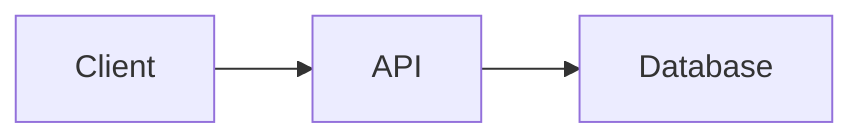

# Mega Revision Notes

A production-quality, content-driven technical revision notes website built with React, TypeScript, and Vite. Designed to scale from 10 to 500+ notes without architectural changes.

## 🚀 Technology Stack

| Technology | Purpose |
|-----------|---------|
| React 19 + TypeScript | UI framework |
| Vite | Build tool |
| Tailwind CSS | Styling |
| React Router v6 | Client-side routing |
| react-markdown | Markdown rendering |
| rehype-highlight | Syntax highlighting |
| Mermaid | Diagrams |
| FlexSearch | Client-side search |
| gray-matter | YAML frontmatter parsing |
| GitHub Actions | CI/CD deployment |

## 📁 Project Structure

```
Mega_Notes/
├── content/                    ← All Markdown notes (the content)
│   ├── dsa/
│   │   └── getting-started/
│   │       └── index.md
│   ├── backend/
│   │   ├── rest-api/
│   │   │   └── index.md
│   │   ├── nodejs/
│   │   ├── express/
│   │   ├── jwt/
│   │   ├── authentication/
│   │   ├── sessions/
│   │   ├── mongodb/
│   │   ├── redis/
│   │   └── kafka/
│   ├── frontend/
│   ├── databases/
│   ├── operating-systems/
│   ├── computer-networks/
│   └── system-design/
│
├── src/
│   ├── components/
│   │   ├── layout/             ← Header, Sidebar, TOC, PageLayout
│   │   ├── markdown/           ← MarkdownRenderer, CodeBlock, Mermaid, Callouts
│   │   └── search/             ← SearchModal
│   ├── hooks/                  ← useTheme, useSearch, useTOC
│   ├── lib/                    ← content engine, search index, utils
│   ├── pages/                  ← HomePage, NotePage, NotFoundPage
│   ├── types/                  ← Shared TypeScript interfaces
│   ├── App.tsx                 ← Router setup
│   ├── main.tsx                ← Entry point
│   └── index.css               ← Global styles + Tailwind
│
├── public/
│   ├── 404.html                ← GitHub Pages SPA redirect
│   └── favicon.svg
│
├── .github/workflows/
│   └── deploy.yml              ← GitHub Pages CI/CD
│
├── vite.config.ts
├── tailwind.config.ts
├── tsconfig.json
└── package.json
```

## 🛠 Local Development

```bash
# Install dependencies
npm install

# Start dev server
npm run dev

# Production build
npm run build

# Preview production build
npm run preview
```

## 📝 Content Architecture

The entire site is **content-driven**. Adding a note requires **zero changes to React components**.

### How content works

```
content/                    ← You add Markdown files here
    ↓
import.meta.glob            ← Vite discovers all .md files at build time
    ↓
gray-matter                 ← YAML frontmatter is parsed
    ↓
content.ts engine           ← Notes, NavTree, search index are built
    ↓
React components            ← Generic UI renders any note
```

### Markdown format

Every note uses YAML frontmatter:

```markdown
---
title: Your Note Title
category: Backend
topic: Redis
difficulty: Beginner          # Optional: Beginner | Intermediate | Advanced
description: Short description shown under the title.
tags:
  - backend
  - redis
  - caching
order: 1                       # Optional: sort order within category
date: "2025-01-15"            # Optional: for "recently added" section

source:                        # Optional: only if source exists
  title: Video Title
  youtube: https://youtube.com/...
---

# Your content here...
```

## ➕ How to Add Content

### Add a new topic to an existing category

1. Create a folder inside `content/<category>/`:

```
content/backend/rate-limiting/
└── index.md
```

2. Write the Markdown file with frontmatter:

```markdown
---
title: Rate Limiting
category: Backend
topic: Rate Limiting
difficulty: Intermediate
tags:
  - backend
  - security
  - api
order: 10
date: "2025-03-01"
---

## What is Rate Limiting?

Your content here...
```

3. **Done.** The website automatically discovers it. No React code changes needed.

### Add a new category

1. Create a new folder inside `content/`:

```
content/devops/
└── docker/
    └── index.md
```

2. Write a note with the new category name in frontmatter.

3. (Optional) Add the category to the order map and labels in `src/lib/content.ts`:

```typescript
const CATEGORY_ORDER: Record<string, number> = {
  // ...existing
  'devops': 7,
};

const CATEGORY_LABELS: Record<string, string> = {
  // ...existing
  'devops': 'DevOps',
};
```

### Add images

Place images alongside the Markdown file:

```
content/backend/redis/
├── index.md
└── images/
    └── architecture.png
```

Reference in Markdown:

```markdown

```

> **Note:** For Vite to serve these correctly, images should be referenced with relative paths in Markdown.

### Add Mermaid diagrams

Use fenced code blocks with the `mermaid` language:

````markdown

````

Diagrams render automatically — no configuration needed.

### Add custom callout boxes

Use `:::type` directives:

```markdown
:::info Optional Title
This is an informational callout.
:::

:::warning
This is a warning.
:::

:::tip
This is a helpful tip.
:::

:::danger
This is important / dangerous.
:::

:::definition
This is a definition.
:::
```

### Add quick revision section

```markdown
:::revision
- Point one
- Point two
- Point three
:::
```

### Add interview questions

```markdown
:::interview
Q1. What is REST?
A1. REST stands for Representational State Transfer. It is an architectural style for APIs.

Q2. What is stateless?
A2. Each request contains all the information needed. The server stores no session state.
:::
```

### Add YouTube timestamp links

```markdown
[Watch at 12:34](https://youtube.com/watch?v=VIDEO_ID&t=754s)
```

## 🔍 How Search Works

Search is client-side using [FlexSearch](https://github.com/nextapps-de/flexsearch):

- All note metadata is indexed at startup
- Fields indexed: title, category, topic, tags, description
- Results update in real-time as you type
- Open with `Ctrl+K` / `⌘K` or click the search bar
- Keyboard navigation: `↑↓` to move, `Enter` to open, `Esc` to close

## 🌙 Themes

- Light and dark modes supported
- Defaults to your OS preference
- Toggle via the sun/moon icon in the header
- Persists to localStorage

## 🚢 GitHub Pages Deployment

### Automatic deployment

The project includes a GitHub Actions workflow (`.github/workflows/deploy.yml`) that:

1. Triggers on push to `main`
2. Installs Node.js 20 + npm
3. Runs `npm ci` and `npm run build`
4. Deploys `dist/` to GitHub Pages

### Setup steps

1. Push the repo to GitHub

2. Go to **Settings → Pages** in your repository

3. Under **Build and deployment**, select:
   - Source: **GitHub Actions**

4. Push to `main` — the workflow will automatically build and deploy

5. Your site will be live at: `https://<username>.github.io/Mega_Notes/`

### Important: Base path

The Vite config sets `base: '/Mega_Notes/'`. If your repository name is different, update this in `vite.config.ts`:

```typescript
export default defineConfig({
  base: '/your-repo-name/',
  // ...
});
```

### SPA routing on GitHub Pages

GitHub Pages doesn't natively support client-side routing. This project uses the `404.html` redirect trick:

1. When GitHub Pages gets a 404 for `/Mega_Notes/backend/rest-api`, it serves `404.html`
2. `404.html` encodes the path and redirects to `index.html?/backend/rest-api`
3. `index.html` decodes the path and uses `history.replaceState` to restore the URL
4. React Router handles the route normally

### Updating the website

```bash
# Add/update content in content/
# Then:
git add .
git commit -m "Add new notes"
git push origin main

# GitHub Actions deploys automatically
```

## 🤖 AI Content Workflow

This project is optimized for the following workflow:

1. **You obtain content** (YouTube transcript, notes, text, etc.)
2. **You give it to an AI agent**: *"Add these Redis notes to Backend → Redis"*
3. **AI creates/updates** `content/backend/redis/index.md`
4. **You review** the changes
5. **You push** to GitHub
6. **GitHub Actions** deploys automatically

## 📄 License

Personal project — not licensed for redistribution.
