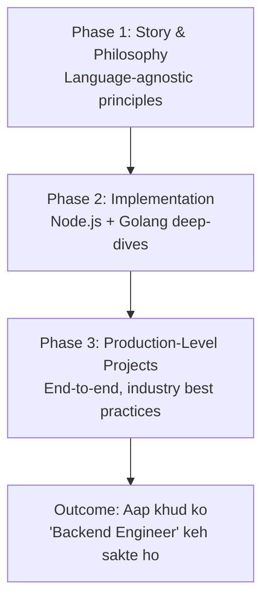

# Backend Engineering Learning Path — The 3-Phase Journey

> ⚠️ **Note on this document**: Ye bhi ek **meta/expectation-setting** video hai (jaise pichla roadmap wala video). Isme koi technical concept explain nahi hua — balki ye batata hai ki **poori playlist/course ka structure kya hoga** aur kis order me content release hoga. Isliye ye note bhi ek short "learning-path guide" ki tarah likha gaya hai, na ki ek deep-dive concept note.

---

## 1. Overview

Is video me creator apni backend engineering learning series ka **3-phase structure** explain karta hai — taaki learner ko pata ho ki kis phase me kya milega aur kyun us particular order me content design kiya gaya hai.

---

## 2. Why This Structure? (Goal)

Poori series ka goal hai:

- Backend engineering ki **story aur philosophy** samjhana — big questions, inner workings, aur components/machines ke beech collaboration kaise hoti hai
- Reader ko **production-grade backend ki big picture** dikhana
- Un concepts ko appreciate karna jo normally languages, runtimes, frameworks, aur libraries ke peeche **abstract** ho jaate hain

> 💭 Mental Model: Jab tak aap sirf ek framework use karte ho, framework ke andar chal rahi cheezein "magic" lagti hain. Is series ka goal hai us magic ko systematically expose karna — pehle philosophy se, phir implementation se, phir real projects se.

---

## 3. Core Concept: The 3-Phase Journey



| Phase                        | Focus                                                                   | Format                                                  |
| ---------------------------- | ----------------------------------------------------------------------- | ------------------------------------------------------- |
| 1. Story & Philosophy        | Language-agnostic concepts, patterns, "why" behind every backend system | Current playlist (jisme aap ho)                         |
| 2. Implementation            | Same principles ko real code me implement karna                         | Alag playlist — do versions: **Node.js** aur **Golang** |
| 3. Production-Level Projects | Sab kuch combine karke end-to-end real projects banana                  | Follow-along production projects                        |

---

## 4. Phase-by-Phase Breakdown

### Phase 1 — Story & Philosophy (current playlist)

- Ye backend engineering seekhne ka **first step** hai
- Goal hai **language-agnostic skills** build karna — skills jo kisi bhi specific framework ya library se **beyond** hon
- Yahan foundations clear hoti hain — common patterns identify karna jo **har** backend application me repeat hote hain, aur ye samajhna ki philosophies ke through concepts aapas me kaise connect hote hain

> 💡 Important: Jab tak foundations aur philosophy clear na ho jaaye, implementation phase pe jaana premature hai — isliye creator explicitly is order ko follow kar raha hai (philosophy → implementation → projects).

### Phase 2 — Implementation (Node.js & Golang)

- Is phase me language/ecosystem choose karna padta hai — creator **Node.js** aur **Golang** dono me version release karega, kyunki inhi do languages me unka firsthand daily experience hai
- Approach: Phase 1 ke **har principle** ko pick karke, us particular language aur uske ecosystem me deep-dive karna
- Isliye Phase 1 ke zyadatar videos ka Phase 2 me ek **associated implementation-specific video** hoga

**Example diya gaya:**

> Agar Phase 1 me "Databases, drivers, aur migrations" pe principle discuss hua hai, to Phase 2 me is concept ka Node.js aur Golang dono me implementation dikhaya jaayega — jaise **PostgreSQL** ke saath:
>
> - Node.js driver: **postgres.js**
> - Golang driver: **pgx**

### Phase 3 — Production-Level Projects

- Ye woh phase hai jaha **sab kuch combine hota hai** — saare concepts, saari language-specific deep-dives, aur saari philosophies
- Yahan **end-to-end production-grade projects** build kiye jaayenge, industry standards aur best practices ke saath
- Multiple aise projects banaye jaayenge jinhe learner follow-along kar sakta hai

---

## 5. Expected Outcome

> 🎯 Agar aap poori journey complete karte ho — sab kuch internalize karte ho aur saare projects follow karte ho — to aap confidently khud ko ek **backend engineer** keh sakte ho.

Aapko real systems build karne ki ability milni chahiye — systems jo:

- **Scale** kar sakein (zero users se lekar million users tak)
- Log-term **maintain** kiye ja sakein

---

## 6. Quick Revision

- Playlist structure = **3 Phases**: Philosophy → Implementation → Production Projects
- Phase 1 (current): language-agnostic story/philosophy, foundational patterns
- Phase 2: same principles, do languages me implement — **Node.js** aur **Golang**
- Phase 2 example: Databases/migrations principle → Postgres implementation via **postgres.js** (Node) aur **pgx** (Golang)
- Phase 3: sab kuch combine karke end-to-end **production-level projects**
- Final outcome: real, scalable, maintainable systems banane ki capability

---

## 7. Self-Check Questions

**Q. Is series me philosophy phase pehle aur implementation phase baad me kyun rakha gaya hai?**
**Answer:** Kyunki foundations aur common patterns pehle samajhna zaroori hai — tabhi implementation dekhte waqt aap ye samajh paoge ki code me actually kaunsa principle implement ho raha hai, na ki sirf syntax follow kar rahe ho.

**Q. Phase 2 me sirf ek language kyun nahi, do languages (Node.js aur Golang) kyun choose ki gayi hain?**
**Answer:** Taaki learning language-agnostic rahe — creator ke paas dono languages ka firsthand daily experience hai, aur do implementations dekhne se ye reinforce hota hai ki underlying principle same hai, sirf syntax/ecosystem alag hai.

---

## 8. 🧠 Final Mental Model

```text
Phase 1: WHY & WHAT (Philosophy)
        ↓
Phase 2: HOW — in code (Node.js / Golang)
        ↓
Phase 3: ALL TOGETHER (Production Projects)
        ↓
Outcome: Genuine Backend Engineer
```

> 🧠 Ye poora structure ek simple idea pe based hai: **pehle samjho "kyun", phir dekho "kaise ek language me", phir sab kuch combine karke real duniya me use karo.**
