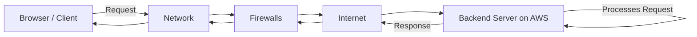
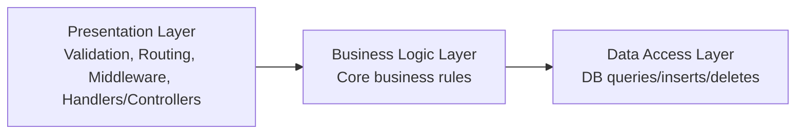
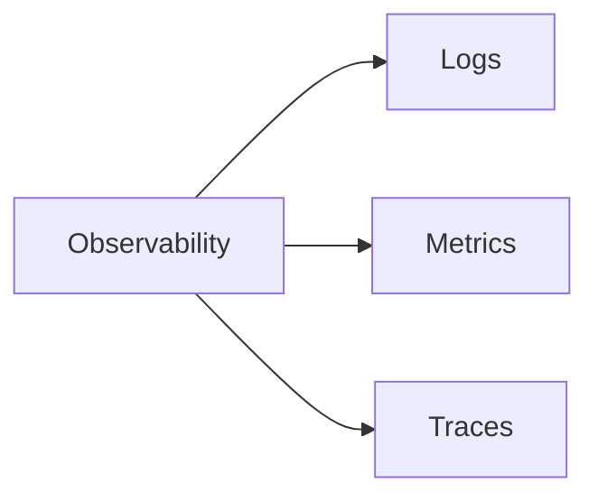
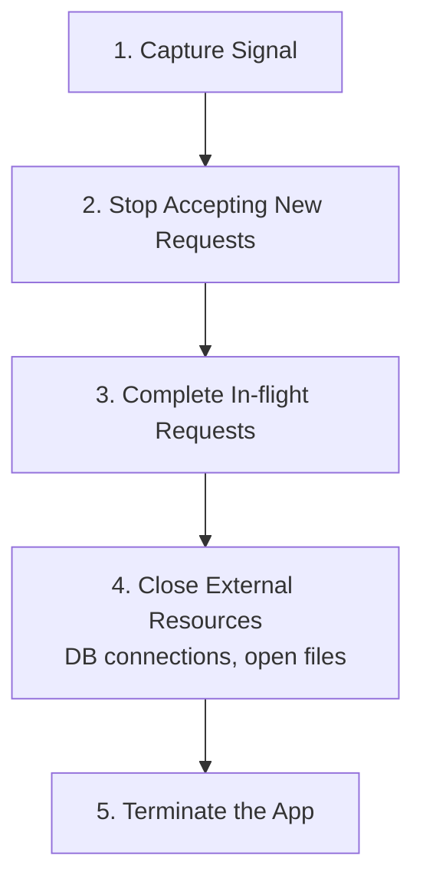

# Backend Engineering Roadmap — From First Principles

> ⚠️ **Note on this document**: Ye video ek "meta" / overview episode hai — isme koi ek concept deeply explain nahi hua hai. Ye ek **course roadmap** hai jisme aane wale 30-40 videos me kya-kya cover hoga uska structure diya gaya hai. Isliye ye notes ek standard "concept explanation" note nahi, balki ek **master index / syllabus tracker** ki tarah design kiye gaye hain — jisko aap apni backend learning journey ka checklist bana sakte ho, aur jaise-jaise individual topics deeply padhte jao, unko yahan se link kar sakte ho.

---

## 1. Overview

Ye roadmap backend engineering ko **first principles** se seekhne ke liye banaya gaya hai — matlab kisi specific language ya framework (jaise Express, Spring Boot, Ruby on Rails) ke through nahi, balki un **underlying systems aur concepts** ke through jo har backend stack ke peeche kaam karte hain.

Poora roadmap ek single request ke journey se start hota hai (browser → network → server → response) aur phir dheere-dheere zyada complex layers (HTTP, routing, auth, databases, caching, scaling, devops) tak build hota hai.

---

## 2. Why This Roadmap? (Problem → Solution)

### Problem 1: Information Overload

Backend development seekhne ke liye already 100+ resources available hain, lekin problem ye hai ki:

- Kya seekhna hai — priority kya honi chahiye?
- Big picture kaise dekhein — ye sab concepts aapas me connect kaise hote hain?

Isi wajah se log saalon lag jaate hain concepts ko properly samajhne me, kyunki zyadatar log ek **limited scope** (college course ya ek bootcamp) se start karte hain aur baaki cheezein **trial-and-error** se seekhte hain — jo bahut time-consuming approach hai.

### Problem 2: Language/Framework-First Learning

Dusra bada problem ye hai ki log backend development ek **specific language/framework ki lens** se seekhte hain (Express, Spring Boot, Rails, etc). Isme dikkat ye hai:

> 💡 Jab aap sirf ek framework ki lens se problems solve karna seekhte ho, to aapke andar **blind spots** create ho jaate hain.

**Example scenario**: Agar aap saalon Ruby on Rails pe kaam karte ho, aur company decide karti hai ki performance ke liye Golang pe migrate karna hai — to agar aapko underlying systems (HTTP, caching, concurrency, databases) ki fundamental understanding nahi hai, to aapka knowledge us naye stack me transfer nahi ho payega.

### Solution

Isliye ye roadmap **foundational, language-agnostic concepts** pe based hai — jo authors ki khud ki backend engineering ki struggle, kai books, aur hundreds of open-source codebases ke study se compile kiya gaya hai.

---

## 3. Core Philosophy: Backend Engineering Kya Hai?

> 🧠 Mental Model: Backend engineering sirf CRUD APIs banane tak limited nahi hai.

Backend engineering ka matlab hai:

- **Reliable** systems banana
- **Scalable** systems banana
- **Fault-tolerant** systems banana
- **Maintainable** codebases likhna
- **Efficient** systems design karna

Ye 5 properties hi is poore roadmap ka underlying goal hain — har topic (routing ho ya caching ho ya devops) in properties me se kisi na kisi ko achieve karne ke liye hi seekha ja raha hai.

---

## 4. High-Level Mental Model: Request Ka Safar

Roadmap ki shuruaat is understanding se hoti hai ki jab browser se ek request bhejte ho, to wo kaise different hops se guzar kar backend server tak pahunchti hai aur response wapas kaise aata hai.



Is diagram ka goal hai ek **vivid understanding** dena ki client aur server kaise communicate karte hain — ye foundational picture pura roadmap ke liye base ka kaam karta hai.

---

## 5. The Complete Roadmap — Grouped by Layer

Transcript me diye gaye 29 topics ko maine 7 logical groups me organize kiya hai taaki seekhna aasan ho. Ye grouping original video ke order ko respect karti hai, bas related cheezein ek saath cluster ki gayi hain.

```mermaid
flowchart TD
    subgraph G1[A. Foundational Layer]
        A1[System Overview / Request Flow]
        A2[HTTP Protocol]
    end
    subgraph G2[B. Request Handling Layer]
        B1[Routing]
        B2[Serialization/Deserialization]
        B3[Authentication & Authorization]
        B4[Validation & Transformation]
        B5[Middleware]
        B6[Request Context]
        B7[Handlers, Controllers, MVC, CRUD, REST]
    end
    subgraph G3[C. Data Layer]
        C1[Databases]
        C2[Business Logic Layer]
        C3[Caching]
    end
    subgraph G4[D. Async & Communication]
        D1[Transactional Emails]
        D2[Task Queue & Scheduling]
        D3[Elasticsearch]
    end
    subgraph G5[E. Cross-Cutting Concerns]
        E1[Error Handling]
        E2[Config Management]
        E3[Logging, Monitoring, Observability]
        E4[Graceful Shutdown]
        E5[Security]
    end
    subgraph G6[F. Scale & Performance]
        F1[Scaling & Performance]
        F2[Concurrency & Parallelism]
        F3[Object Storage & Large Files]
        F4[Real-time Systems]
    end
    subgraph G7[G. Quality & Standards]
        G1a[Testing & Code Quality]
        G1b[12-Factor App]
        G1c[OpenAPI Standards]
        G1d[Webhooks]
        G1e[DevOps Concepts]
    end

    G1 --> G2 --> G3 --> G4 --> G5 --> G6 --> G7
```



---

### A. Foundational Layer

#### A1. System Overview / Request Flow

- Browser se request kaise nikalti hai aur network, firewalls, internet ke through kaise route hoti hai
- Request AWS pe situated remote backend server tak kaise pahunchti hai
- Server response kaise generate karta hai aur response ka structure kaisa hota hai

#### A2. HTTP Protocol

HTTP communication establish karne ka core protocol hai. Isme cover hoga:

| Sub-topic              | Kya cover hoga                                                               |
| ---------------------- | ---------------------------------------------------------------------------- |
| Raw HTTP messages      | Request/response messages actually kaise dikhte hain                         |
| HTTP Headers           | Request headers, Representational headers, General headers, Security headers |
| HTTP Methods           | GET, POST, PUT, DELETE — semantics aur principles                            |
| CORS Flow              | Simple request vs Pre-flight request ka difference aur flow                  |
| HTTP Responses         | Response structure aur different status codes                                |
| HTTP Caching           | ETags, Max-Age headers jaise caching techniques                              |
| HTTP Versions          | HTTP 1.1 vs 2.0 vs 3.0 ke differences                                        |
| Content Negotiation    | Client-server ke beech headers se format decide karna                        |
| Persistent Connections | Connection reuse kaise hota hai                                              |
| Compression            | gzip, deflate, Brotli (br) jaise techniques                                  |
| Security               | SSL, TLS, HTTPS                                                              |

> 🎯 Interview Tip: HTTP methods ke semantics (idempotency, safety) aur status codes (2xx, 4xx, 5xx) interview me bahut commonly puche jaate hain.

---

### B. Request Handling Layer

#### B1. Routing

- Routing URLs ko server-side logic se **map** karta hai, aur HTTP methods se iska direct connection hai
- Route components: **path parameters**, **query parameters**
- Route types: static routes, dynamic routes, nested/hierarchical routes, catch-all/wildcard routes, regex-based routes
- **API Versioning**: different versioning techniques, deprecation best practices
- **Route Grouping**: versioning, permissions, aur shared middleware ke liye helpful
- Route security aur route-matching performance optimization

#### B2. Serialization & Deserialization

> 💭 Mental Model: Serialization ka matlab hai data ko network pe bhejne se pehle ek particular format me convert karna. Deserialization iska ulta hai — client se aayi hui data ko server apne native format me convert karta hai. Ye interoperability ke liye zaroori hai.

**Formats:**

| Format Type | Examples  | Characteristic                         |
| ----------- | --------- | -------------------------------------- |
| Text-based  | JSON, XML | Human-readable, easy to debug payload  |
| Binary      | Protobuf  | Faster, but payload readable nahi hota |

> ⚖️ Trade-off: Text-based formats me readability zyada hoti hai (aap payload check kar sakte ho), binary formats me performance zyada hoti hai. Ye ek genuine trade-off hai — kab kaunsa use karna hai wo use-case pe depend karta hai.

**JSON deep dive:**

- Structure aur data types: strings, numbers, booleans, arrays, objects
- Nested objects/collections ka serialization
- Native data structures me deserialize karna (Python dict, Golang structs, JS objects)
- Common errors: missing/extra fields, null values, date serialization aur time-zone issues
- Custom serialization implement karna

**Error handling & Security:**

- Invalid data / data conversion errors / unknown fields handle karna
- Security concerns: injection attacks
- Processing se pehle validation, JSON Schema validation

**Performance:**

- Serialized data reduce karna (compression, unnecessary fields eliminate karna)
- JSON vs Protobuf performance comparison

#### B3. Authentication & Authorization

**Why**: Ye decide karta hai ki user kaun hai (authentication) aur wo kya kar sakta hai (authorization).

- **Types**: Stateful vs Stateless authentication
- Basic authentication, Token-based authentication
- Sessions, JWTs, Cookies
- **OAuth protocol** aur **OpenID Connect** deep dive
- API keys, Multi-factor authentication (MFA)
- **Salting, Hashing**, aur cryptographic techniques
- **Access control models**: ACL, RBAC, ABAC

**Security best practices:**

- Cookies secure karna
- CSRF, XSS, MITM attacks avoid karna
- **Audit logging**: auth events record karna audits/monitoring ke liye — failed login attempts, privilege escalation, sensitive resource access track karna
- Error messages **de-escalate** karna (generic error messages) taaki attackers ko information leak na ho
- **Timing attacks** avoid karna

> ⚠️ Common Mistake: Timing Attack — agar wrong password ka error response, wrong username ke error response se time me different hai (kyunki password check karne me hashing lagti hai), to attacker is timing difference se guess kar sakta hai ki username valid hai ya nahi. Isliye consistent response time zaroori hai.

- Consistent responses across failure modes (rate limiting, account lockout)

#### B4. Validation & Transformation

**Validation types:**

| Type      | Example                                                           |
| --------- | ----------------------------------------------------------------- |
| Syntactic | Valid email format? Valid phone number? Valid date format?        |
| Semantic  | DOB future me nahi ho sakti; age 1-120 ke beech honi chahiye      |
| Type      | String hai ya nahi, integer hai ya nahi, array/object hai ya nahi |

> 💡 Important: **Client-side validation** UX improve karta hai (instant feedback), lekin **server-side validation** hi actual security implementation hai — kyunki wahi aapki business logic ka gateway hai. Server-side validation kabhi skip mat karo, chahe client-side already implemented ho.

- **Fail Fast**: unnecessary processing reduce karne ke liye early return karo
- Frontend aur backend validation ke beech consistency maintain karna

**Transformation:**

- Type casting (string → number, jaise query/path params hamesha string aate hain)
- Date format conversions

**Normalization:**

- Email ko lowercase karna
- Whitespace trim karna
- Phone number me country code add karna

**Sanitization:**

- SQL injection jaisi attacks se bachne ke liye user input sanitize karna

**Complex validation logic:**

- Relationship-based validation (password === confirm-password)
- Conditional validation (partner-name required only if married === true)
- Chained validation (lowercase → remove special chars → check length)

**Error handling in validation:**

- Meaningful error messages front-end ko bhejna
- Validation errors ek response me aggregate karna
- Error messages **obfuscate** karna (e.g. "invalid password" ki jagah "invalid credentials" bolna, security ke liye)
- Failed transformations gracefully handle karna (invalid JSON, failed date conversion)
- Validation ke performance trade-offs, early return se optimize karna

#### B5. Middleware

> 💭 Mental Model: Middleware ek function hai jo request cycle ke beech me baithta hai aur request/response ko intercept karke kuch kaam karta hai, phir control next middleware ko pass karta hai.

- Middleware kab use karna hai, common use cases
- Request cycle me role: **pre-request middleware** vs **post-response middleware**
- **Chaining**: middleware sequence me execute hote hain, `next()` function se control pass hota hai
- **Middleware ordering** important hai — example order: logging → authentication → validation → route handling → error handling
- Middleware se pipeline **short-circuit** karna (e.g. 404 errors handle karna)

**Common middlewares:**

- Security middleware (X-Content-Type-Options, Strict-Transport-Security/HSTS, Content-Security-Policy headers add karna)
- CORS middleware
- CSRF-protection middleware
- Rate-limiting middleware
- Authentication middleware (route-protecting logic reuse karne ke liye)
- Logging/monitoring middleware (structured logging, observability)
- Error-handling middleware (consistent API error responses)
- Compression/performance middleware (response body compress karna)
- Data-parsing middleware (JSON, URL-encoded forms, multipart file uploads)

- Best practices: middlewares ko lightweight aur efficient rakhna, correct order maintain karna (order security aur performance dono affect karta hai)

#### B6. Request Context

> 💭 Mental Model: Request context ek **request-scoped state** hai — sirf us particular request ke liye valid metadata, jo middlewares, controllers, aur services ke beech pass hota hai.

**Components:**

- Request metadata: HTTP method, URL, headers, query params, body
- Session/user info (e.g. auth middleware me fetch kiya gaya user data context me inject hota hai)
- Tracking/logging info: unique request IDs, trace IDs
- Request-specific data: caching data, permission checks

**Use cases**: authentication, rate limiting, tracing, logging

**Timeouts**: request timeouts, custom timeouts, cancellation signals

**Best practices:**

- Lightweight rakhna (memory overhead avoid karne ke liye)
- Request life cycle ke baad context data cleanup karna (memory leaks avoid karne ke liye)
- Context ke through components ko tightly couple na karna, aur data-passing ke liye over-reliance na karna

#### B7. Handlers, Controllers, MVC, CRUD & REST

- **MVC pattern**: handlers, controllers aur services ki responsibilities
- Middleware se controllers me code reduce karna
- Handlers me **centralized error handling**, consistent success/error message formats

**CRUD ↔ HTTP mapping:**

| HTTP Method | Operation                     | Common Status Codes           |
| ----------- | ----------------------------- | ----------------------------- |
| POST        | Create/Submit                 | 201 Created / 400 Bad Request |
| GET         | Fetch list or single resource | 200 OK                        |
| PUT / PATCH | Update resource               | 200 OK                        |
| DELETE      | Delete resource               | 200/204                       |

- **Pagination**, **Search API**, **Sorting**, **Filtering** implement karna
- Best practices: strict validation, consistent response formatting, payload limiting, sensitive fields redact karna, error handling, auth

**RESTful architecture:**

- APIs ko resources ke around design karna, HTTP semantics follow karna
- Versioning types: URI versioning, header versioning, query-string versioning, media-type versioning
- OpenAPI spec ke saath design karna
- Content negotiation, exceptions capture karke meaningful messages dena
- Client-side caching support karna (ETags)
- Large requests/responses optimize karna

---

### C. Data Layer

#### C1. Databases

- **Relational vs Non-relational**: kab kaunsa use karna hai
- Theoretical concepts: **ACID**, **CAP Theorem**
- Basic querying aur joins
- Database design best practices: **schema design**, **indexing**
- Optimization: query optimization, caching, **connection pooling**
- Data integrity: constraints, validations, transactions, concurrency
- **ORMs**: kaise kaam karte hain, use karne ke trade-offs
- Database migrations

#### C2. Business Logic Layer (BLL)

> 🧠 Mental Model: Ek typical request cycle 3 layers me divide hoti hai:



- **Presentation layer**: validation, routing, middleware, handlers/controllers — jo directly user ki data se deal karta hai
- **Business Logic Layer**: core business rules handle karta hai, aur behind-the-scenes Data Access Layer ko use karta hai
- **Data Access Layer**: database ke saath directly interact karta hai

**Design principles**: Separation of Concerns, Single Responsibility, Open/Closed, Dependency Inversion

**BLL components**: Services, Domain models (core entities jaise User ya Order), Business rules, Business validation logic

- Service layer design best practices
- Errors ko service layer se presentation layer tak properly propagate karna

#### C3. Caching

> 💭 Mental Model: Caching database persistence se alag hai — ye temporary, fast storage hai jo frequently accessed data ko database hit kiye bina serve karne me help karta hai.

**Types**: memory caching, browser caching, database caching — client-side vs server-side caching ki need

**Caching strategies:**

| Strategy                  | Concept                                                                          |
| ------------------------- | -------------------------------------------------------------------------------- |
| Cache-aside               | App pehle cache check karta hai, miss hone pe DB se laake cache update karta hai |
| Write-through             | Data cache aur DB dono me sath likha jaata hai                                   |
| Write-behind (Write-back) | Data pehle cache me likhte hain, DB me baad me async likha jaata hai             |
| Read-through              | Cache khud DB se data fetch karke populate karta hai                             |

**Cache eviction strategies**: LRU (Least Recently Used), LFU (Least Frequently Used), TTL (Time To Live), FIFO

**Cache invalidation**: manual invalidation, TTL-based invalidation, event-based invalidation

**Caching levels:**

- **L1 (Level 1)**: In-memory — fast, small
- **L2 (Level 2)**: Network/distributed — slower, large
- **Hierarchical caching**: L1 + L2 combine karke — frequently used data L1 me, less frequent data L2 me

**Web app caching**: static assets caching, API response caching via headers

**Database caching**: query caching (e.g. heavy joins ka result Redis me store karna)

- **Cache hit/miss ratio** ko optimize karna

---

### D. Async & Communication

#### D1. Transactional Emails

- Use cases aur common scenarios
- Anatomy: subject, preheader, body header, main content, CTA, footer
- Dynamic parameters se personalize karna

#### D2. Task Queuing & Scheduling

**Queuing use cases**: emails send karna, image processing, third-party API integration (payment processing, webhooks), heavy computation offload karna (batch processing)

> 💡 Example: User ek button click karta hai apna saara data clear karne ke liye — is operation me multiple tables pe queries chalani padti hain jisme time lag sakta hai. Isliye request ko block karne ki jagah, hum turant response bhej dete hain aur ek background job task queue me push kar dete hain.

**Scheduling use cases**: database backups, recurring notifications/reminders, data synchronization, maintenance (logs/cache clear karna)

**Task Queue components**: Producer, Queue, Consumer, Broker, Backend

**Task dependencies**: chain dependency, parent-child relationship

**Task groups**: multiple tasks concurrently execute karke sabke complete hone ka wait karna

- Errors handle karna aur retries implement karna
- **Task prioritization** aur rate limiting (e.g. Payment processing ko notification-sending se pehle priority dena)

#### D3. Elasticsearch

**Why**: full-text search aur log analytics jaise use cases ke liye

**Techniques**: Inverted index, Term Frequency (TF), Inverse Document Frequency (IDF), Segments, Shards

**Use cases**: type-ahead experience, log analytics, social media search (user profiles, posts, comments)

- Indexes create/manage karna
- Searching types: basic search, full-text search, relevance scoring
- Performance optimization: text vs keyword fields, analyzers, boosting, pagination
- Advanced patterns: filtering, aggregation, fuzzy search
- **Kibana** se user-friendly interaction
- Best practices: field mappings explicitly define karna, shard count optimize karna, batch indexing, wildcards avoid karna

---

### E. Cross-Cutting Concerns

#### E1. Error Handling

**Error types**: syntax errors, runtime errors, logical errors

**Strategies**: fail-safe vs fail-fast, graceful degradation, error prevention

**Practices**: errors early catch karna (swallow mat karo), custom error types, gracefully fail karna, errors log karna, stack traces use karna

- **Global error handlers**
- User-facing errors: friendly messages, actionable feedback
- Monitoring/logging tools: Sentry, ELK stack
- Alerts: email-based, Slack-based

#### E2. Config Management

**Config types**: static configs (DB credentials, API endpoints), dynamic configs (feature flags, rate limits), sensitive configs (credentials, tokens, secrets)

**Config sources**: `.env` files, JSON, YAML — environment variables vs command-line flags vs static files ka trade-off

#### E3. Logging, Monitoring & Observability

> 💡 Important: Logging, Tracing, Monitoring, aur Observability — ye chaaron alag concepts hain, inko differentiate karna zaroori hai.

**Logging types**: system logging, application logging, access logging, security logs

**Log levels**: debug, info, warn, error, fatal

- **Structured vs unstructured logging**
- Best practices: centralized logging, log rotation/retention, contextual/meaningful logs, sensitive data (passwords, API keys) log na karna

**Monitoring types**: infrastructure monitoring, application performance monitoring (APM), uptime monitoring

- Tools: Prometheus, Grafana
- Alerts: thresholds define karna, action-based alerts banana, **alert fatigue** avoid karna

**Observability — 3 Pillars:**



- Log management ke security aur compliance aspects

#### E4. Graceful Shutdown

**Why**: server restart, cloud scaling, microservices, ya long-running jobs ke waqt zaroori hota hai

**How (Signal Handling)**: SIGTERM aur SIGKILL signals

**Steps of Graceful Shutdown:**



#### E5. Security

**Attacks to avoid**: SQL Injection, NoSQL Injection, XSS, CSRF, Broken Authentication, Insecure Deserialization

**Secure design principles**: Least Privilege, Defense in Depth, Fail Secure Defaults, Separation of Duties, Security by Design

- Input validation aur sanitization ki importance
- Rate limits, Content Security Policy (CSP), CORS, SameSite cookies
- Security events ki monitoring ki importance

---

### F. Scale & Performance

#### F1. Scaling & Performance

**Performance metrics**: response time, resource utilization, bottleneck identification

**Caching & DB optimization:**

- N+1 query problem avoid karna
- Proper joins use karna
- Lazy loading appropriately use karna
- Database indexes use karna (frequently-queried fields, foreign keys, search fields index karna)
- Large datasets ke liye batch processing

**Memory leaks avoid karna**: file handles/DB connections close karna, long processes ke baad cleanup karna

- Network overhead minimize karna: payload size reduce karna, compression use karna
- Performance testing aur profiling

**Best practices**:

- Pehle clear aur maintainable code likho, premature optimization mat karo
- Modular code likho (individual components optimize karna aasan ho jaata hai)
- **Graceful degradation**: agar resources unavailable hain to system crash nahi hona chahiye
- Non-critical tasks (emails, logging) ko background processes/task queues me offload karna

#### F2. Concurrency & Parallelism

> 🎯 Interview Tip: Ye ek bahut common interview question hai.

- **Concurrency** IO-bound tasks me help karta hai
- **Parallelism** CPU-bound tasks me help karta hai

#### F3. Object Storage & Large Files

- Use cases: AWS S3 jaise object storage
- Large files manage karna: **chunking**, **streaming**
- Multipart file uploads

#### F4. Real-time Backend Systems

- **WebSockets**
- **Server-Sent Events (SSE)**
- **Pub/Sub architecture**

---

### G. Quality & Standards

#### G1. Testing & Code Quality

**Testing types**: unit testing, integration testing, end-to-end testing, functional testing, regression testing, performance testing, load/stress testing, user acceptance testing, security testing

- **Test-Driven Development (TDD)**
- Tests ko CI/CD environments me automate karna
- Code quality: external linting/formatting tools

**Quality metrics:**

| Metric                | Meaning                                                                                              |
| --------------------- | ---------------------------------------------------------------------------------------------------- |
| Cyclomatic Complexity | Function ke through possible paths ki count se complexity measure karna                              |
| Maintainability Index | Complexity, lines of code, aur other factors se code maintain karna kitna easy hai wo quantify karna |

#### G2. 12-Factor App

- Ek interesting set of principles jo modern SaaS apps banane ke liye follow kiye jaate hain

#### G3. OpenAPI Standards

- Need aur benefits: documentation automation, ecosystem (Swagger UI, ReDoc, Postman)
- History: Swagger → OpenAPI transition, currently active versions
- Key concepts: API paths, request/response definitions, parameters, schemas
- Document structure: metadata, paths, components, security definitions, responses
- Naye features: OpenAPI 3.0 aur 3.1
- Best practices: duplication avoid karna, standards follow karna
- **API-First Development**: pehle OpenAPI spec likho, phir APIs banao

#### G4. Webhooks

> 💭 Mental Model: API request (polling) **client-initiated** hoti hai, jabki Webhook **server-initiated (push)** hota hai.

|           | API (Polling)                    | Webhook (Push)                                  |
| --------- | -------------------------------- | ----------------------------------------------- |
| Initiator | Client                           | Server                                          |
| Pattern   | Client baar-baar check karta hai | Server khud notify karta hai jab event hota hai |

- Use cases: notifications bhejna, third-party integrations
- Components: Webhook URL, Event triggers, Payload, HTTP method, Response handling
- Best practices: signature verification, HTTPS use karna, quick response + retry logic, logging
- Testing: **ngrok** jaise tools se
- Real-world examples: Stripe payment processing, GitHub webhooks, Slack/Discord/Twilio integrations

#### G5. DevOps Concepts

- Core concepts: Continuous Integration (CI), Continuous Delivery (CD), Continuous Deployment
- Practices: Infrastructure as Code, Config management, Version control
- Tools: **Docker** (containers create karna), **Kubernetes** (container orchestration), CI/CD pipelines
- Scaling: **Horizontal scaling vs Vertical scaling**
- Deployment strategies: Red-Green deployment, Rolling deployment

---

## 6. Common Confusions (Roadmap Highlights)

Ye pairs roadmap me explicitly mention hue hain — inko clear samajhna zaroori hai:

| Concept A              | Concept B                               | Key Difference (transcript ke hisab se)                                                                                                                  |
| ---------------------- | --------------------------------------- | -------------------------------------------------------------------------------------------------------------------------------------------------------- |
| Authentication         | Authorization                           | Authentication = kaun ho tum; Authorization = kya kar sakte ho                                                                                           |
| Client-side validation | Server-side validation                  | Client-side = UX/instant feedback; Server-side = actual security gateway                                                                                 |
| API Polling            | Webhook                                 | Polling = client-initiated; Webhook = server-initiated push                                                                                              |
| Concurrency            | Parallelism                             | Concurrency = IO-bound tasks; Parallelism = CPU-bound tasks                                                                                              |
| Horizontal scaling     | Vertical scaling                        | Zyada machines add karna vs ek machine ki capacity badhana                                                                                               |
| Cache-aside            | Write-through/Write-behind/Read-through | Alag-alag caching strategies — kab data cache me likha/padha jaata hai iska pattern alag                                                                 |
| JSON                   | Protobuf                                | Text-based & readable vs Binary & performant                                                                                                             |
| Logging                | Monitoring / Observability              | Alag-alag layers — logging events record karta hai, monitoring health track karta hai, observability system ki internal state samajhne ki capability hai |

---

## 7. Interview Questions

### Basic

**Q. Backend engineering sirf CRUD APIs banane tak limited hai — sahi ya galat?**
**Answer:** Galat. Backend engineering me reliable, scalable, fault-tolerant, maintainable, aur efficient systems design karna shamil hai — CRUD APIs to bas iska ek chhota sa hissa hain.

**Q. Concurrency aur Parallelism kis type ke tasks me use hote hain?**
**Answer:** Concurrency IO-bound tasks me help karta hai (jaise network calls, file reads), jabki Parallelism CPU-bound tasks me help karta hai (jaise heavy computations).

**Q. API polling aur Webhook me kya fundamental difference hai?**
**Answer:** API polling client-initiated hota hai — client baar-baar server se check karta hai. Webhook server-initiated (push) hota hai — server khud client ko notify karta hai jab koi event hota hai.

### Intermediate

**Q. Client-side validation implement karne ke baad bhi server-side validation kyun zaroori hai?**
**Answer:** Client-side validation user experience improve karta hai (instant feedback deta hai), lekin ise bypass kiya ja sakta hai. Server-side validation hi actual security enforcement hai kyunki wahi business logic ka gateway hai — isliye chahe client-side validation ho bhi, server-side validation kabhi skip nahi karni chahiye.

**Q. Timing attack kya hota hai authentication ke context me?**
**Answer:** Agar wrong password ka response time, wrong username ke response time se alag hai (kyunki password verify karne me hashing jaisa cryptographic operation lagta hai jo time leta hai), to attacker is time difference se guess kar sakta hai ki given username valid hai ya nahi. Isse bachne ke liye response times consistent rakhne chahiye.

**Q. Graceful shutdown ke steps kya hain?**
**Answer:** (1) Signal capture karna (SIGTERM/SIGKILL), (2) naye requests accept karna band karna, (3) already in-flight requests complete karna, (4) external resources (DB connections, open files) close karna, (5) app terminate karna.

**Q. Observability ke 3 pillars kya hain?**
**Answer:** Logs, Metrics, aur Traces.

### Advanced

**Q. Business Logic Layer ko presentation layer aur data access layer se separate rakhna kyun important hai?**
**Answer:** Ye separation of concerns follow karta hai — presentation layer sirf user data accept/return karne ka kaam karta hai, business logic layer core rules handle karta hai, aur data access layer sirf DB operations karta hai. Isse system maintainable rehta hai, testing aasan hoti hai, aur ek layer ko change karne se doosri layers directly affect nahi hoti (dependency inversion, single responsibility jaise principles follow hote hain).

**Q. Text-based (JSON) aur binary (Protobuf) serialization formats ke beech kya trade-off hai, aur kab kaunsa choose karoge?**
**Answer:** JSON readable hai — payload directly dekh aur debug kar sakte ho, lekin comparatively slow hota hai. Protobuf binary format hai jo fast aur compact hota hai, lekin human-readable nahi hota. Agar debugging/interoperability priority hai to JSON, agar high-performance internal service-to-service communication chahiye to Protobuf better choice hai.

**Q. Hierarchical caching (L1 + L2) kaise kaam karti hai aur ye kyun useful hai?**
**Answer:** L1 cache fast lekin small hota hai (in-memory), jismein sabse frequently accessed data store hota hai. L2 cache slower lekin bada hota hai (network/distributed), jismein less frequently accessed data store hota hai. Dono ko combine karne se system frequently-needed data ko instant serve kar pata hai, jabki bade dataset ko bhi cover kar leta hai — isse cost aur speed dono balance hote hain.

---

## 8. ⚡ Quick Revision

- Backend engineering = reliable + scalable + fault-tolerant + maintainable + efficient systems (CRUD se bahut zyada)
- Language/framework-first learning se blind spots create hote hain — systems-first approach better hai
- Request journey: Browser → Network → Firewalls → Internet → Backend Server (AWS) → Response
- HTTP: methods, headers, status codes, CORS, caching (ETags, max-age), versions, compression, TLS/HTTPS
- Routing: static/dynamic/nested/catch-all/regex routes, API versioning, route grouping
- Serialization: JSON (text) vs Protobuf (binary) — readability vs performance trade-off
- AuthN/AuthZ: sessions, JWTs, OAuth, OpenID Connect, ACL/RBAC/ABAC, salting/hashing, timing attacks
- Validation: syntactic → semantic → type; server-side validation is non-negotiable; transformation, normalization, sanitization
- Middleware: chaining, ordering matters, common middlewares (security, CORS, auth, logging, error handling, compression)
- Request Context: request-scoped state, cleanup zaroori hai memory leaks avoid karne ke liye
- MVC + CRUD + REST: HTTP method ↔ status code mapping, pagination/search/sort/filter
- Databases: relational vs non-relational, ACID, CAP theorem, indexing, ORMs, migrations
- BLL: Presentation → Business Logic → Data Access layer separation
- Caching: cache-aside/write-through/write-behind/read-through, LRU/LFU/TTL/FIFO eviction, L1+L2 hierarchical caching
- Task Queue: producer-queue-consumer-broker, retries, prioritization
- Elasticsearch: inverted index, TF-IDF, shards, full-text search
- Error Handling: fail-fast vs fail-safe, global error handlers, Sentry/ELK
- Config Management: static/dynamic/sensitive configs, env vars vs flags vs files
- Logging/Monitoring/Observability: 3 pillars = Logs + Metrics + Traces
- Graceful Shutdown: Signal → Stop accepting → Complete in-flight → Close resources → Terminate
- Security: SQLi, XSS, CSRF avoid karna; least privilege, defense in depth
- Scaling: N+1 avoid karna, indexing, batch processing, graceful degradation
- Concurrency (IO-bound) vs Parallelism (CPU-bound)
- Object Storage: S3, chunking, streaming, multipart uploads
- Real-time: WebSockets, SSE, Pub/Sub
- Testing: unit → integration → e2e → TDD; Cyclomatic Complexity, Maintainability Index
- 12-Factor App principles
- OpenAPI: Swagger → OpenAPI, API-First Development
- Webhooks: server-initiated push vs client-initiated polling
- DevOps: CI/CD, IaC, Docker, Kubernetes, horizontal vs vertical scaling, Red-Green/Rolling deployment

---

## 9. 🧠 Final Mental Model

```text
Client Request
     ↓
Network / Firewall / Internet (Transport)
     ↓
HTTP Protocol (Communication Contract)
     ↓
Routing (URL → Logic Mapping)
     ↓
Middleware Chain (Cross-cutting concerns: auth, logging, security)
     ↓
Validation & Deserialization (Trust nothing from outside)
     ↓
Handlers/Controllers (Presentation Layer)
     ↓
Business Logic Layer (Core Rules)
     ↓
Data Access Layer ←→ Databases / Cache / Queues / Search
     ↓
Response Serialization
     ↓
Client Response

   [Cross-cutting, har layer ke saath]:
   Error Handling · Logging/Monitoring/Observability ·
   Security · Config Management · Graceful Shutdown

   [Scale hone ke baad zaroori]:
   Caching · Concurrency/Parallelism · Object Storage ·
   Real-time Systems · Task Queues

   [Professional maturity ke liye]:
   Testing · 12-Factor App · OpenAPI · Webhooks · DevOps
```

> 🧠 Is roadmap ka poora idea ye hai ki backend engineering ek **single request ke safar** se shuru hoti hai, aur phir har layer pe depth add hoti jaati hai — jab tak aap ek complete, production-grade, scalable system ko samajh na paao, chahe wo kisi bhi language ya framework me implement kiya gaya ho.
