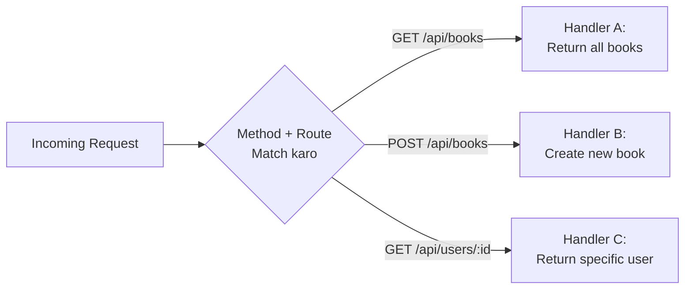
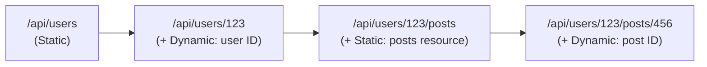
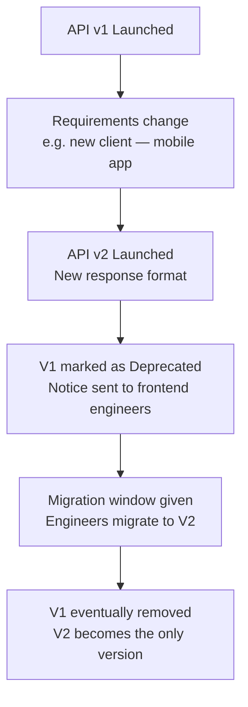

# What is Routing in Backend? How Requests Find Their Way Home

## 1. Overview

Pichli video me humne **HTTP methods** discuss kiye the — jo request ka **"WHAT"** (intent/action) express karte hain. Is video ka topic hai **Routing** — jo request ka **"WHERE"** express karta hai, yaani kis resource pe wo action perform karna hai.

> 💭 Mental Model: HTTP Method = **WHAT** (kya karna hai — fetch/create/update/delete). Route = **WHERE** (kis resource pe karna hai). Dono milkar server ko batate hain ki exactly kaunsa operation kis data pe perform karna hai.

---

## 2. Core Concept: Routing Kya Hai

> 💡 Important: **Routing basically URL parameters ko server-side logic se map karne ka process hai.**

**Example:**

- Method: `GET`
- Route: `/users`
- Matlab: "Mujhe kuch data **fetch** karna hai, aur wo data **users** resource se related hai"

Server in dono cheezon (intent + route) ko combine karke ek particular **Handler** (instructions ka set) ko map karta hai, jo business logic, database operations, etc. execute karke response return karta hai.

---

## 3. How It Works: Method + Route = Unique Key

> 💭 Mental Model: Server ke andar, **HTTP Method** aur **Route** dono milkar ek "key" banate hain jo ek specific Handler se match hota hai.

**Demo Example:**

| Request   | Method | Route        | Result                        |
| --------- | ------ | ------------ | ----------------------------- |
| Request 1 | GET    | `/api/books` | Books ki list return hoti hai |
| Request 2 | POST   | `/api/books` | Naya book create hota hai     |

> 🧠 Remember: Dono requests ka **route same hai** (`/api/books`), lekin **method alag hai** (GET vs POST) — isliye ye dono **alag-alag Handlers** se match hote hain aur **kabhi clash nahi karte**. Method aur Route ko **concatenate** karke server ek unique routing logic banata hai.



---

## 4. Types of Routes

### 4.1 Static Routes

> 💭 Mental Model: Static route ek **constant string** hai — koi variable/dynamic parameter nahi hota. Route hamesha same rehta hai, aur (generally) same type ka response deta hai.

**Example:** `/api/books` — ye string kabhi change nahi hoga, chahe kitni bhi baar request karo.

### 4.2 Dynamic Routes (Path Parameters)

> 💭 Mental Model: Dynamic route me ek **variable part** hota hai jo request ke hisaab se change hota hai — jaise ek specific ID.

**Example:** `GET /api/users/123`

- Yahan `123` **user ka ID** represent karta hai
- Server is ID ko route se **extract** kar sakta hai aur usse database query, ya koi bhi operation ke liye use kar sakta hai

**Server-side matching pattern (language-agnostic convention):**

```text
R.get("/api/users/:id")
```

- `:id` ek **placeholder** hai jo batata hai ki "yahan koi bhi string aa sakti hai, aur use `id` naam ke variable me capture karo"
- Ye convention (colon `:` se dynamic parameter denote karna) **industry-wide** hai — chahe server Java, Python, Node.js, Golang, ya Rust me likha ho

> 💡 Important: Route parameters/path parameters me jo bhi value aati hai — number ho ya special characters — sab **string** me convert ho jaata hai. `123` dikhne me number lagta hai, lekin route mein ye ek string ki tarah treat hota hai.

**Terminology**: Ye dynamic part ko **Path Parameter** ya **Route Parameter** kehte hain (dono terms same cheez ke liye use hote hain).

> 🎯 Interview Tip: Path parameters REST APIs ko **human-readable** banate hain — `GET /api/users/123` ko easily padha ja sakta hai: "mujhe user 123 ka data fetch karna hai (GET)."

### 4.3 Query Parameters

> ⚠️ Common Confusion: Path Parameters aur Query Parameters dono "dynamic values" carry karte hain, lekin inka purpose alag hai.

**Structure**: `/api/search?query=some+value`

- `?` ke baad wala part **Query Parameters** kehlata hai — key-value pairs ke form me
- Ye syntax hai: `?key=value` (aur multiple params `&` se separate hote hain)

**Why Query Parameters?**

> 💡 Important: POST/PUT requests me hume **request body** milta hai data bhejne ke liye. Lekin **GET requests me body nahi hota** — to agar hume kuch values server ko bhejni hon (jaise search term, filters, sorting order), to unhe kahan bhejein?

Technically aap path parameter me bhi daal sakte ho (e.g. `/api/search/some-value`), lekin:

> ⚠️ Common Mistake: Path parameters ek **semantic expression** ke liye designed hain (jaise "user ID 123 ka data") — agar aap arbitrary search values ya filters ko path parameter me daaloge, to ye maintain karna mushkil ho jaata hai aur REST API ke semantic purpose ko defeat kar deta hai.

Isliye **query parameters** use hote hain — ye request ke baare me **metadata** bhejne ke liye designed hain: filtering, sorting, pagination, etc.

**Example — Pagination:**

```text
GET /api/books?page=2&limit=20
```

Response me typically metadata milta hai:

```json
{
  "data": [
    /* array of books */
  ],
  "total": 100,
  "currentPage": 1,
  "totalPages": 5
}
```

- Server default `limit` (e.g. 20 books per page) ke saath data bhejta hai agar client kuch specify na kare
- `total`, `currentPage`, `totalPages` jaisi metadata client ko batati hai ki **next page kaise fetch** karni hai — client bas `page=2` query parameter add kar dega agli request me

**Path Parameter vs Query Parameter — Summary:**

| Aspect                     | Path Parameter                                            | Query Parameter                             |
| -------------------------- | --------------------------------------------------------- | ------------------------------------------- |
| Syntax                     | `/users/:id`                                              | `/search?query=value`                       |
| Purpose                    | Semantic expression — ek specific resource identify karna | Metadata — filtering, sorting, pagination   |
| Typical use case           | `/users/123` (user 123 ka data)                           | `/books?page=2&limit=20`                    |
| Kis method ke saath common | Kisi bhi method ke saath                                  | Mostly GET (jahan body available nahi hota) |

### 4.4 Nested Routes

> 💡 Important: Nested Routing technically ek "alag type" ki routing nahi hai — ye ek **practice** hai jo REST APIs me **semantic expression** ke liye use hoti hai, jab different resources ko nest karna ho.

**Example**: `GET /api/users/123/posts/456`



Har level pe alag semantic meaning aur alag response milta hai:

| Route                      | Meaning                            | Response                  |
| -------------------------- | ---------------------------------- | ------------------------- |
| `/api/users`               | Saare users fetch karo             | List of all users         |
| `/api/users/123`           | User 123 ka data fetch karo        | Single user's details     |
| `/api/users/123/posts`     | User 123 ke saare posts fetch karo | List of that user's posts |
| `/api/users/123/posts/456` | User 123 ke post 456 ko fetch karo | Ek specific post ka data  |

> 🧠 Remember: Har route apne aap me **unique** hai — server har level pe alag Handler se match karta hai. Nested routing bahut common hai jaise hi API ki complexity thodi bhi badhti hai.

---

## 5. Route Versioning & Deprecation

**Example:**

- `GET /api/v1/products` → Response: `{ data: [{ id, name, price }, ...] }`
- `GET /api/v2/products` → Response: `{ data: [{ id, title, price }, ...] }`

> 💭 Mental Model: Route Versioning ek common practice hai REST API endpoints me — jaha URL me `v1`, `v2` jaisa version number include kiya jaata hai.

**Why do we need versioning?**

Imagine: Aap ek API endpoint se web-app ke liye data serve kar rahe the ek particular format me. Baad me naye requirements aaye (jaise React Native app ya Flutter app support karna hai), jinke liye response format change karna pada.

**Do options hain:**

1. Route pura change kar do (e.g. `/api/new-products`)
2. **Versioning add karo**: `/api/v1/products` (purana format) aur `/api/v2/products` (naya format)

**Benefits of versioning:**

- Intention clearly express hoti hai — "V1 me hum ye format serve karte the, V2 me naya format hai"
- Poora route change nahi karna padta



- Deprecation ke baad, frontend engineers ko ek **migration window** milta hai jisme wo V1 se V2 pe migrate kar sakte hain
- Eventually V1 completely remove ho jaata hai, aur V2 hi standard reh jaata hai

> 🚀 Real-World Usage: Ye workflow ek **stable aur complete process** deta hai naye structures/breaking changes ko API endpoints me add karne ke liye — bina existing clients ko turant break kiye.

---

## 6. Catch-All Route

**Example:** Client `GET /a/v3/products` request karta hai — jo server actually serve hi nahi karta (koi Handler exist nahi karta is route ke liye).

> 💭 Mental Model: Server saare defined routes/methods ke matching ke **baad**, ek "catch-all" pattern (jaise `/*` ya wildcard) define karta hai. Jo bhi request in saari matching stages ke baad bhi match nahi hui, wo is catch-all Handler tak pahunchti hai.

- Ye Handler ek **user-friendly message** bhejta hai — "ye route exist nahi karta" / "not found"
- Agar catch-all handling na ho, to default behavior hota hai — server sirf ek **null response** bhej deta hai, jo client ke liye kam useful hai

> 💡 Important: Catch-all route ka goal hai — undefined routes ke liye bhi ek **meaningful, user-friendly response** dena, chahi wo ek raw `null` ya empty response na ho.

---

## 7. Common Confusions

| Confusion                                           | Clarification                                                                                                                      |
| --------------------------------------------------- | ---------------------------------------------------------------------------------------------------------------------------------- |
| Path Parameter vs Query Parameter                   | Path parameter = semantic identification (`/users/123`); Query parameter = metadata jaisa filtering/sorting/pagination (`?page=2`) |
| "Nested Route" ek alag routing type hai             | Nahi — ye ek **practice/pattern** hai semantic expression ke liye, koi fundamentally naya routing concept nahi                     |
| Route matching sirf URL pe hoti hai                 | Nahi — Method + Route dono milkar unique matching key banate hain. Same route, different methods = different Handlers              |
| Route parameters me numbers "number type" hote hain | Nahi — route/path parameters me har value **string** hi hoti hai, chahe wo number jaisi dikhe                                      |

---

## 8. Interview Questions

### Basic

**Q. HTTP Method aur Route ka basic difference kya hai?**
**Answer:** HTTP Method request ka "WHAT" (intent — fetch/create/update/delete) express karta hai. Route request ka "WHERE" (kaunsa resource) express karta hai. Dono milkar server ko batate hain kaunsa exact operation kis data pe perform karna hai.

**Q. Static route aur Dynamic route me kya difference hai?**
**Answer:** Static route ek constant string hai jo kabhi change nahi hoti (e.g. `/api/books`). Dynamic route me ek variable part hota hai (e.g. `/api/users/:id`) jo request ke hisaab se change hota hai — jaise koi specific ID.

### Intermediate

**Q. Path parameters ke liye query parameters use karne ki bajaye kab better hote hain?**
**Answer:** Jab bhejni wali value ek **specific resource ko semantically identify** kar rahi ho (jaise user ID), tab path parameter use karo (`/users/123`). Jab value **metadata** ho — jaise filtering, sorting, ya pagination options — tab query parameters use karo (`/books?page=2&limit=20`), especially GET requests me jaha body available nahi hota.

**Q. Same route ke do methods (GET aur POST) kabhi clash kyun nahi karte?**
**Answer:** Kyunki server internally **Method + Route** ko combine karke ek unique routing key banata hai. `GET /api/books` aur `POST /api/books` do alag keys hain — isliye alag-alag Handlers se match hote hain, chahe route string same ho.

### Advanced

**Q. Route Versioning ki zaroorat kyun padti hai, aur ise implement karne ka best practice workflow kya hai?**
**Answer:** Jab API ke response format me breaking changes ki zaroorat ho (jaise naye client type — mobile app — support karna), to poora route badalne ki jagah versioning (`/api/v1/...` → `/api/v2/...`) use karte hain. Isse purana aur naya dono format parallel me serve ho sakte hain. Best practice workflow: V2 launch karo, V1 ko deprecated mark karo, engineers ko migration window do, aur eventually V1 hata do jab sab V2 pe migrate ho jaayein.

**Q. Catch-all route ka purpose kya hai, aur agar wo na ho to kya hota hai?**
**Answer:** Catch-all route saare defined routes ke match na hone ke baad trigger hota hai — ye ek user-friendly "not found" message deta hai. Agar catch-all na ho, to server default behavior me sirf null response bhej deta hai, jo client ke liye debug karna aur samajhna mushkil hota hai.

---

## 9. ⚡ Quick Revision

- HTTP Method = **WHAT** (intent); Route = **WHERE** (resource)
- Routing = URL parameters ko server-side logic (Handler) se map karna
- Server **Method + Route** ko combine karke unique key banata hai — same route, different methods = different Handlers
- **Static Route**: constant string, koi variable nahi (`/api/books`)
- **Dynamic Route (Path Parameter)**: variable part hoti hai (`/api/users/:id`), convention hai colon (`:`) se denote karna, values hamesha string hoti hain
- **Query Parameters**: `?key=value` format, GET requests me metadata (filter/sort/pagination) bhejne ke liye, kyunki GET me body nahi hota
- Path parameter = semantic identity; Query parameter = metadata
- **Nested Routes**: ek practice, alag resources ko nest karke semantic meaning express karna (`/users/123/posts/456`)
- **Route Versioning**: `/api/v1/...` vs `/api/v2/...` — breaking changes handle karne ka stable workflow (launch v2 → deprecate v1 → migration window → remove v1)
- **Catch-All Route**: saare defined routes match na hone pe user-friendly "not found" response dene ke liye

---

## 10. 🧠 Final Mental Model

```text
HTTP Method (WHAT)  +  Route (WHERE)
        ↓
   Unique Routing Key
        ↓
   Server matches → Handler
        ↓
   Handler executes business logic,
   DB operations, etc.
        ↓
   Response returned to client

Route Types:
   Static     → constant string
   Dynamic    → variable path parameter (semantic ID)
   Query      → metadata (filter/sort/paginate)
   Nested     → multiple resources chained for deeper semantics
   Versioned  → v1/v2 for breaking changes
   Catch-All  → fallback for unmatched routes
```

> 🧠 Routing fundamentally ek simple idea hai: **"kis address (route) pe, kya (method) karna hai"** — aur is simple combination ke around hi saari REST API design ki richness (nesting, versioning, pagination) build hoti hai.
