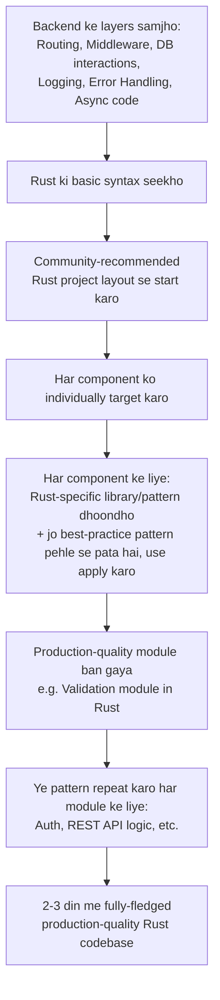

# Benefits of Learning Backend Engineering from First Principles

## 1. Overview

Ye video is baat pe focus karti hai ki **backend engineering ko first principles se seekhna** kyun itna valuable hai — ye sirf ek theoretical concept nahi, balki real career scenarios me directly kaam aata hai: naye codebase me bug fix karna ho, naya project banana ho, ya ek naye language/stack me switch karna ho.

---

## 2. The Problem: Common Scenarios Where Engineers Struggle

Video 3 real scenarios se shuru hoti hai jo har engineer face karta hai:

### Scenario 1: Naya joinee, unfamiliar backend codebase

Aap frontend developer ho aur aapko backend codebase me ek bug fix karne ko kaha gaya hai.

- Backend kisi unfamiliar language me likha ho sakta hai
- Bigger question ye hai: **shuruaat kahan se karein?** Codebase ki complexity me lost hue bina issue kaise dhoondein?

### Scenario 2: Scratch se API banana

- Codebase ka mental map kaise banayein?
- Standards ko kaise follow karein?
- Kuch break kiye bina kaise implement karein?

### Scenario 3: Language switch karna

Aap TypeScript ya Golang backend engineer ho, aur suddenly Rust ya Python me switch karna pade.

- Kaise jaldi speed pakdein bina alag-alag libraries ke docs me hours waste kiye (jaise Rust ke liye Axum ya Diesel, Python ke liye FastAPI, Pydantic, ya SQLAlchemy)?
- Existing knowledge ko naye environment me kaise apply karein bina "wheel reinvent" kiye?

> 💭 Mental Model: Ye teeno scenarios ek hi core problem share karte hain — jab aapki understanding sirf **syntax aur framework-specific** hai, to naye environment me aap **from scratch** shuru karte ho. Lekin agar aapki understanding **first principles** based hai, to sirf syntax badalta hai, samajh wahi rehti hai.

---

## 3. Core Concept: "First Principles" Ka Matlab Kya Hai

> 💡 Important: First Principles ka matlab **rules ki ek list** nahi hai.

First principles se murad hai — kuch **foundational, universal building blocks** jinke around poora backend codebase revolve karta hai, chahe wo codebase kitna bhi chhota ya bada ho. Ye ek generic **map of backend engineering territory** hai jo aapko kisi bhi unfamiliar jagah pe rasta dhoondhne me help karta hai.

Complex systems ko unke **most basic aur universal components** me todne ki ability hi first-principles thinking hai.

---

## 4. The Benefits (Problem → Solution Breakdown)

### 4.1 Seeing the Big Picture

> 🧠 Mental Model: Jab aap kisi existing codebase me enter karte ho, uski structure/complexity se overwhelmed hone ki jagah, aap system ke different parts ko **mentally alag-alag** kar sakte ho aur unpe isolated tareeke se kaam kar sakte ho.

- Aap **core logic**, **routing layers**, **database connections**, aur **over-engineered pieces** ko identify kar sakte ho
- In "noises" ko filter karke, aap confidently changes ya bug-fixes shuru kar sakte ho

> 💡 Observation diya gaya video me: Senior Engineers, CTOs, ya CxOs kisi bhi codebase ko dekh kar jaldi andaza laga lete hain ki kya chal raha hai ya bug kaha ho sakta hai. Ye isliye possible hai kyunki **human brain patterns pick up karne me bahut acha hai** — senior engineers ye subconsciously kar lete hain saalon ke experience se.

**Key insight**: Aapko iske liye saalon wait karne ki zaroorat nahi — first principles ko **deliberately** din 1 se practice karke, aap ye skill 6 months–1 year me develop kar sakte ho.

### 4.2 Faster Onboarding

Jab aap first principles samajhte ho — jaise **HTTP kaise kaam karta hai**, **databases APIs se kaise interact karte hain**, ya **requests middleware se kaise flow karti hain** — to aap kisi bhi language ya framework me dive kar ke jaldi apna rasta dhoondh sakte ho.

- Library-specific docs me hours spend karne ki zaroorat khatam ho jaati hai
- Ek baar authentication, routing, middleware, aur database interaction ke core concepts clear ho jaayein, to **syntax secondary ho jaata hai**
- Aap **logic** pe focus kar paate ho, syntax pe nahi — jo ek codebase ke saath familiarity bahut jaldi develop karwata hai

### 4.3 10x Faster in New Projects

Scratch se naya project start karte waqt, first-principles-based backend knowledge aapko **incredible speed aur precision** deta hai.

- Aap production-quality code ke saath **MVPs** bahut jaldi bana paate ho — kyunki aap boilerplate tutorials follow nahi kar rahe, balki system ki **deep understanding** se kaam kar rahe ho
- Aap jaante ho routes kaise structure karne hain, database connections kaise set up karni hain, aur critical functionalities (caching, error handling, logging) kaise implement karni hain — bina baar-baar documentation reference kiye

### 4.4 Reduced Syntax Fatigue

Naya language seekhna already overwhelming hota hai — aur agar aapko pata na ho ki syntax seekhne ke baad **kya concept next seekhna hai** ya us syntax ko actual backend problems solve karne ke liye kaise apply karna hai, to frustration ya burnout ho sakta hai.

> 💡 First principles is fatigue ko reduce karte hain — kyunki fundamental building blocks samajhne ke baad, languages ke beech switch karna daunting nahi rehta. Aap jaante ho **kaunsa problem solve kar rahe ho** — bas sahi syntax aur libraries apply karni hoti hain.

#### Case Study: Node.js → Rust Transition

> 🚀 Real-World Usage: Ye example video me diya gaya hai first-principles approach ko practically demonstrate karne ke liye.

**Problem**: Aap Node.js developer ho aur Rust backend engineer banna chahte ho. Rust ek fairly naya language hai, aur Rust ke liye Node jitne **project-based resources** available nahi hain. Aap basic syntax jaante ho (data structures, basic programs), lekin production-quality end-to-end project tak "threshold cross" kaise karein?

**Solution (first-principles approach):**



Yani: aap **concepts** (routing, validation, repository pattern, handlers, authN/authZ) already jaante ho aur unke **production-quality patterns** bhi jaante ho — bas har concept ke liye Rust-specific syntax/library dhoondh kar us pattern me daal dete ho.

### 4.5 Choosing the Right Tool for the Right Job

> ⚠️ Common Mistake: Engineers apne aap ko ek label me confine kar lete hain — "main Node.js backend developer hoon" ya "main Ruby backend developer hoon". Jab koi requirement aata hai jisme **high concurrency** ya **low latency** chahiye, to wo apne usual language/stack tak hi limited reh jaate hain aur best tool choose karne ki confidence nahi hoti.

First principles se aap backend engineering ke core problems (data persistence, request handling, security, scaling) ko samajhte ho — isse aapko **right tool choose karne ki ability** milti hai, apne current stack se independent:

- **Redis** — caching ke liye kab use karna hai
- **PostgreSQL** — relational data ke liye kab use karna hai
- **MongoDB** — unstructured data ke liye kab use karna hai
- **Kafka** — real-time event streaming ke liye kab use karna hai

### 4.6 More Employable

Aaj ke rapidly changing tech landscape me, apna backend knowledge multiple languages/frameworks me apply kar paana aapko bahut **versatile** banata hai.

- Employers un engineers ko chahte hain jo **critically aur independently** soch sakein, kisi bhi team me join ho kar jaldi value contribute kar sakein
- First principles master karke aap ek **adaptable engineer** ban jaate ho — jo kisi specific language ya stack tak confined nahi hai, balki kisi bhi environment me problems solve kar sakta hai

---

## 5. Summary Table: Benefit vs Underlying Reason

| Benefit                      | Core Reason                                                                                                  |
| ---------------------------- | ------------------------------------------------------------------------------------------------------------ |
| Seeing the Big Picture       | Aap system ko components me mentally separate kar sakte ho — noise filter karke core logic identify karte ho |
| Faster Onboarding            | Syntax secondary ho jaata hai, logic pe focus milta hai                                                      |
| 10x Faster in New Projects   | Deep system-understanding se kaam karte ho, boilerplate tutorials pe depend nahi karte                       |
| Reduced Syntax Fatigue       | Pata hota hai "kya seekhna hai" aur "kyun" — sirf syntax apply karna hota hai                                |
| Right Tool for the Right Job | Core problems (persistence, request handling, scaling) samajhte ho, tool-agnostic decisions le paate ho      |
| More Employable              | Language/framework se independent, adaptable, versatile engineer bante ho                                    |

---

## 6. Common Confusion

> ⚠️ "First Principles" ek **rules ki list** nahi hai — ye **foundational/universal building blocks** hain jinke around poora codebase revolve karta hai (routing, middleware, database interaction, auth, error handling, logging, etc.), chahe codebase kitna bhi bada/chhota ho ya kisi bhi language/framework me likha ho.

---

## 7. Interview / Reflection Questions

### Basic

**Q. First principles seekhne se "syntax fatigue" kaise kam hoti hai?**
**Answer:** Jab aap fundamental building blocks (routing, middleware, DB interaction, auth, etc.) samajh lete ho, to naya language seekhte waqt confusion nahi hoti ki "ab kya seekhna hai" — aapko pata hota hai kaunsa concept solve karna hai, bas uske liye naye syntax/library ko apply karna hota hai.

### Intermediate

**Q. Senior engineers/CTOs kisi bhi codebase ko dekh kar jaldi samajh kaise lete hain?**
**Answer:** Human brain patterns recognize karne me acha hota hai — saalon ke experience se senior engineers subconsciously in patterns (core logic, routing layers, DB connections, over-engineering) ko pehchan lete hain. Video ke hisab se, ye skill saalon wait kiye bina bhi first principles ko deliberately practice karke 6 months-1 year me develop ki ja sakti hai.

**Q. Node.js se Rust me transition karte waqt first-principles approach kaise apply hoti hai?**
**Answer:** Pehle backend ke saare layers (routing, middleware, DB interaction, logging, error handling, async code) ko concepts ke roop me samjho. Fir Rust ki basic syntax seekho. Community-recommended project layout se start karke, har component (validation, auth, handlers, repository pattern) ko individually target karo — har concept ke liye Rust-specific library/pattern dhoondho aur usme wahi best-practice pattern apply karo jo aapko already pata hai. Isse 2-3 din me production-quality Rust codebase ban sakti hai.

### Advanced

**Q. First-principles thinking kaise "right tool for the right job" choose karne me help karti hai?**
**Answer:** Jab aap sirf apne current stack/language ke label me confined rehte ho, to high-concurrency ya low-latency requirements aane pe aap sahi tool choose karne ki confidence nahi rakhte. Lekin agar aap backend ke core problems (data persistence, request handling, security, scaling) ko fundamentally samajhte ho, to aap tools (Redis for caching, Postgres for relational data, MongoDB for unstructured data, Kafka for real-time streaming) ko unke actual use-case ke hisaab se choose kar sakte ho — apne current tech stack se independent.

---

## 8. ⚡ Quick Revision

- First principles = foundational, universal backend building blocks (routing, middleware, DB interaction, auth, logging, error handling) — na ki rules ki list
- Common struggle scenarios: unfamiliar codebase me bug fix, scratch se API banana, naye language me switch karna
- **Benefit 1 — Big Picture**: system ko mentally components me separate karke noise filter karna (jaisa senior engineers/CTOs karte hain)
- **Benefit 2 — Faster Onboarding**: syntax secondary, logic primary
- **Benefit 3 — 10x Faster in New Projects**: deep understanding se MVP bhi production-quality speed se banti hai
- **Benefit 4 — Reduced Syntax Fatigue**: pata hota hai kya seekhna hai, bas syntax apply karna hai
- **Benefit 5 — Right Tool for the Right Job**: language-agnostic tool decisions (Redis, Postgres, MongoDB, Kafka)
- **Benefit 6 — More Employable**: versatile, adaptable engineer, kisi ek stack tak limited nahi
- Case study: Node.js → Rust — concepts already pata hain, bas syntax + best-practice pattern map karna hota hai har module ke liye
- Ye skill saalon wait kiye bina deliberately practice karke develop ki ja sakti hai (6 months–1 year)

---

## 9. 🧠 Final Mental Model

```text
Framework-Specific Developer
        ↓ (learns first principles)
Understands: Routing · Middleware · Auth ·
             DB Interaction · Error Handling · Logging
        ↓
Syntax becomes secondary, Logic becomes primary
        ↓
Can navigate ANY language/framework quickly
        ↓
True Software Engineer —
not limited by a specific stack,
adaptable, versatile, more employable
```

> 🧠 First principles aapko ek **internal compass** dete hain — naye code, naye language, ya naye architecture me lost hone ki jagah, aap confidently aur efficiently navigate kar paate ho, chahe environment kitna bhi unfamiliar kyun na ho.
