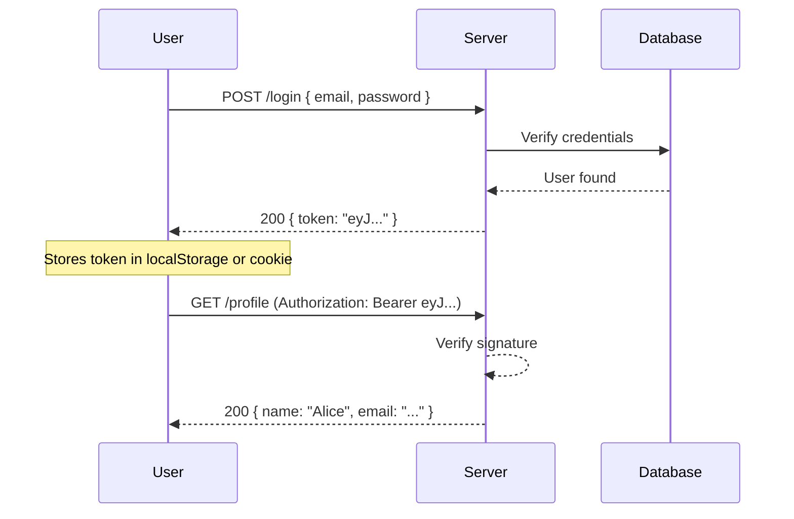

## What is JWT?

**JSON Web Token (JWT)** is an open standard (RFC 7519) that defines a compact and self-contained way for securely transmitting information between parties as a JSON object.

JWTs are commonly used for **authentication** and **information exchange**.

## JWT Structure

A JWT has three parts separated by dots:

```
header.payload.signature
```

```text
eyJhbGciOiJIUzI1NiIsInR5cCI6IkpXVCJ9
.eyJzdWIiOiIxMjM0NTY3ODkwIiwibmFtZSI6IkpvaG4iLCJpYXQiOjE1MTYyMzkwMjJ9
.SflKxwRJSMeKKF2QT4fwpMeJf36POk6yJV_adQssw5c
```

| Part | Description |
|------|-------------|
| **Header** | Algorithm + token type (`{"alg":"HS256","typ":"JWT"}`) |
| **Payload** | Claims — user data + expiration |
| **Signature** | `HMAC(base64(header) + "." + base64(payload), secret)` |

## Authentication Flow



## Implementation

```typescript
import jwt from 'jsonwebtoken';

const SECRET = process.env.JWT_SECRET!;

// Sign a token
function signToken(userId: string): string {
  return jwt.sign(
    { sub: userId, iat: Math.floor(Date.now() / 1000) },
    SECRET,
    { expiresIn: '15m' }
  );
}

// Verify a token
function verifyToken(token: string): jwt.JwtPayload {
  return jwt.verify(token, SECRET) as jwt.JwtPayload;
}

// Middleware
function authMiddleware(req, res, next) {
  const authHeader = req.headers.authorization;
  if (!authHeader?.startsWith('Bearer ')) {
    return res.status(401).json({ error: 'No token provided' });
  }

  const token = authHeader.slice(7);
  try {
    req.user = verifyToken(token);
    next();
  } catch {
    res.status(401).json({ error: 'Invalid or expired token' });
  }
}
```

## JWT vs Session

| Feature | JWT | Session |
|---------|-----|---------|
| Storage | Client-side | Server-side |
| Stateful | No | Yes |
| Scalability | Easy (no shared state) | Requires session store |
| Revocation | Difficult | Easy |
| Size | Larger (token in every request) | Small (session ID only) |
| Security | Vulnerable if secret leaks | Secure with httpOnly cookie |

:::warning Never store JWTs in localStorage for sensitive apps
Use `httpOnly` cookies to prevent XSS attacks from accessing your tokens. localStorage is accessible by JavaScript.
:::

:::revision
- JWT = Header.Payload.Signature — all base64 encoded.
- Signature is signed with a secret (HS256) or private key (RS256).
- JWTs are stateless — server verifies signature without DB lookup.
- Access tokens: short-lived (15 min). Refresh tokens: long-lived (7 days).
- Never store sensitive data in the JWT payload — it is only base64 encoded, not encrypted.
- Use `httpOnly; Secure; SameSite=Strict` cookies for storing tokens.
:::

:::interview
Q1. What are the three parts of a JWT?
A1. Header (algorithm + type), Payload (claims/data), and Signature (HMAC of header+payload using the secret).

Q2. Is the JWT payload encrypted?
A2. No. The payload is only base64-encoded, which means anyone can decode it. Never store sensitive data in the payload unless you use JWE (JSON Web Encryption).

Q3. How do you invalidate a JWT before it expires?
A3. JWTs are stateless, so you cannot invalidate them by default. Common solutions are: maintaining a token blacklist in Redis, using short expiry + refresh tokens, or rotating secrets.

Q4. What is the difference between HS256 and RS256?
A4. HS256 uses a single shared secret (symmetric). RS256 uses a private key to sign and a public key to verify (asymmetric) — better for distributed systems.
:::
