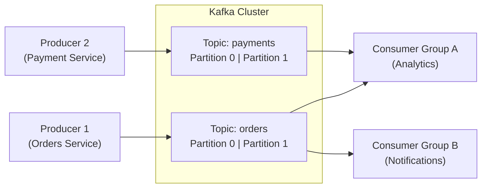

## What is Kafka?

Apache Kafka is a **distributed event streaming platform** designed for high-throughput, fault-tolerant, real-time data pipelines. It acts as a highly scalable **message broker**.

## Core Concepts

| Concept | Description |
|---------|-------------|
| **Producer** | Application that publishes events to topics |
| **Consumer** | Application that subscribes to and reads events |
| **Topic** | Named category/stream of events |
| **Partition** | Topic split for parallelism |
| **Broker** | Kafka server that stores messages |
| **Consumer Group** | Group of consumers sharing load of a topic |

## Architecture



## Producer Example (Node.js)

```typescript
import { Kafka } from 'kafkajs';

const kafka = new Kafka({ brokers: ['localhost:9092'] });
const producer = kafka.producer();

await producer.connect();

await producer.send({
  topic: 'orders',
  messages: [
    {
      key: 'order-123',
      value: JSON.stringify({ orderId: 123, status: 'created', amount: 99.99 }),
    },
  ],
});

await producer.disconnect();
```

:::revision
- Kafka is a distributed, fault-tolerant event streaming platform.
- Events are stored in topics, divided into partitions for parallelism.
- Kafka retains messages for a configurable period (default 7 days) — consumers can replay.
- Consumer groups allow multiple consumers to process a topic in parallel.
- Kafka is typically used for: event sourcing, log aggregation, real-time analytics, decoupling microservices.
:::
