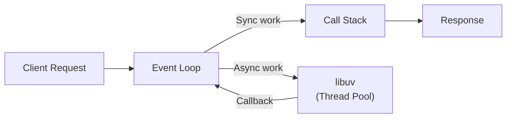

## What is Node.js?

Node.js is an open-source, cross-platform **JavaScript runtime environment** that executes JavaScript code outside of a browser. It uses the **V8 engine** (same as Google Chrome) and is built on an **event-driven, non-blocking I/O model**.

:::info Key Point
Node.js lets you run JavaScript on the server — not just in the browser.
:::

## Event Loop



## Non-Blocking I/O

```javascript
const fs = require('fs');

// ❌ Blocking (synchronous) — freezes event loop
const data = fs.readFileSync('large-file.txt', 'utf8');
console.log(data);

// ✅ Non-blocking (asynchronous) — continues event loop
fs.readFile('large-file.txt', 'utf8', (err, data) => {
  if (err) throw err;
  console.log(data);
});

console.log('This runs before the file is read!');
```

## Core Modules

| Module | Purpose |
|--------|---------|
| `fs` | File system operations |
| `http` | HTTP server/client |
| `path` | File path utilities |
| `os` | Operating system info |
| `events` | Event emitter |
| `stream` | Streaming data |
| `crypto` | Cryptographic functions |
| `process` | Current Node.js process |

:::revision
- Node.js runs JavaScript on the server using V8.
- Single-threaded, event-driven, non-blocking I/O.
- The event loop allows handling thousands of concurrent connections.
- `require()` for CommonJS, `import` for ES Modules.
- npm is the package registry for Node.js.
:::

:::interview
Q1. What is the Node.js event loop?
A1. The event loop is a mechanism that allows Node.js to perform non-blocking I/O operations. It offloads operations to the OS or thread pool, and when they complete, their callbacks are placed in a queue to be executed.

Q2. Is Node.js single-threaded?
A2. Node.js runs JavaScript in a single thread, but libuv (the underlying C library) uses a thread pool for certain I/O operations. So Node.js itself is single-threaded for your code, but not for all operations.
:::
