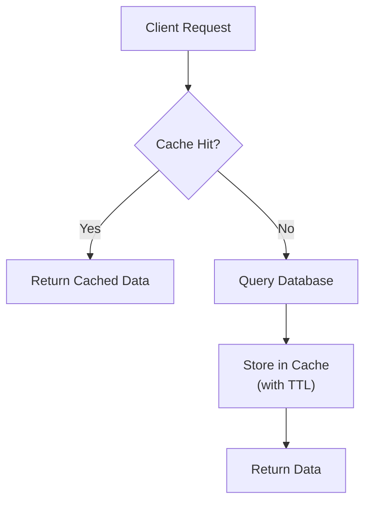

## What is Redis?

**Redis** (Remote Dictionary Server) is an open-source, in-memory key-value store. It supports various data structures and is most commonly used as a **cache**, **session store**, or **message broker**.

:::info Why is Redis so fast?
Redis stores all data in **RAM** rather than on disk. Operations are O(1) for most commands, and it's single-threaded (no lock contention).
:::

## Common Data Types

| Type | Commands | Use Case |
|------|----------|----------|
| String | `GET`, `SET`, `INCR` | Cache, counters |
| Hash | `HGET`, `HSET` | User profiles, objects |
| List | `LPUSH`, `RPOP` | Queues, activity feeds |
| Set | `SADD`, `SMEMBERS` | Tags, unique visitors |
| Sorted Set | `ZADD`, `ZRANGE` | Leaderboards, priority queues |

## Basic Commands

```bash
# Connect
redis-cli

# Strings
SET user:name "Alice"           # SET key value
GET user:name                   # "Alice"
SET counter 0
INCR counter                    # 1
EXPIRE user:name 3600           # Expire in 1 hour
TTL user:name                   # Seconds remaining

# Hashes (objects)
HSET user:1 name "Bob" age 30
HGET user:1 name                # "Bob"
HGETALL user:1                  # All fields

# Lists (queues)
RPUSH queue:emails "email1"
LPOP queue:emails               # Dequeue

# Sets
SADD active:users "user:1" "user:2"
SMEMBERS active:users
```

## Caching Pattern (Node.js)

```typescript
import { createClient } from 'redis';
import express from 'express';

const redis = createClient({ url: process.env.REDIS_URL });
await redis.connect();

const app = express();

app.get('/product/:id', async (req, res) => {
  const cacheKey = `product:${req.params.id}`;

  // 1. Check cache
  const cached = await redis.get(cacheKey);
  if (cached) {
    return res.json({ source: 'cache', data: JSON.parse(cached) });
  }

  // 2. Query database
  const product = await db.findProduct(req.params.id);
  if (!product) return res.status(404).json({ error: 'Not found' });

  // 3. Store in cache with 5 min TTL
  await redis.setEx(cacheKey, 300, JSON.stringify(product));

  res.json({ source: 'database', data: product });
});
```

## Caching Strategies



| Strategy | Description |
|----------|-------------|
| **Cache-Aside** | App checks cache first, writes to cache on miss |
| **Write-Through** | Write to cache and DB simultaneously |
| **Write-Behind** | Write to cache, async write to DB |
| **Read-Through** | Cache layer handles DB reads |

:::revision
- Redis is in-memory — extremely fast (microsecond latency).
- Main use cases: caching, sessions, rate limiting, pub/sub, queues.
- Data types: String, Hash, List, Set, Sorted Set.
- Use `EXPIRE` / `TTL` to manage cache lifetime.
- Redis is single-threaded but handles thousands of operations per second.
- Data persistence options: RDB (snapshots) and AOF (append-only file).
:::

:::interview
Q1. What is the difference between Redis and Memcached?
A1. Redis supports more data types (hash, list, set, sorted set), persistence, pub/sub, Lua scripting, and clustering. Memcached is simpler and only supports key-value strings. Redis is preferred in most modern applications.

Q2. What is a cache eviction policy in Redis?
A2. When Redis runs out of memory, it uses eviction policies to decide which keys to remove. Common ones: `allkeys-lru` (least recently used), `volatile-lru` (LRU among keys with TTL), `noeviction` (return error when full).

Q3. How would you implement rate limiting with Redis?
A3. Use INCR + EXPIRE. Increment a counter per user per time window. If counter exceeds limit, reject the request. Use Lua scripts for atomic operations.
:::
