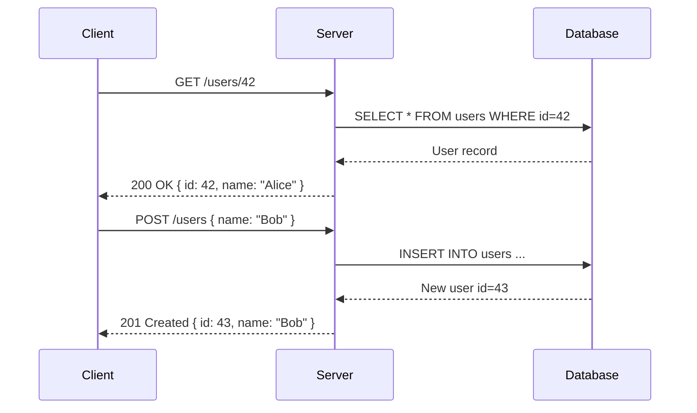

## Introduction

REST (Representational State Transfer) is an **architectural style** for designing networked applications. It was defined by Roy Fielding in his 2000 doctoral dissertation.

REST is **not a protocol** — it is a set of constraints that, when applied, make a web service scalable, stateless, and easy to consume.

:::info What is an API?
An **API** (Application Programming Interface) is a contract that allows two software systems to communicate. A REST API uses HTTP to expose resources.
:::

## Core Constraints

For a system to be RESTful, it must satisfy these constraints:

| Constraint | Description |
|-----------|-------------|
| **Client-Server** | UI and data storage are separated |
| **Stateless** | Each request contains all info needed; no session stored server-side |
| **Cacheable** | Responses must define whether they can be cached |
| **Uniform Interface** | Resources are identified by URLs; standard methods apply |
| **Layered System** | Client doesn't know if it talks to end server or intermediary |
| **Code on Demand** | (Optional) Server can send executable code to client |

## HTTP Methods

```http
GET    /users          → List all users
GET    /users/42       → Get user with id 42
POST   /users          → Create a new user
PUT    /users/42       → Replace user 42 entirely
PATCH  /users/42       → Partially update user 42
DELETE /users/42       → Delete user 42
```

:::tip Idempotency
An operation is **idempotent** if calling it multiple times produces the same result.
`GET`, `PUT`, `DELETE` are idempotent. `POST` is not.
:::

## HTTP Status Codes

```text
2xx  Success
  200 OK
  201 Created
  204 No Content

3xx  Redirection
  301 Moved Permanently
  304 Not Modified

4xx  Client Errors
  400 Bad Request
  401 Unauthorized
  403 Forbidden
  404 Not Found
  409 Conflict
  422 Unprocessable Entity

5xx  Server Errors
  500 Internal Server Error
  503 Service Unavailable
```

## Request / Response Flow



## Example: Node.js Express REST API

```typescript
import express, { Request, Response } from 'express';

const app = express();
app.use(express.json());

interface User {
  id: number;
  name: string;
  email: string;
}

const users: User[] = [
  { id: 1, name: 'Alice', email: 'alice@example.com' },
];

// GET all users
app.get('/users', (_req: Request, res: Response) => {
  res.json(users);
});

// GET single user
app.get('/users/:id', (req: Request, res: Response) => {
  const user = users.find((u) => u.id === Number(req.params.id));
  if (!user) return res.status(404).json({ error: 'User not found' });
  res.json(user);
});

// POST create user
app.post('/users', (req: Request, res: Response) => {
  const newUser: User = { id: Date.now(), ...req.body };
  users.push(newUser);
  res.status(201).json(newUser);
});

app.listen(3000, () => console.log('Server running on port 3000'));
```

## REST vs GraphQL vs gRPC

| Feature | REST | GraphQL | gRPC |
|---------|------|---------|------|
| Protocol | HTTP | HTTP | HTTP/2 |
| Data format | JSON/XML | JSON | Protobuf |
| Over-fetching | Common | Avoided | N/A |
| Flexibility | Medium | High | Low |
| Performance | Good | Good | Excellent |
| Learning curve | Low | Medium | High |

:::warning REST is not RPC
REST focuses on **resources** (nouns), not **actions** (verbs).
Use `/users/42/deactivate` as `POST /users/42/deactivate`, not `GET /deactivateUser?id=42`.
:::

:::revision
- REST is an architectural style using HTTP.
- Resources are identified by URLs (URIs).
- HTTP methods: GET (read), POST (create), PUT (replace), PATCH (update), DELETE (remove).
- REST is **stateless** — server stores no client state.
- Use proper HTTP status codes in responses.
- `200 OK`, `201 Created`, `400 Bad Request`, `404 Not Found`, `500 Server Error`.
- GET, PUT, DELETE are **idempotent**; POST is not.
:::

:::interview
Q1. What does REST stand for?
A1. Representational State Transfer. It is an architectural style for designing networked applications, not a protocol.

Q2. What does stateless mean in REST?
A2. Each HTTP request must contain all the information needed to be understood by the server. The server does not store any client session state between requests.

Q3. What is the difference between PUT and PATCH?
A3. PUT replaces the entire resource with the provided data. PATCH partially updates the resource — only the provided fields are changed.

Q4. What HTTP status code do you use when a resource is not found?
A4. 404 Not Found.

Q5. Is REST the same as HTTP?
A5. No. HTTP is a protocol. REST is an architectural style that commonly uses HTTP, but is not tied to it.
:::
