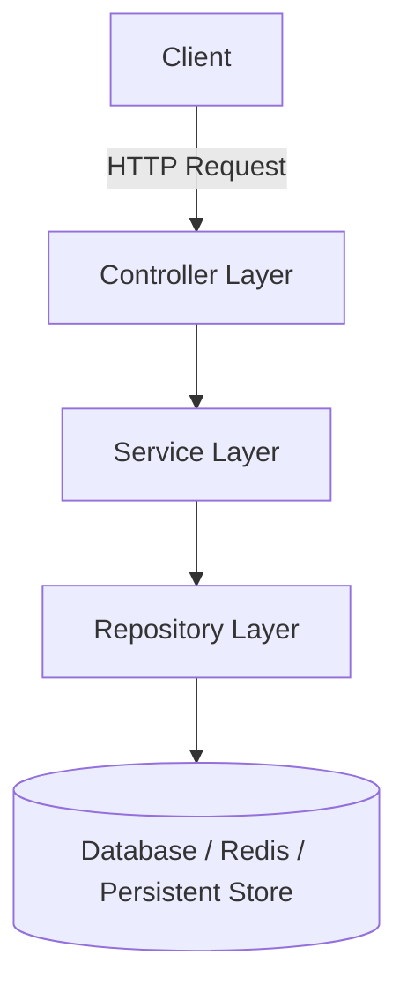
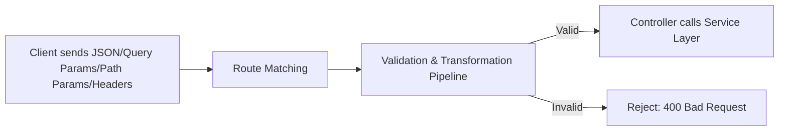
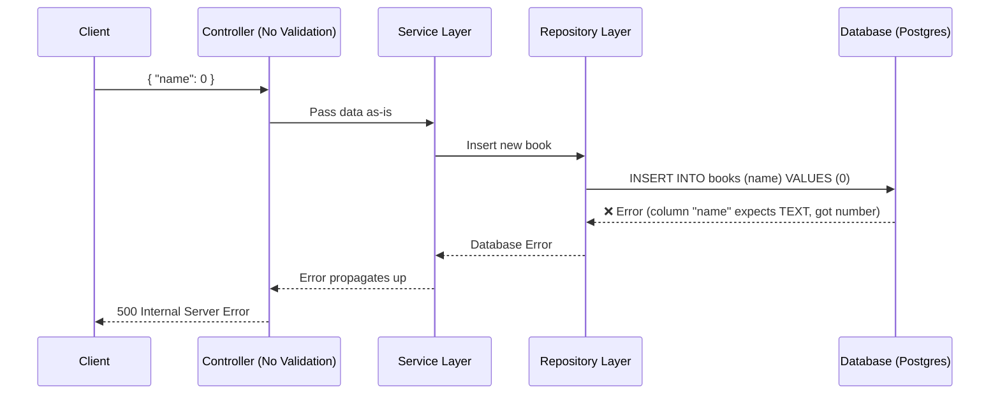
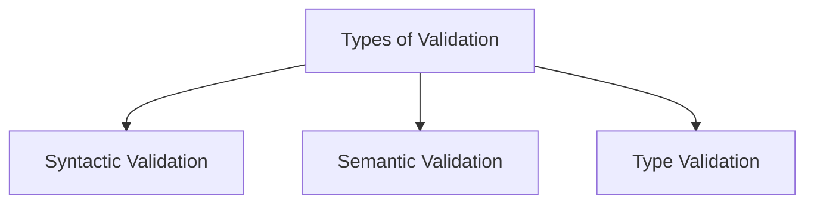
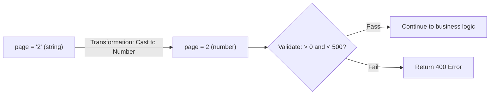
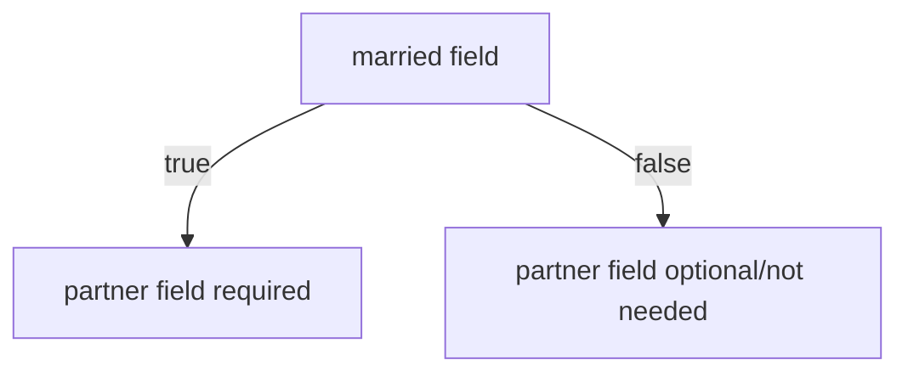
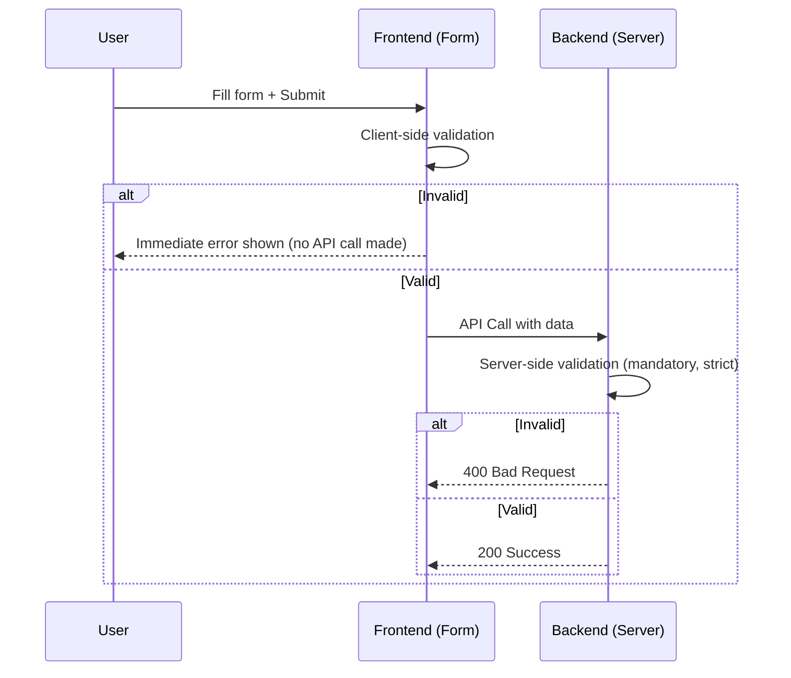

# Validations and Transformations

## 1. Overview

Ye topic bahut bada ya complex nahi hai — ye basically ek set of **rules aur guidelines** hai jo tumhe apni APIs design karte waqt dhyaan mein rakhne chahiye. Iska core focus hai **data integrity** aur **security**.

> 🧠 Remember
> Validation aur Transformation dono milke ek "gatekeeper" ka kaam karte hain — client se aane wala data server ke andar business logic tak pahunchne se pehle, ye check aur clean karte hain ki data sahi shape mein hai.

---

## 2. Why Do We Need This? — Backend Layered Architecture Ka Context

Pehle samajhte hain ki backend architecture mein validations/transformations exactly **kahan** fit hote hain.

Typical backend mein 3 layers hote hain:



| Layer                | Responsibility                                                                                           |
| -------------------- | -------------------------------------------------------------------------------------------------------- |
| **Repository Layer** | Database connections, queries — insert, delete, update, select                                           |
| **Service Layer**    | Business logic — repository methods call karna, notifications bhejna, emails bhejna, webhooks call karna |
| **Controller Layer** | HTTP-specific stuff — status codes, request/response format, **validations**                             |

> 💡 Important
> Controller aur Service layer ko alag isliye rakha jaata hai kyunki hum **HTTP-related concerns** (status codes, request format, validation) ko **business logic** se separate rakhna chahte hain. Controller layer client se data leta hai, service layer ko call karta hai, aur wapas client ko response deta hai.

Ek typical request flow: Client → Route matching → Controller method call → Service layer → (optionally) Repository layer → Response wapas client tak.

---

## 3. Where Exactly Do Validations & Transformations Happen?



> 🎯 Interview Tip
> Agar puchein "validation kahan honi chahiye?" — answer: **Route match hone ke turant baad, controller layer mein business logic execute hone se pehle** — yani sabse pehla entry point jahan client ka raw data server ke andar aata hai.

Validation/Transformation client se aane wale **kisi bhi tarah ke data** pe apply hota hai:

- JSON payload (request body)
- Query parameters
- Path parameters
- Headers

**Core Idea:** Jo bhi format ek particular API expect karta hai, hum confirm karte hain ki client ne data **exactly usi format mein** bheja hai — business logic execute karne se pehle.

---

## 4. Core Concept: Validation vs Transformation

|                         | Validation                                                                      | Transformation                                                     |
| ----------------------- | ------------------------------------------------------------------------------- | ------------------------------------------------------------------ |
| **Kya karta hai**       | Data ko check karta hai ki wo expected structure/rules follow karta hai ya nahi | Data ko ek format se doosre format mein convert karta hai          |
| **Example**             | "Kya `name` field required hai aur present hai?"                                | Query parameter ka string `"20"` ko number `20` mein convert karna |
| **Result agar fail ho** | Client ko error return hota hai (usually 400)                                   | N/A — ye process hai, pass/fail nahi                               |

Dono ko generally ek hi **pipeline** mein combine kiya jaata hai — isse saara "input data handling" logic ek jagah rehta hai, alag-alag jagah dhundhne ki zaroorat nahi padti.

---

## 5. Why Validate at the Entry Point? (Problem → Solution)

### Problem: Bina Validation Ke Kya Hota Hai

Socho ek API hai jo book create karti hai, aur expect karti hai ki `name` field ek **string** ho. Agar validation na ho, aur client `name: 0` (number) bhej de:



> ⚠️ Common Mistake
> Validation na hone ki wajah se galat-type data seedha **database tak pahunch jaata hai**. Database apna khud ka type-constraint check karta hai (jaise Postgres mein column `TEXT NOT NULL`), aur query **fail** ho jaati hai — jiska result hota hai ek generic aur **poor user experience wala `500 Internal Server Error`**.

### Solution: Entry Point Pe Hi Validate Karo

Agar validation pipeline entry point pe ho, to:

- Galat data turant reject ho jaata hai
- Client ko meaningful **`400 Bad Request`** milta hai ("aapka data hamare constraints satisfy nahi karta, sahi format mein retry karo")
- Database aur downstream layers tak invalid data **pahunchta hi nahi**

> 💭 Mental Model
> Validation pipeline ko socho jaise ek **security check at the airport** — passenger (data) plane (business logic/database) mein ghusne se pehle hi check ho jaata hai. Agar kuch galat hai, wahin turant rok diya jaata hai — plane ke andar jaake problem create nahi hone di jaati.

| Scenario                                                    | Response                                                  |
| ----------------------------------------------------------- | --------------------------------------------------------- |
| **Validation entry point pe hoti hai, data invalid hai**    | `400 Bad Request` — clear, actionable error               |
| **Validation nahi hoti, invalid data DB tak pahunchta hai** | `500 Internal Server Error` — generic, confusing, poor UX |

---

## 6. Types of Validation

Ye teen sabse common types hain jo tumhe practically milenge (exhaustive list nahi hai, requirement ke hisaab se aur bhi ho sakte hain).



### 6.1 Syntactic Validation

**Kya hai:** Check karna ki provided string ek particular **structure/pattern** follow karta hai ya nahi.

| Field        | Expected Structure                                        |
| ------------ | --------------------------------------------------------- |
| Email        | `local-part@domain.tld` (jaise `something@example.com`)   |
| Phone Number | Country code + fixed digits (country ke hisaab se varies) |
| Date         | Specific format — jaise `YYYY-MM-DD`                      |

> 💡 Important
> Syntactic validation ye nahi check karta ki data "makes sense" hai ya nahi — sirf ye check karta hai ki **structure/pattern** match ho raha hai ya nahi.

### 6.2 Semantic Validation

**Kya hai:** Check karna ki provided data **logically/semantically sense** karta hai ya nahi — chahe structure sahi ho.

**Examples:**

- **Date of Birth future mein nahi ho sakti** — agar aaj ki date `2025-01-11` hai, aur user `2025-01-13` (future date) de raha hai, to structurally to date sahi hai, lekin semantically galat hai
- **Age 365 nahi ho sakti** — ek number hai (type-wise sahi), lekin realistically ek insaan ki age 365 nahi ho sakti

> ⚠️ Common Mistake
> Syntactic aur semantic validation ko confuse karna. Syntactic = "kya format sahi hai?" | Semantic = "kya value logically valid hai?" Ek date `13/25/2025` jaisi galat format wali date **syntactic** error hai; ek future date jo format mein sahi hai lekin logically galat hai wo **semantic** error hai.

### 6.3 Type Validation

**Kya hai:** Basic check — field ka data type match ho raha hai ya nahi (string, number, boolean, array, object, etc.)

**Example:** Agar API expect kar rahi hai `numberField` ek **number** ho, aur client string bhejta hai, to error milega: `"expected number, received string"`. Isi tarah arrays ke andar bhi har element ka type check ho sakta hai (jaise "array ka har element string hona chahiye").

> 🎯 Interview Tip
> Agar interviewer teeno types ke beech difference puche, ek line mein yaad rakho: **Syntactic = format, Semantic = logic/sense, Type = data type**.

---

## 7. Transformation — Data Ko Convert Karna

**Transformation** ka matlab hai: client se aaye data pe kuch **operations** run karna taaki wo server/service layer ke expected format mein convert ho jaaye.

### Example: Query Parameter Casting

Query parameters HTTP mein **hamesha strings** hote hain — chahe unka intended meaning number ho.

```text
GET /bookmarks?page=2&limit=20
```

Yahan `page` aur `limit` **strings** ke roop mein server tak pahunchte hain (`"2"` aur `"20"`), lekin humari validation requirement hai:

- `page` → number, `> 0` aur `< 500`
- `limit` → number, `> 0` aur `< 10000`

Agar directly validation run kar di jaaye bina cast kiye, to validation **fail** ho jaayegi kyunki value string hai, number nahi.



> 💡 Important
> **Casting** basically ek data type ko forcefully doosre data type mein convert karne ka process hai. Yahan responsibility hai ki server (specifically validation/transformation pipeline) **query parameter string ko number mein cast kare**, tabhi hum uspe numeric validations (jaise range check) apply kar sakte hain.

### Other Examples of Transformation

- **Email normalization** — `Test@Gmail.COM` ko lowercase mein convert karna: `test@gmail.com`
- **Phone number formatting** — agar user `+` character nahi deta, server automatically add kar sakta hai
- **Date reformatting** — ek format mein aayi date ko service layer ke expected format mein convert karna

> 🧠 Remember
> Transformation validation se **pehle bhi** ho sakti hai (jaise string-to-number casting taaki validation possible ho paaye) aur validation ke **baad bhi** ho sakti hai (jaise validated data ko service layer ke liye convenient format mein badalna).

---

## 8. Complex Validation Patterns (Cross-Field & Conditional)

Validation sirf single-field checks tak limited nahi hai — real-world APIs mein **multi-field, conditional rules** bhi zaroori hote hain.

### Example 1: Field Matching (Password Confirmation)

**Requirement:** `password` aur `passwordConfirmation` field ka value **match** hona chahiye.

- Agar dono strings alag hain → error: `"passwords don't match"`
- Password ke liye khud ka bhi constraint ho sakta hai — jaise `"minimum 8 characters"`

### Example 2: Conditional Required Fields

**Requirement:** Agar `married = true` hai, to `partner` field **required** ho jaata hai. Agar `married = false` hai, to `partner` field ki zaroorat nahi.



> 🎯 Interview Tip
> Ye pattern (conditional validation based on another field's value) real interviews mein aksar puchha jaata hai — libraries jaise Zod (`.superRefine`), Yup, ya Joi mein isko custom refinement logic se implement kiya jaata hai.

> 💡 Extra Context
> Ye specific implementation detail (jaise Zod/Yup/Joi library ka use) transcript mein directly discuss nahi hua, sirf concept discuss hua tha — ye standard background knowledge hai backend validation libraries ke context mein.

---

## 9. Frontend Validation vs Backend Validation

Ye ek **bahut common confusion/mistake** hai jo naye developers karte hain — frontend validation ko backend validation ka substitute samajhna.

### Typical Confusion

Ek form hai jisme `name` field hai. User type karta hai, aur agar frontend validation pass ho jaaye (character limits, type match, etc.), to hi `Submit` button API call karta hai. Agar validation fail ho, to form mein hi error dikha diya jaata hai — API call hota hi nahi.

> ⚠️ Common Mistake
> Ye sochna ki agar frontend validation ho rahi hai, to backend validation ki zaroorat nahi — ya backend validation ko halka rakh dena.

### Why This Is Wrong

|                              | Frontend Validation                                                                                                          | Backend Validation                                    |
| ---------------------------- | ---------------------------------------------------------------------------------------------------------------------------- | ----------------------------------------------------- |
| **Purpose**                  | **UX (User Experience)** — turant feedback dena user ko                                                                      | **Security aur Data Integrity**                       |
| **Kab bypass ho sakta hai?** | Bahut asaani se — API client tools (Postman, Insomnia) directly API ko hit kar sakte hain, koi frontend involve hi nahi hota | Nahi ho sakta — ye server ka last line of defense hai |
| **Kya zaroori hai?**         | Achhi UX ke liye recommended                                                                                                 | **Mandatory** — bina isske server unsafe hai          |

> 💡 Important
> Server ke multiple clients ho sakte hain — ek convenient web app jo apni khud ki validation kare, ya ek **API client (Postman/Insomnia)** jahan **koi frontend hi nahi hai**. Agar backend, security ke liye frontend validation pe depend karta hai, to jaise hi koi client badalta hai (ya koi seedha API ko hit karta hai), **server break ho jaayega**.

> 🧠 Remember
> **Client validation → User Experience ke liye.**
> **Server validation → Security aur Data Integrity ke liye — hamesha mandatory, chahe client kuch bhi ho.**

### How They Work Together



Frontend validation **fast feedback loop** deta hai (koi network call nahi lagti), jabki backend validation **final, mandatory security gate** hai jo kisi bhi client se aaye data pe apply hoti hai.

---

## 10. Advantages of a Proper Validation/Transformation Pipeline

- **Data Integrity** — sirf clean, expected-format data hi business logic aur database tak pahunchta hai
- **Security** — malicious ya malformed input pehle hi reject ho jaata hai
- **Better Error Messages** — client ko `400 Bad Request` ke saath specific reason milta hai, na ki generic `500` error
- **Self-Documenting APIs** — validation error messages khud hi bata dete hain API ko konse fields chahiye, kis format mein — agar proper documentation available na ho to bhi
- **Centralized Logic** — validation aur transformation ek hi pipeline mein hone se, saara "input handling" logic ek jagah milta hai

---

## 11. Common Mistakes

> ⚠️ Common Mistake
> **Validation na karke seedha data ko service/repository layer tak bhej dena** — isse invalid data database tak pahunch sakta hai aur generic `500` errors create karta hai.

> ⚠️ Common Mistake
> **Query parameters ko bina cast kiye directly numeric validation apply karna** — query params hamesha strings hote hain, pehle unhe cast karna zaroori hai.

> ⚠️ Common Mistake
> **Frontend validation ko backend validation ka replacement samajhna** — API clients (Postman/Insomnia) jaise tools frontend ko bypass kar sakte hain.

> ⚠️ Common Mistake
> **Syntactic aur semantic validation ko mix-up karna** — format check alag hai, "does it make sense" check alag hai.

---

## 12. Comparison Table — Validation Types Summary

| Type          | Checks                      | Example                                                 |
| ------------- | --------------------------- | ------------------------------------------------------- |
| **Syntactic** | Structure/pattern match     | Email format, phone number pattern, date format         |
| **Semantic**  | Value logically makes sense | Date of birth not in future, age within realistic range |
| **Type**      | Data type match             | String vs number vs boolean vs array                    |

---

## 13. Real-World Usage

- Har production-grade REST API mein request body/query params/path params pe validation middleware hota hai (jaise Express.js ke saath Zod/Joi/Yup, ya NestJS ke class-validator)
- Form-heavy applications (signup, checkout, profile update) mein cross-field validation (password confirmation, conditional required fields) common hai
- Pagination APIs (`page`, `limit` query params) mein transformation (string → number casting) almost hamesha zaroori hoti hai

---

## 14. Interview Questions

### Basic

**Q. Validation aur Transformation mein kya farak hai?**
**Answer:** Validation data ko check karta hai ki wo expected rules/structure follow karta hai ya nahi (pass/fail). Transformation data ko ek format se doosre format mein convert karta hai (jaise string ko number mein cast karna).

**Q. Validation kahan honi chahiye backend architecture mein?**
**Answer:** Route match hone ke turant baad, controller layer mein — business logic (service layer call) execute hone se pehle. Ye pehla entry point hota hai jahan client ka data server ke andar aata hai.

**Q. Validation na karne pe kya galat response client ko milta hai?**
**Answer:** Agar invalid data database tak pahunch jaata hai aur wahan database-level constraint fail hoti hai, to client ko generic `500 Internal Server Error` milta hai — jo poor user experience hai. Validation hone pe client ko meaningful `400 Bad Request` milta.

### Intermediate

**Q. Query parameters ke saath transformation ki zaroorat kyun padti hai?**
**Answer:** Kyunki HTTP query parameters hamesha **strings** ke roop mein server tak pahunchte hain, chahe unka intended data type kuch bhi ho (number, boolean, etc.). Agar numeric validation (jaise range check) apply karni ho, to pehle string ko number mein **cast** karna zaroori hai — yehi transformation hai.

**Q. Semantic validation ka example do jo type validation na pakad paaye.**
**Answer:** Age field jahan value `365` di gayi ho — type-wise ye ek valid number hai, isliye type validation ise pass kar degi. Lekin semantically ek insaan ki age 365 nahi ho sakti — isliye semantic validation ise reject karegi.

**Q. Frontend validation ko backend validation se replace karna kyun galat hai?**
**Answer:** Kyunki server ke multiple clients ho sakte hain jinme se sabme frontend involve nahi hota — jaise Postman/Insomnia jaise API clients directly server ko hit karte hain, koi frontend validation layer beech mein nahi hoti. Agar server security/data-integrity ke liye frontend pe depend karta hai, to koi bhi client jo frontend ko bypass karta hai, unvalidated data bhej sakta hai — server compromise ho sakta hai.

### Advanced

**Q. Ek conditional validation rule design karo jahan field B, field A ki value pe depend karta ho. Isko kis layer mein implement karoge aur kyun?**
**Answer:** Example: agar `married = true`, to `partner` field required ho jaata hai. Ye logic validation/transformation pipeline mein hi implement hona chahiye (controller layer ke entry point pe), kyunki ye bhi ek input-shape correctness ka concern hai — business logic (service layer) mein pahunchne se pehle hi confirm ho jaana chahiye ki required combination of fields present hai.

**Q. Agar tumhare paas ek API hai jahan validation pipeline missing hai aur production mein intermittent `500` errors aa rahe hain jab specific clients galat type ka data bhejte hain, to tum is issue ko kaise debug aur fix karoge?**
**Answer:** Pehle logs check karke pata lagana ki error database-level type-constraint violation se aa raha hai (jaise Postgres column type mismatch). Fix ke roop mein, controller layer ke entry point pe ek validation-transformation pipeline add karna — jisme syntactic, semantic, aur type validations honi chahiye jo API ke exact requirements ke against check karein, aur invalid input pe turant `400 Bad Request` return karein — isse invalid data database tak pahunchna hi band ho jaayega.

---

## ⚡ Quick Revision

- Validation & Transformation **controller layer ke entry point** pe hoti hai — route matched hone ke baad, business logic run hone se pehle
- **Validation** = check karna ki data expected structure/rules follow karta hai (pass/fail)
- **Transformation** = data ko ek format se doosre format mein convert karna (jaise casting)
- Bina validation ke, invalid data seedha database tak pahunch sakta hai → generic **`500 Internal Server Error`**
- Validation hone pe, invalid data reject ho jaata hai turant → meaningful **`400 Bad Request`**
- Teen main validation types: **Syntactic** (format/pattern), **Semantic** (logical sense), **Type** (data type match)
- Query parameters hamesha **strings** hote hain — numeric validation se pehle **casting/transformation** zaroori hai
- Complex validation = **cross-field matching** (password confirmation) + **conditional required fields** (married → partner required)
- **Frontend validation = UX ke liye** | **Backend validation = Security aur Data Integrity ke liye, hamesha mandatory**
- API clients (Postman/Insomnia) frontend validation ko bypass kar sakte hain — isliye backend validation kabhi bhi frontend pe depend nahi karni chahiye

---

## 🧠 Final Mental Model

```text
Client Data (JSON / Query Params / Path Params / Headers)
     ↓
Route Matching
     ↓
Validation & Transformation Pipeline
     ├── Transformation (cast types, normalize values)
     ├── Syntactic Validation (format check)
     ├── Semantic Validation (logical sense check)
     ├── Type Validation (data type check)
     └── Cross-field / Conditional Validation
     ↓
Valid? ──No──→ 400 Bad Request (reject early)
     │
    Yes
     ↓
Controller → Service Layer → Repository Layer → Database
     ↓
Response to Client
```

Validation aur Transformation ka poora point ye hai: **server ke andar sirf clean, predictable, expected-shape data hi entry paaye.** Ye ek gatekeeper hai jo galat data ko jitni jaldi ho sake reject kar deta hai — taaki business logic aur database ko unexpected states se bachaya ja sake, aur client ko useful, actionable error messages mil saken.
