# Authentication and Authorization

## 1. Overview

Authentication aur Authorization backend engineering ke sabse fundamental aur roz-marra use hone waale concepts hain. Har jagah jahan login screen dikhti hai, signup form aata hai — wahan yehi dono concepts kaam kar rahe hote hain.

Do sentences mein samajho:

> 🧠 Remember
> **Authentication** = "Tum kaun ho?" (identity verify karna, ek subject ko identity assign karna)
> **Authorization** = "Tum kya kar sakte ho?" (permissions/capabilities decide karna)

Dono ek particular **context** mein evaluate hote hain — context matlab koi platform, operating system, phone, ya koi bhi system.

---

## 2. Why Do We Need This? — Historical Journey

Authentication ek din mein invent nahi hua — ye ek **evolution** hai. Is history ko samajhna zaroori hai kyunki isi se pata chalta hai ki **har naya mechanism kis problem ko solve karne ke liye aaya**.

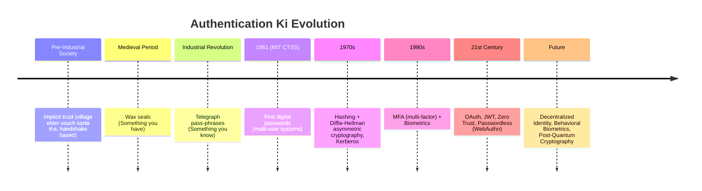

### Step-by-step Story

1. **Pre-Industrial Societies (Implicit Trust)**
   Identity, subject ki **recognition** ke barabar thi. Village elder jaise trusted log kisi ke liye vouch kar dete the, aur deals **handshake** se seal hoti thi. Ye trust pure **human contextual trust** pe based tha.

   > ⚠️ Problem: Jaise-jaise population badhi aur interactions familiar circles se bahar gaye, ye implicit trust **scale nahi kar paya** — ek gaanv ka elder doosre desh/continent mein trusted nahi hota.

2. **Medieval Period — Seals aur Cryptography ka Genesis**
   Society ko ek aisa system chahiye tha jo personal recognition se aage scale kare. Isliye **wax seals** aaye — unique pattern wali seals jo documents/letters pe lagayi jaati thi, jo aaj ke **signatures** ka early form thi.
   - Ye ek **"something you have"** (possession-based) authentication tha
   - Seals **forge** ki ja sakti thi — isi wajah se **pehla recorded authentication bypass attack** hua
   - Isse watermark aur encrypted codes jaisi advanced mechanisms evolve hui

3. **Industrial Revolution — Pass-phrases aur Shared Secrets**
   Telegraph ek critical infrastructure ban gaya, aur operators **pre-agreed pass-phrases** use karne lage — ye static passwords ka early form tha.

   > 💡 Important
   > Ye principle **"something you possessed"** (seal) se shift hoke **"something you know"** (password/pass-phrase) ban gaya — jo security ke liye ek better step tha kyunki ye tumhare dimaag mein hota hai, physically chhina nahi ja sakta.

4. **Mainframes & 1961 — Digital Authentication Ka Janam**
   MIT ke Project MAC mein researchers ne **CTSS (Compatible Time-Sharing System)** pe kaam karte hue multi-user systems ke liye passwords introduce kiye.

   > ⚠️ Common Mistake (Historical)
   > Password **plain text** mein store kiye jaate the. Jab kisi ne galti se password file printer se print kar di, tab ye vulnerability samne aayi — yehi incident **secure password storage** (hashing) ki philosophy ka genesis bana.

5. **Hashing Ka Introduction**
   Hashing ek cryptographic algorithm hai jo:
   - Plain text input leta hai
   - Use ek **fixed-length**, irreversible string mein convert karta hai
   - Same input ke liye **hamesha same output** deta hai

   > 💭 Mental Model
   > Hashing ko socho jaise ek **blender** — chahe tum 3 letter ka string daalo ya 100 letter ka, output hamesha same size ka "smoothie" (hash) hoga, aur usse wapas original ingredients (plain text) nikaalna practically impossible hai.

6. **1970s — Asymmetric Cryptography (Diffie-Hellman)**
   Whitfield Diffie aur Martin Hellman ne **Diffie-Hellman key exchange** introduce kiya — jisse do parties ek **untrusted medium** pe bhi ek shared secret establish kar sakte the. Ye **asymmetric cryptography** ka foundation bana, jo aaj **PKI (Public Key Infrastructure)** ka backbone hai.

   Isi era mein **Kerberos** protocol aaya jo **ticket-based authentication** leke aaya — ye modern **token-based authentication** ka precursor tha.

7. **1990s — Internet Growth aur MFA**
   Simple username-password brute-force aur dictionary attacks ke against kaafi nahi tha. Isliye **MFA (Multi-Factor Authentication)** aaya, jo teen principles combine karta hai:

   | Factor             | Matlab                      | Example                   |
   | ------------------ | --------------------------- | ------------------------- |
   | Something you know | Knowledge-based             | Password, PIN             |
   | Something you have | Possession-based            | Smart card, OTP generator |
   | Something you are  | Inherence-based (Biometric) | Fingerprint, retina scan  |

   > ⚠️ Limitation: Biometric authentication bhi perfect nahi tha — false positives, false negatives, aur template security jaisi challenges aayi.

8. **21st Century — Modern Authentication**
   Cloud computing, mobile devices, aur API-based architectures ki demand ki wajah se advanced frameworks aaye: **OAuth**, **JWT**, **Zero Trust Architecture**, aur **Passwordless authentication (WebAuthn)** — jo hardware mein stored public/private key pairs use karke passwords ko poori tarah eliminate karta hai.

9. **Future Candidates**
   - **Decentralized Identity** (blockchain-based, abhi early stage mein)
   - **Behavioral Biometrics**
   - **Post-Quantum Cryptography** — quantum computers aane ke baad aaj ke RSA jaise cryptographic algorithms break ho sakte hain, isliye quantum-resistant algorithms pe kaam ho raha hai

> 🎯 Interview Tip
> Agar interviewer history-based question puche, to key transition yaad rakho: **"Something you have" (seals) → "Something you know" (passwords) → "Something you are" (biometrics) → Combination (MFA) → Stateless tokens (JWT/OAuth)**.

---

## 3. Three Core Building Blocks

Authentication/Authorization discuss karne se pehle, teen aise components samajhna zaroori hai jo baar-baar aayenge: **Sessions**, **JWT**, aur **Cookies**.

### 3.1 Sessions

**Problem:** HTTP by design **stateless** hai — har request ek isolated interaction hoti hai, server ko previous request ka koi memory nahi hota. Ye static websites (jahan sirf padhna hota tha) ke liye theek tha, lekin jab web **dynamic** ho gaya (e.g., e-commerce cart, logged-in state maintain karna), to statelessness ek **bottleneck** ban gayi.

**Solution: Session** — server-side temporary context jo user ko "remember" karta hai.

#### Session Workflow

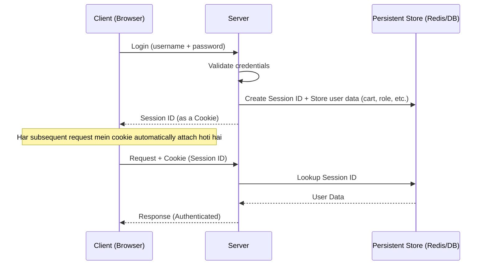

Steps:

1. **Session Creation** — Login successful hone pe server ek unique **Session ID** generate karta hai, aur usse related user data (role, cart items, auth status) ek **persistent store** mein bundle karke store karta hai
   - Persistent store: Database (file-based) ya **Redis** (in-memory — fast access ke liye zyada popular)
2. **Session ID Delivery** — Session ID client ko **cookie** ke through bheja jaata hai
3. **Subsequent Requests** — Har request mein cookie automatically attach hoti hai, server us Session ID se persistent store mein lookup karke user ko identify karta hai
4. **Expiry** — Sessions **short-lived** hote hain (e.g., 15 minutes). Expire hone ke baad naya session banta hai

#### Storage Evolution of Sessions

| Era             | Storage Mechanism                   | Limitation                                             |
| --------------- | ----------------------------------- | ------------------------------------------------------ |
| Early           | File-based sessions                 | Scalability issues                                     |
| Next            | Database-backed sessions            | Better, persistent across restarts, but slower lookups |
| Distributed Era | In-memory stores (Redis, Memcached) | Fast, scalable across distributed systems              |

---

### 3.2 JWT (JSON Web Token)

**Problem (Why JWT?):** By mid-2000s, web apps globally distributed ho gaye. Session-based (stateful) approach mein do major bottlenecks aaye:

1. **Memory overhead** — Millions of users ke liye session data maintain karna costly ho gaya
2. **Replication issues** — Distributed architecture mein alag-alag regions ke servers ke beech session data **synchronize** karna latency aur consistency challenges leke aaya

**Solution:** JWT — ek **stateless mechanism** (formalized in 2015) jisse claims (user info) ek self-contained token ke through transfer kiye ja sakte hain, bina kisi persistent lookup ke.

#### JWT Structure

JWT ek Base64-encoded string hai jiske **3 parts** hote hain, `.` (dot) se separated:

```text
HEADER.PAYLOAD.SIGNATURE
```

| Part          | Content                                                                                    | Purpose                                                                      |
| ------------- | ------------------------------------------------------------------------------------------ | ---------------------------------------------------------------------------- |
| **Header**    | Metadata — jaise signing algorithm                                                         | Batata hai JWT kaise sign hua                                                |
| **Payload**   | Actual data — `sub` (user ID), `iat` (issued at), aur optional fields jaise `name`, `role` | User ke baare mein information                                               |
| **Signature** | Cryptographic signature (secret key se generate hoti hai)                                  | Tamper-detection — verify karta hai ki token genuine hai aur modify nahi hua |

> 💡 Important
> `sub` field mein user ID store hota hai (kisi bhi context ka — database ID, auth provider ID, etc.). `iat` field batata hai token kab issue hua (issued at). Signature verify karne ke liye server apni **secret key** use karta hai — agar koi JWT ke content ko tamper karta hai, signature verification **fail** ho jaayegi.

#### JWT Ke Advantages

1. **Statelessness** — Server-side storage cost khatam, kyunki saari info token ke andar hi hoti hai
2. **Scalability** — Microservices/distributed architecture mein multiple servers ek hi **shared secret key** use karke JWT verify kar sakte hain — bina session data share kiye
3. **Portability** — Lightweight, URL-friendly (Base64), cookie/local storage/headers kisi bhi jagah easily carry ho sakta hai

#### JWT Ke Disadvantages

1. **Token Theft** — Agar kisi ko tumhara JWT mil jaaye, wo tumhara impersonate kar sakta hai jab tak token expire nahi hota
2. **Revocation Problem** — Stateless hone ki wajah se, ek baar issue hua token **manually revoke nahi ho sakta** — sirf secret key change karke sab users ko logout kiya ja sakta hai (jo bahut inconvenient hai)

> ⚠️ Common Mistake
> Ye sochna ki JWT hamesha "more secure" hai session se — actually JWT ka trade-off ye hai ki revocation control lose ho jaata hai.

#### Hybrid Approach (Blacklist)

Kuch systems JWT ke saath ek **blacklist** maintain karte hain (Redis/DB mein) taaki specific tokens ko temporarily block kiya ja sake.

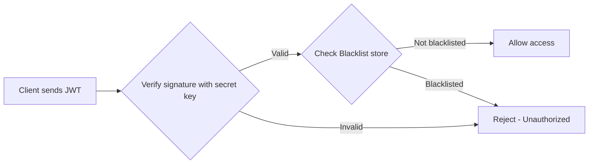

> 🎯 Interview Tip
> Agar interviewer puche "Blacklist use karne ka matlab to phir stateful approach ho gayi, JWT ka fayda kya raha?" — answer: Ye ek **trade-off** hai. Blacklist ek chhota, targeted lookup hai (sirf revoked tokens ke liye), poore session data ka lookup nahi. Isliye JWT ka bulk of the benefit (self-contained user data) still milta hai.
>
> Industry ki practical advice: Agar production system bana rahe ho, apna khud ka authentication implement karne ke bajaye, established **Auth providers** (jaise Auth0, Clerk) use karo — unhe security, hashing, salting jaisi complexities khud handle karni padti hain. Apna khud ka auth sirf **learning purpose** ke liye implement karo.

---

### 3.3 Cookies

**Cookie** ek mechanism hai jisse server, client ke browser mein kuch information (koi bhi string/value) store kar sakta hai.

Key characteristics:

- Server se set hoti hai, client ke browser mein store hoti hai
- Ek server sirf apni khud ki set ki hui cookie access kar sakta hai (doosre server ki cookie nahi dekh sakta) — ye ek **security feature** hai
- Cookie set hone ke baad, wo **automatically** har subsequent request ke saath us server ko bhej di jaati hai

#### Cookie-Based Auth Flow

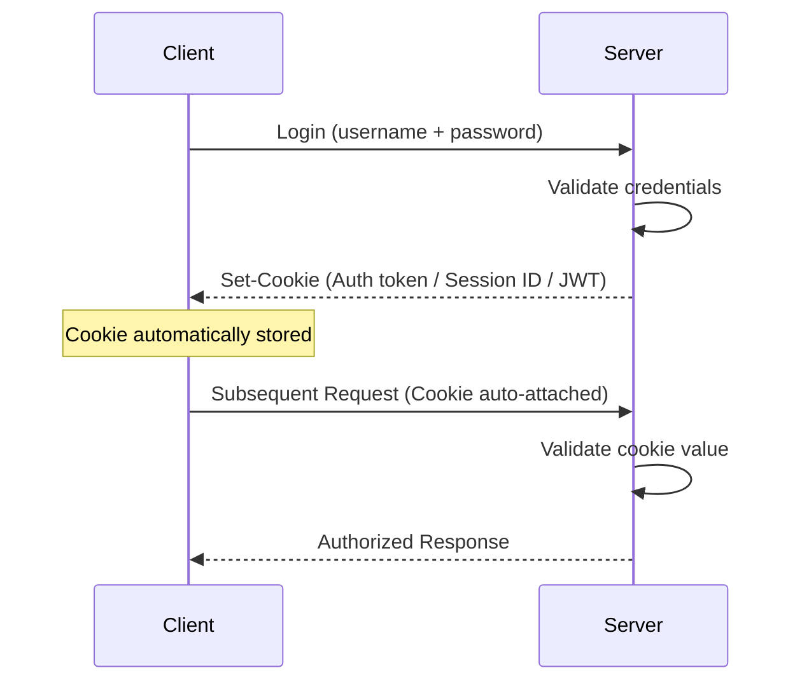

> 💡 Important
> Cookie sirf ek **delivery mechanism** hai — usme session ID, JWT, ya kuch bhi ho sakta hai. Iska value depend karta hai implementation pe. Iska real fayda ye hai ki ye process **automate** karti hai — client ko manually token attach karne ki zaroorat nahi padti.

---

## 4. Types of Authentication

Ab tak humne teen building blocks dekhe (Sessions, JWT, Cookies). Ab dekhte hain in components ka use karke **authentication ke major types** kya hain.

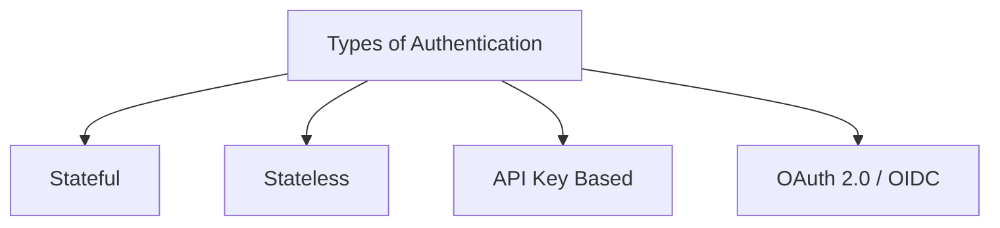

### 4.1 Stateful Authentication

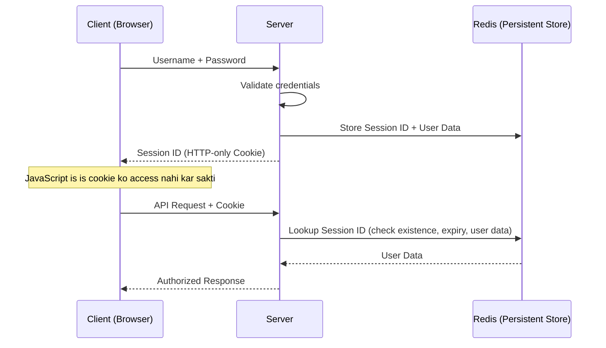

- Session ID **HTTP-only cookie** mein store hoti hai — matlab **JavaScript** us cookie ki value access nahi kar sakti (XSS attacks se protection)
- Session ID ka format flexible hai — koi cryptographically random string ho sakta hai, ya JWT bhi ho sakta hai — depends on implementation

### 4.2 Stateless Authentication

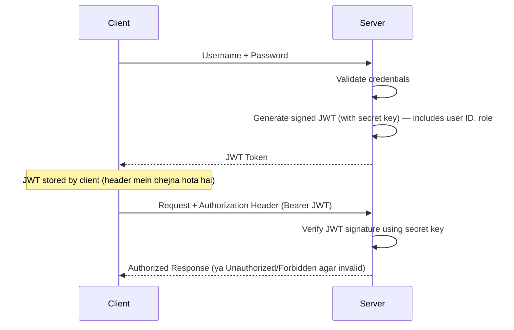

- Server ko koi persistent store lookup **nahi** karna padta — saari user info JWT ke andar hi hoti hai
- Verification sirf secret key se signature check karke hoti hai — isi wajah se ise **stateless** kehte hain

### 4.3 Stateful vs Stateless — Comparison

| Aspect                   | Stateful (Session)                                                                                   | Stateless (JWT)                                                          |
| ------------------------ | ---------------------------------------------------------------------------------------------------- | ------------------------------------------------------------------------ |
| Storage                  | Server-side persistent store (Redis/DB) chahiye                                                      | Koi storage lookup nahi chahiye                                          |
| Control                  | **Centralized control** — real-time active sessions dekh sakte ho, easily revoke/logout kar sakte ho | Revocation **complex** hai — token expire hone tak valid rehta hai       |
| Scalability              | Distributed systems mein latency/complexity zyada                                                    | Highly **scalable**, distributed-friendly                                |
| Best For                 | Web apps, SaaS platforms jahan strict session control chahiye                                        | APIs, mobile apps, microservices jahan tokens carry karte hain user info |
| Session store dependency | Haan                                                                                                 | Nahi                                                                     |

> 🎯 Interview Tip
> Common opinion (jo video mein bhi mention hui): Zyada tar applications ke liye **stateful authentication** better hai kyunki security aur revocation control zyada important hote hain most SaaS use-cases mein. Lekin distributed/mobile-heavy systems ke liye **stateless** zyada practical hai.

#### Hybrid Approach (Real-World Practice)

- **Web app (browser)** clients ke liye → **Stateful authentication**
- **Mobile apps / third-party integrations / server-to-server** clients ke liye → **Stateless authentication**

Isse dono approach ke fayde ek saath mil jaate hain.

---

### 4.4 API Key Based Authentication

**Use case:** Jab access **human interaction** ke liye nahi, balki **machine-to-machine communication** ke liye chahiye.

#### Client-to-Server (Human) vs Machine-to-Machine

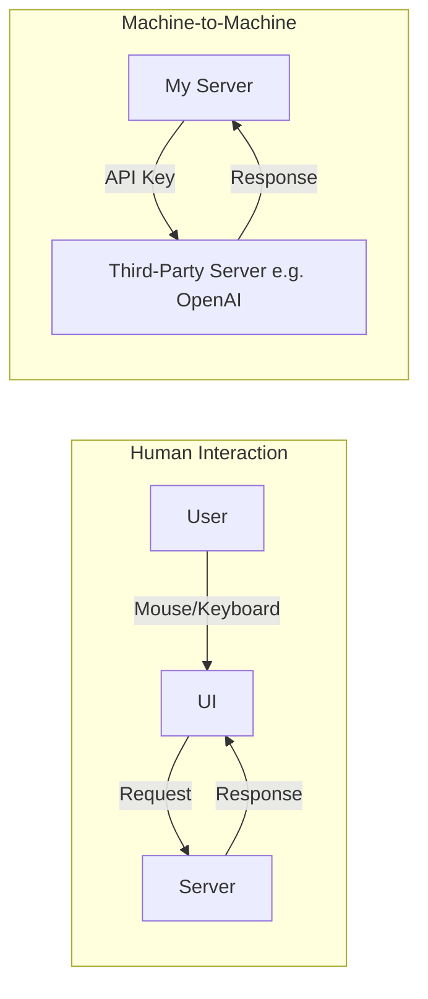

**Example:** Chat GPT ki UI use karna = human interaction. Lekin agar tumhara khud ka server programmatically OpenAI ke model ko call karta hai (bina UI ke, code se) — ye **machine-to-machine communication** hai, jahan **API Key** use hoti hai.

#### Kaise Kaam Karta Hai

1. Platform ki UI pe jaake "Generate API Key" click karte ho
2. Ek cryptographically-safe random string milti hai
3. Is key ko header mein attach karke, apne server se target server ko programmatically request bhejte ho
4. Target server key ko validate karke, associated permissions/quota/identity ke hisaab se access deta hai

**Advantages:**

- Generate karna **easy** hai (ek click)
- **Machine-to-machine** communication ke liye ideal — koi manual login form/human trigger nahi chahiye
- **Confined access** provide kiya ja sakta hai — specific permissions, expiry dates ke saath

---

### 4.5 OAuth 1.0, OAuth 2.0 aur OpenID Connect (OIDC)

#### Problem: Delegation

Jaise-jaise platforms badhe, ek naya use-case emerge hua: **ek platform ko doosre platform ke resources ki zaroorat padi** — programmatically. Examples:

- Travel/booking app ko Gmail access chahiye (flight tickets scan karne ke liye)
- Social media app ko Google Contacts import karne hain

Ye problem **delegation problem** kehlaata hai — ek platform doosre platform ke resource ko access kare, **user ki taraf se**.

**Initial (bad) solution:** Log apna **password share** karne lage. Ye disastrous tha:

1. Password sharing = **full access** dena — kuch bhi limit nahi kar sakte
2. Access revoke karna almost **impossible** tha bina password change kiye — aur wo bhi sab jagah change karna padta tha

#### OAuth 1.0 (2007) — Token Sharing

Solution: **Passwords ki jagah tokens share karo.** Token ke paas **specific, limited permissions** hoti hain (unlike password jo full access deta hai).

**Key Components:**

| Component                | Role                          | Example              |
| ------------------------ | ----------------------------- | -------------------- |
| **Resource Owner**       | Data ka asli owner            | Tum (user)           |
| **Client**               | Access maang raha app         | Facebook             |
| **Resource Server**      | Jahan data stored hai         | Google               |
| **Authorization Server** | Token issue karne wala server | Google's Auth Server |

**OAuth 1.0 Flow:**

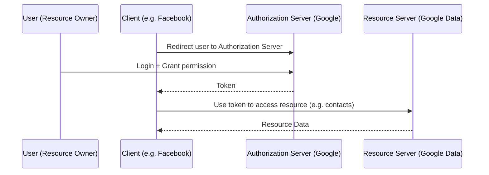

**OAuth 1.0 Limitations:**

1. Developers ke liye implement karna **very complex** tha
2. **Cryptographic signatures** use karta tha jo error-prone thi

#### OAuth 2.0 (~2010) — Simplified

**Improvements:**

1. **Bearer tokens** introduce kiye — bahut zyada simpler (though thoda zyada vulnerable, lekin implementation ease trade-off worth tha)
2. **Multiple flows** allow kiye, app type ke hisaab se:

| Flow                        | Use Case                                                 |
| --------------------------- | -------------------------------------------------------- |
| **Authorization Code Flow** | Server-side apps                                         |
| **Implicit Flow**           | Browser-based apps (ab discouraged — security risks)     |
| **Client Credentials Flow** | Machine-to-machine communication (bina user involvement) |
| **Device Code Flow**        | Limited-input devices (jaise Smart TV)                   |

> ⚠️ Common Mistake
> **OAuth authentication ke liye nahi hai** — ye sirf **authorization/delegation** solve karta hai. Isse ye pata nahi chalta ki user "kaun hai" (authentication) — sirf ye pata chalta hai ki client ko "kya access mila hai" resource server pe.

#### OpenID Connect (OIDC) (~2014) — Authentication Gap Fill

OAuth 2.0 ke upar built, OIDC ne authentication ka gap fill kiya. Isne introduce kiya: **ID Token** — jo ek **JWT** hota hai, jisme user ki identity information hoti hai (user ID, issued-at, issuing authority, name, email, etc.)

**OIDC Flow ("Sign in with Google" jaisa):**

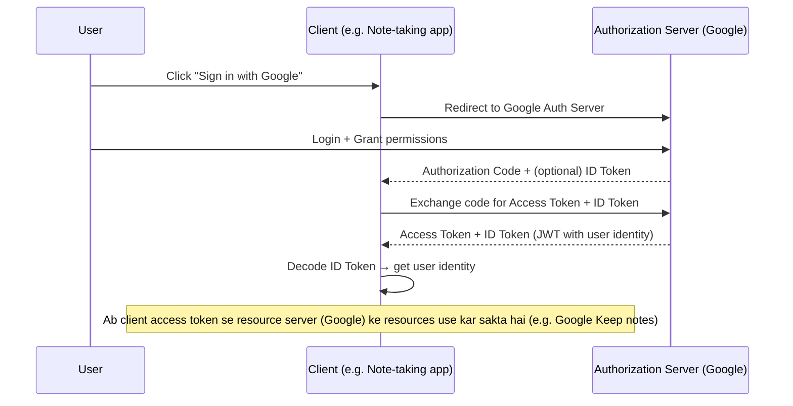

> 💭 Mental Model
> OAuth 2.0 aur OIDC ko socho **security guards + key makers** ki tarah — wo confirm karte hain ki koi bhi user ya platform sirf utna hi access paaye jitna use grant kiya gaya hai, na kam na zyada. In dono ne mil ke internet ko "password-sharing chaos" se ek secure, interconnected system mein badal diya.

### 4.6 Authentication Types — Summary Table

| Type                 | Kab Use Karo                                                           | Example                                              |
| -------------------- | ---------------------------------------------------------------------- | ---------------------------------------------------- |
| **Stateful**         | Web apps jahan strict session control aur real-time revocation chahiye | SaaS platforms, traditional web apps                 |
| **Stateless (JWT)**  | Distributed/scalable systems, APIs                                     | Microservices, public APIs                           |
| **API Key**          | Machine-to-machine ya single-purpose programmatic access               | Server-to-server integration, third-party API access |
| **OAuth 2.0 / OIDC** | Third-party integrations, external login providers                     | "Sign in with Google/Facebook/Discord"               |

> 🎯 Interview Tip
> Real-world mein zyada tar applications **stateful** aur **stateless** authentication ka hi zyada use karte hain — ye two sabse common hain jab apna khud ka API build kar rahe ho.

---

## 5. Authorization

Authentication (identity) ke baad, agla sawaal aata hai: **is user ke paas kya karne ki permission hai?** — yehi authorization hai.

### 5.1 Why Do We Need Authorization?

Example: Ek note-taking platform hai. User login karke notes create/update/delete kar sakta hai. Ab socho:

- Delete kiya hua note turant permanently delete nahi hota — pehle ek "dead zone" (recycle bin jaisa) mein 30 din ke liye jaata hai
- Platform ke **creator/admin** ko ek special **Admin UI** chahiye jisse wo dead zone ke notes access kar sake — ye capability **normal users** ko nahi milni chahiye

**Naive (bad) solution:** Ek "god mode" random string bana ke har API request ke saath bhej do, server check kare ye string hai to special access do.

> ⚠️ Common Mistake
> Ye approach do problems create karti hai:
>
> 1. **Security risk** — agar ye special string intercept ho jaaye, attacker DB clean kar sakta hai, sab data manipulate kar sakta hai
> 2. **Scalability issue** — agar same level ka access doosre trusted logo ko bhi dena hai, to aur strings banane padte hain — system complex aur error-prone ho jaata hai

Isi problem ko solve karne ke liye **Authorization techniques** aayi — jisme sabse popular hai **RBAC (Role-Based Access Control)**.

### 5.2 RBAC — Role-Based Access Control

**Core Idea:** Har user ko ek **role** assign hota hai (jaise `user`, `admin`, `moderator`), aur har role ke paas specific **permissions** hoti hain particular resources pe.

| Role      | Notes Resource      | Dead Zone Notes Resource |
| --------- | ------------------- | ------------------------ |
| User      | Read, Write, Delete | ❌ No access             |
| Admin     | Read, Write, Delete | ✅ Read access           |
| Moderator | Read, Write         | ❌ No access (example)   |

Roles aur permissions ko **granular** level tak customize kiya ja sakta hai — different resources pe different roles ke different access levels define kar sakte ho.

### 5.3 RBAC Workflow

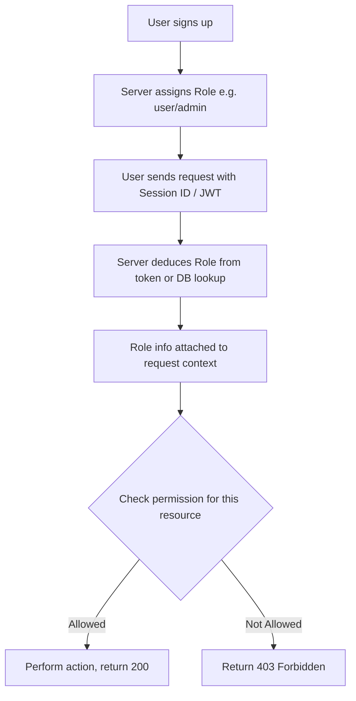

Example: Agar `role = admin` hai, to Dead Zone notes access mil jaata hai. Agar `role = user` hai, to server error dega: **403 Forbidden** ("aapke paas is resource ko access karne ki permission nahi hai").

> 💡 Important
> Role information request cycle ke **shuru mein hi deduce** kar li jaati hai (token verify karte waqt), aur aage ke **middlewares**/business-logic ko pass kar di jaati hai taaki wo decide kar saken ki request continue honi chahiye ya reject.

---

## 6. Security Best Practices in Auth Workflows

### 6.1 Generic Error Messages

Authentication flow mein, specific/helpful error messages **attackers ke liye clues** ban jaate hain.

| Scenario                      | ❌ Bad (Specific) Message                        | Problem                                                                                       |
| ----------------------------- | ------------------------------------------------ | --------------------------------------------------------------------------------------------- |
| Email database mein nahi mila | "User not found"                                 | Attacker ko pata chal jaata hai ki username exist nahi karta, wo agla try karega              |
| Email sahi, password galat    | "Incorrect password"                             | Attacker ko confirm ho jaata hai ki username sahi hai, ab wo sirf password brute-force karega |
| Multiple failed attempts      | "Account locked due to too many failed attempts" | Attacker ko pata chalta hai unka approach kaam kar raha tha                                   |

> ⚠️ Common Mistake
> Authentication workflows mein user-friendly, specific error messages dena. Isse attacker ka **attack surface badh jaata hai** kyunki unhe confirmation milta rehta hai ki wo sahi direction mein try kar rahe hain.

> 💡 Important
> **Solution:** Authentication ke context mein hamesha ek **generic message** bhejo — jaise sirf `"Authentication failed"` — chahe reason kuch bhi ho (user not found, wrong password, account locked). Isse attacker confuse rehta hai ki agla kadam kya lena chahiye.
>
> Note: Ye rule sirf **authentication workflow** ke liye hai — validation errors ya doosri APIs mein tum user-friendly messages de sakte ho.

### 6.2 Timing Attacks

**Typical authentication check ka order:**

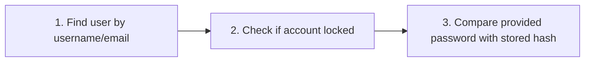

**Problem:** Har step ka **response time alag** hota hai:

- Agar **username hi invalid** hai → system pehle step pe hi terminate ho jaata hai → **fast response**
- Agar **username valid** hai lekin **password galat** hai → system teesre step tak pahunchta hai, jahan **password hashing** hoti hai (jo thoda time leti hai) → **slower response** (delay)

> ⚠️ Common Mistake
> Is response-time difference (jaise 200ms ka delay) ko measure karke, attacker pata laga sakta hai ki username valid tha ya nahi — bina kisi explicit error message ke bhi! Isi ko **Timing Attack** kehte hain.

**Defense Mechanisms:**

1. **Constant-Time Comparison Functions** — Cryptographically secure functions jo password hashes compare karte waqt, execution time ko input similarity se independent rakhte hain
2. **Simulated Response Delay** — Agar username hi invalid ho, to bhi ek artificial delay add karo (jaise Node.js mein `setTimeout`, Go mein `time.Sleep`) taaki response time consistent rahe chahe failure kisi bhi step pe ho

> 🎯 Interview Tip
> Agar interviewer puche "Timing attacks se kaise bacha jaaye?" — do concrete answers do: **constant-time comparison** aur **artificial delay simulation**. Ye dikhata hai ki tumhe sirf concept hi nahi, balki practical mitigation bhi pata hai.

---

## 7. Common Confusions

| Confusion                             | Clarification                                                                                                                                                                                |
| ------------------------------------- | -------------------------------------------------------------------------------------------------------------------------------------------------------------------------------------------- |
| **Authentication vs Authorization**   | Authentication = "Who are you?" (identity). Authorization = "What can you do?" (permissions)                                                                                                 |
| **Session vs JWT**                    | Session = stateful, server-side storage lookup chahiye, easy revocation. JWT = stateless, self-contained, revocation complex                                                                 |
| **OAuth vs OIDC**                     | OAuth 2.0 sirf **authorization/delegation** solve karta hai (access token). OIDC OAuth ke upar built hai aur **authentication** add karta hai (ID token — JWT with identity)                 |
| **Password vs Token (OAuth context)** | Password = full, unrestricted access. Token = specific, limited, revocable permissions                                                                                                       |
| **API Key vs OAuth Token**            | API Key generally simple, long-lived, machine-to-machine ke liye. OAuth token delegation-based hota hai, user consent involve karta hai, aur usually zyada granular scopes ke saath aata hai |

---

## 8. Advantages & Disadvantages Summary

| Mechanism              | Advantages                                                                | Disadvantages                                                          |
| ---------------------- | ------------------------------------------------------------------------- | ---------------------------------------------------------------------- |
| **Session (Stateful)** | Centralized control, real-time revocation, secure                         | Scalability challenges in distributed systems, storage overhead        |
| **JWT (Stateless)**    | Scalable, no storage dependency, portable                                 | Hard to revoke, token theft risk                                       |
| **Cookies**            | Automated token delivery, HTTP-only option se XSS protection              | Cross-domain limitations, CSRF risk (agar properly configured na ho)   |
| **API Key**            | Simple, ideal for machine-to-machine                                      | Agar leak ho jaaye to poora access mil jaata hai (agar scoped na ho)   |
| **OAuth 2.0**          | Delegation solve karta hai bina password share kiye, granular permissions | Sirf authorization ke liye — authentication nahi karta                 |
| **OIDC**               | OAuth ke upar authentication add karta hai (ID Token)                     | OAuth 2.0 pe dependent hai, implementation complexity thodi badhti hai |

---

## 9. Interview Questions

### Basic

**Q. Authentication aur Authorization mein kya farak hai?**
**Answer:** Authentication identity verify karta hai — "who are you". Authorization permissions decide karta hai — "what can you do". Authentication hamesha authorization se pehle hota hai.

**Q. Session-based authentication stateful kyun kehlaata hai?**
**Answer:** Kyunki server ko user ki state (session data) apne persistent store — jaise Redis ya database — mein maintain karni padti hai, aur har request pe uska lookup karna padta hai.

**Q. JWT ke teen parts kaunse hain?**
**Answer:** Header (metadata jaise signing algorithm), Payload (user data jaise sub, iat, role), aur Signature (tamper-detection ke liye).

### Intermediate

**Q. JWT ko "stateless" kyun kaha jaata hai?**
**Answer:** Kyunki server ko koi persistent store (DB/Redis) lookup karne ki zaroorat nahi padti — saari zaroori user information (jaise user ID, role) token ke payload mein hi self-contained form mein hoti hai. Server sirf secret key se signature verify karta hai.

**Q. JWT ko revoke karna mushkil kyun hai?**
**Answer:** Kyunki JWT stateless hai — server ke paas iska koi central record nahi hota ki kaunse tokens "active" hain. Ek baar issue hone ke baad, token expiry tak valid rehta hai. Isse solve karne ka ek tarika ek **blacklist** maintain karna hai (hybrid approach), lekin isse pura stateless benefit thoda kam ho jaata hai.

**Q. Cookie mein HTTP-only flag ka kya fayda hai?**
**Answer:** HTTP-only cookie ko JavaScript access nahi kar sakti — sirf server hi isse read/write kar sakta hai HTTP requests ke through. Isse **XSS (Cross-Site Scripting)** attacks se protection milti hai, kyunki malicious client-side script cookie ki value churi nahi kar sakti.

**Q. OAuth 2.0 authentication ke liye use nahi hota — to phir "Sign in with Google" kaise kaam karta hai?**
**Answer:** "Sign in with Google" actually **OpenID Connect (OIDC)** use karta hai, jo OAuth 2.0 ke upar built hai. OIDC ek **ID Token** (JWT) introduce karta hai jisme user ki identity information hoti hai, jo authentication ka gap fill karta hai jo pure OAuth 2.0 mein missing tha.

### Advanced

**Q. Timing attack kya hota hai, aur backend engineer isse kaise defend kar sakta hai?**
**Answer:** Timing attack tab hota hai jab authentication ke different failure points (jaise "username invalid" vs "password invalid") ka **response time alag-alag** hota hai — jisse attacker, bina explicit error message ke bhi, response time measure karke pata laga sakta hai ki attack ka konsa hissa sahi tha. Defense: **constant-time comparison functions** use karo jo input similarity se independent execution time dete hain, ya **artificial delay simulate** karo taaki har failure scenario ka response time consistent rahe.

**Q. Ek large-scale distributed system design karte waqt, stateful aur stateless authentication mein se kaunsa choose karoge aur kyun?**
**Answer:** Depends on requirements — agar strict, real-time session control aur easy revocation chahiye (jaise typical SaaS web app), **stateful** better hai. Agar system highly distributed hai (microservices, mobile clients, multiple regions) jahan latency aur scalability zyada important hai, **stateless (JWT)** better fit hai. Real-world mein aksar **hybrid approach** use hota hai — web app clients ke liye stateful, mobile/third-party/machine clients ke liye stateless.

**Q. RBAC implement karte waqt, role information request lifecycle mein kahan aur kaise pass hoti hai?**
**Answer:** Jab user authenticate hota hai (session ID ya JWT verify hone ke baad), server user ka role deduce karta hai — ya to token ke payload se (JWT case mein) ya database lookup se. Ye role information request cycle ke shuru mein hi extract karke, request context ke through **downstream middlewares/handlers** ko pass ki jaati hai, taaki wo decide kar saken ki particular resource/action ke liye permission hai ya nahi (agar nahi, to 403 Forbidden return hota hai).

---

## ⚡ Quick Revision

- **Authentication** = "Who are you?" | **Authorization** = "What can you do?"
- Authentication history: implicit trust → seals (something you have) → passwords (something you know) → biometrics (something you are) → MFA (combination) → OAuth/JWT/Zero Trust (modern)
- **Session** = stateful, server-side storage (Redis/DB), easy to revoke, scalability challenges in distributed systems
- **JWT** = stateless, self-contained (Header.Payload.Signature), highly scalable, hard to revoke
- **Cookie** = mechanism to store data in browser from server-side; HTTP-only cookies protect against XSS (JS can't read them)
- 4 major authentication types: **Stateful**, **Stateless (JWT)**, **API Key** (machine-to-machine), **OAuth 2.0 / OIDC** (delegation + third-party login)
- **OAuth 2.0** solves **delegation/authorization** (access token) — NOT authentication
- **OIDC** built on OAuth 2.0, adds **authentication** via **ID Token** (JWT with user identity)
- **Authorization (RBAC)** = roles (user/admin/moderator) assigned specific permissions on specific resources
- **403 Forbidden** = authenticated but not authorized for this action
- Security best practices: (1) **generic error messages** during auth (never reveal "user not found" vs "wrong password"), (2) defend against **timing attacks** using constant-time comparisons or artificial delays
- Production advice: prefer established **Auth providers** (Auth0, Clerk, etc.) over building your own auth from scratch, unless learning

---

## 🧠 Final Mental Model

```text
User (Resource Owner)
     ↓ provides credentials
Authentication → "Who are you?" (Session / JWT / API Key / OIDC ID Token)
     ↓ identity established
Authorization → "What can you do?" (RBAC roles & permissions)
     ↓ permission check
Allowed → Business Logic executes → Response
Not Allowed → 403 Forbidden
```

Chahe mechanism koi bhi ho — session, JWT, API key, ya OAuth/OIDC — sabka core purpose ek hi hai: **kisi entity ki identity establish karna (authentication)**, aur phir uss identity ke basis pe **kya permitted hai decide karna (authorization)**. Historical evolution — trust se seals, seals se passwords, passwords se tokens — hamesha ek hi direction mein gaya hai: **zyada scalable, zyada secure, aur zyada automatable** systems ki taraf. Aaj ke backend engineer ke liye, sahi mechanism choose karna depend karta hai use-case pe — web app ho to stateful, distributed API ho to stateless, machine-to-machine ho to API key, aur third-party integration ho to OAuth/OIDC.
