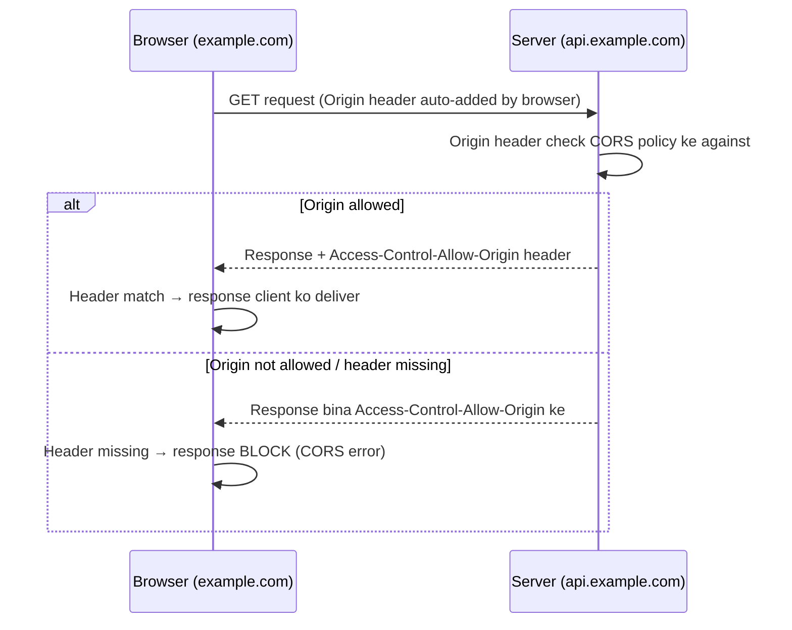
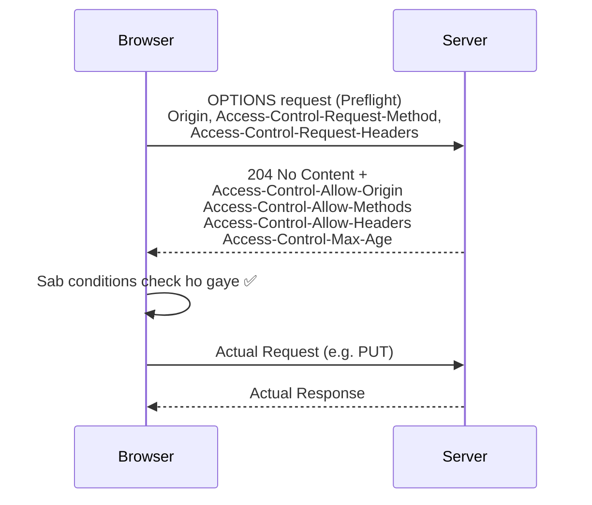
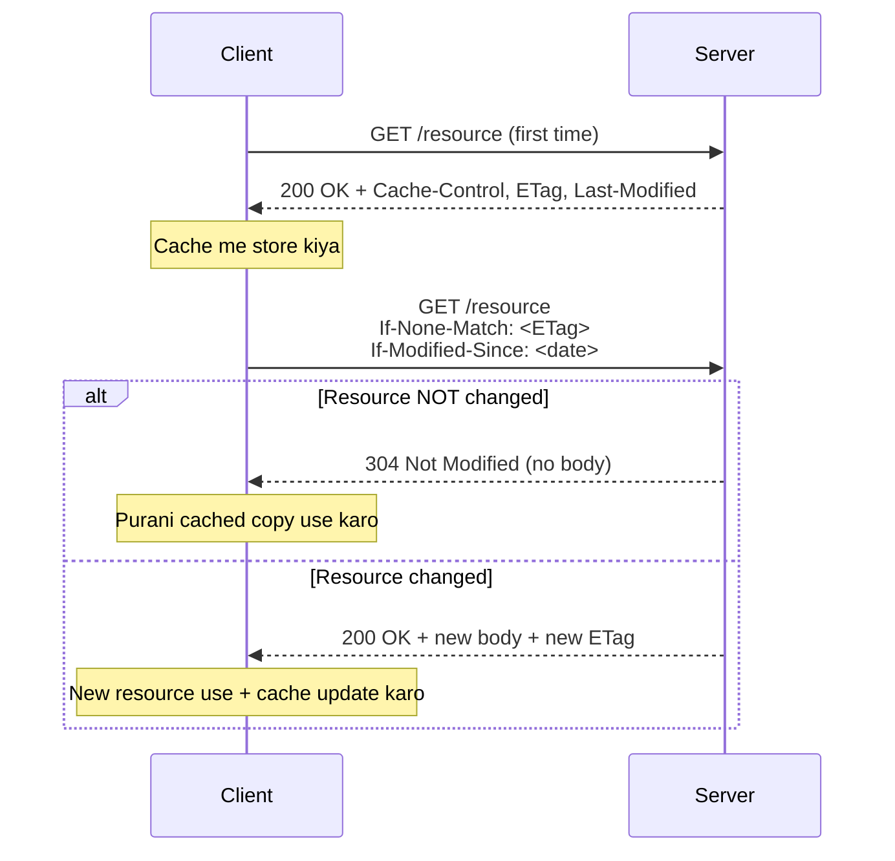

# Understanding HTTP for Backend Engineers — Where It All Starts

## 1. Overview

Backend engineering ka scope itna bada hai ki agar hum har cheez discuss karne lagein to saalon lag jaayenge. Isliye is series me sirf wahi topics cover honge jo **90% codebases** me use hote hain. Is video ka focus hai **HTTP protocol** — wo medium jiske through browsers aur servers aapas me data bhejte/receive karte hain.

> 💡 Important: HTTP ke alawa bhi clients-servers communicate karne ke liye alag-alag protocols use karte hain, lekin HTTP sabse zyada widely used hone ki wajah se is series ka focus hai.

---

## 2. Core Concept: Do Big Ideas Jo HTTP Ke Heart Me Hain

### 2.1 Statelessness

> 💭 Mental Model: Statelessness ka matlab hai — HTTP ko **past interactions ki koi memory nahi hoti**. Har request apne aap me **self-contained** hoti hai — usme wo saari information honi chahiye jo server ko us request ko process karne ke liye chahiye (headers, URL, method, etc). Response bhejne ke baad server request ko **bhool jaata hai**. Agla request bilkul ek naye aur unrelated event ki tarah treat hota hai.

**Implication**: Chunki server ko pichle requests yaad nahi rehte, har request me zaroori data (jaise authentication tokens ya session info) bhejna padta hai. Example: user profile access karte waqt, client ko har request me cookies/tokens bhejne padte hain taaki server ko pata chale ki request kaun kar raha hai.

**Benefits of Statelessness:**

| Benefit     | Explanation                                                                                                                                                                               |
| ----------- | ----------------------------------------------------------------------------------------------------------------------------------------------------------------------------------------- |
| Simplicity  | Server ko session info store nahi karni padti — architecture simple ho jaata hai                                                                                                          |
| Scalability | Requests ko multiple servers ke beech distribute karna aasan hai kyunki koi single server session track nahi karta; server crash ho jaaye to client interaction ki state affect nahi hoti |

> 💡 Important: Chunki HTTP stateless hai, developers **state management techniques** implement karte hain jaise cookies, sessions, ya tokens — taaki user logins ya shopping carts jaisi cheezon me continuity maintain rahe. Ye topics future videos me explore honge.

### 2.2 Client-Server Model

- **Client** (usually web browser ya application) communication **initiate** karta hai — request bhejta hai jisme URL, headers, aur zaroori saari information hoti hai
- **Server** resources (websites, APIs, content) host karta hai aur incoming requests ka wait karta hai; request receive karke process karta hai aur appropriate response bhejta hai (web page, data, error message, JSON, text file, etc)

> 🧠 Remember: HTTP ka rule ye hai ki communication **hamesha client se initiate** hoti hai server se response paane ke liye.

> 💡 Extra Context: HTTP aur HTTPS ko is discussion me interchangeable maan sakte hain — HTTPS basically HTTP ka ek zyada **secure version** hai jisme encryption aur security certificates (TLS) add hote hain. Underlying principles same hain.

---

## 3. Transport Layer: TCP & OSI Model (Brief)

Client aur server ke beech communication ke liye pehle ek **connection mechanism** establish hona chahiye. HTTP ke liye ye kaam **TCP (Transmission Control Protocol)** karta hai.

> 💡 Important: HTTP technically underlying transport protocol ke **connection-based hone ki demand nahi karta** — usse sirf ye chahiye ki wo **reliable** ho aur messages lose na kare (kam se kam error present kare). Do most common transport protocols — **TCP** aur **UDP** — me se TCP zyada reliable mana jaata hai, isliye HTTP traditionally TCP pe rely karta hai (connection-based standard).

Is context me **OSI Model** ka zikr aata hai — backend engineers primarily **Layer 7 (Application Layer)** se deal karte hain. Neeche ke layers (TCP handshake, TLS encryption) mostly **network engineering** concepts hain.

> 🎯 Interview Tip: TCP ek **3-way handshake** use karta hai connection establish karne ke liye — ye ek network-engineering rabbit hole hai, curious ho to alag se padh sakte ho, lekin backend engineering ke liye itna samajhna kaafi hai ki client-server ke beech network connection establish hota hai aur messages send/receive hote hain.

---

## 4. Evolution of HTTP Versions

| Version  | Key Feature                                                                                                                                                                                                                                                    |
| -------- | -------------------------------------------------------------------------------------------------------------------------------------------------------------------------------------------------------------------------------------------------------------- |
| HTTP 1.0 | Har request ke liye **naya connection** khulta tha — connection establish + close har baar, jo inefficient tha aur performance slow karta tha                                                                                                                  |
| HTTP 1.1 | **Persistent connections** introduce hui — same TCP connection pe multiple requests/responses ja sakte the, jisse performance kaafi improve hua; **chunked transfer encoding** aur better caching mechanisms bhi add hue                                       |
| HTTP 2.0 | **Multiplexing** introduce hua — single connection pe multiple requests/responses; **binary framing** (text ki jagah); header compression (HPACK); **server push** (client ke request karne se pehle hi resources bhej dena)                                   |
| HTTP 3.0 | **QUIC protocol** pe based hai — TCP ki jagah **UDP** pe design kiya gaya; faster connection establishment, reduced latency, better packet-loss handling; multiplexing continue karta hai lekin **head-of-line blocking** (jo HTTP 2.0 me issue hai) nahi hota |

> 🧠 Remember: Ye bhi ek rabbit hole hai agar aap network-level detail me jaayein. Bas itna yaad rakhna hai — client aur server kisi na kisi network connection ke through messages exchange karte hain.

---

## 5. Anatomy of an HTTP Message

Ek **request message** wo hai jo client bhejta hai; ek **response message** wo hai jo client server se receive karta hai.

```text
REQUEST MESSAGE                          RESPONSE MESSAGE
----------------                         -----------------
<Method> <Resource URL> <HTTP Version>   <HTTP Version> <Status Code> <Status Text>
Host: <domain>                           <Response Headers...>
<Request Headers...>
                                          (blank line)
(blank line)                             <Response Body>
<Request Body>
```

- **Request Method**: kis type ka action hai (GET, POST, etc)
- **Resource URL**: jo resource request kiya ja raha hai
- **HTTP Version**: e.g. HTTP/1.1 (currently sabse zyada used)
- **Host**: domain (frontend ka domain)
- **Headers**: request/response ke baare me metadata
- Headers ke baad ek **blank line** hoti hai jo signify karti hai ki headers khatam ho gaye aur body shuru ho raha hai
- **Body**: actual data jo client/server bhejna chahta hai
- Response me additionally **Status Code** hota hai (e.g. 200 = OK)

---

## 6. HTTP Headers — Deep Dive

> 💭 Mental Model: Headers basically **key-value pairs** hain jo request/response ke saath metadata carry karte hain.

### Why Do We Need Headers? (Parcel Analogy)

> 💡 Real-life Analogy: Jab hum parcel bhejte hain, to recipient ka address, phone number, PIN code jaisi details **parcel ke andar nahi**, balki **upar** (label pe) likhte hain — taaki jo bhi parcel transmit kar raha hai, use baar-baar parcel **khole bina** hi zaroori info mil jaaye. HTTP headers bhi isi tarah kaam karte hain — request/response body ko baar-baar "open" (parse) kiye bina metadata quickly check ho jaata hai.

### Categories of Headers

| Category                   | Purpose                                                                                                                                          | Examples                                                                                                                                                                                                                                                                                                                                                                                                                                                                                                                                                                            |
| -------------------------- | ------------------------------------------------------------------------------------------------------------------------------------------------ | ----------------------------------------------------------------------------------------------------------------------------------------------------------------------------------------------------------------------------------------------------------------------------------------------------------------------------------------------------------------------------------------------------------------------------------------------------------------------------------------------------------------------------------------------------------------------------------- |
| **Request Headers**        | Client se server ko request ke baare me info dete hain — server ko client ka environment, preferences, capabilities samajhne me madad karte hain | `User-Agent` (client kaun hai — browser/Postman/mobile app), `Authorization` (bearer token jaisi credentials), `Accept` (client kis format ki content expect kar raha hai)                                                                                                                                                                                                                                                                                                                                                                                                          |
| **General Headers**        | Request aur response dono me use hote hain — message ke baare me metadata                                                                        | `Date`, caching related (`no-cache`, `max-age`), `Connection` (keep-alive/close)                                                                                                                                                                                                                                                                                                                                                                                                                                                                                                    |
| **Representation Headers** | Body/resource ke representation ke baare me info dete hain — client/server ko pata chalta hai request/response ko kaise interpret karna hai      | `Content-Type` (media type — JSON/HTML), `Content-Length` (size in bytes), `Content-Encoding` (gzip/deflate), `ETag` (unique identifier, mostly caching ke liye)                                                                                                                                                                                                                                                                                                                                                                                                                    |
| **Security Headers**       | Request/response ki security enhance karte hain — content loading, cookies, encryption jaisi behaviors control karte hain                        | `Strict-Transport-Security/HSTS` (client ko sirf HTTPS pe communicate karne ko force karta hai — protocol downgrade attacks se bachata hai), `Content-Security-Policy` (JS/CSS/images kahan se load ho sakte hain restrict karta hai — XSS se bachata hai), `X-Frame-Options` (page ko iframe me embed hone se rokta hai — clickjacking se bachata hai), `X-Content-Type-Options` (browser ko MIME type guess karne se rokta hai — MIME sniffing attack se bachata hai), Cookie flags `HttpOnly`/`Secure` (cookies ko JS se inaccessible banate hain aur sirf HTTPS pe bhejte hain) |

### Two Big Ideas About Headers

**1. Extensibility**

> HTTP highly extensible hai kyunki headers ko underlying protocol ko change kiye bina easily add ya customize kiya ja sakta hai. Sirf metadata add karke poori interaction ka flow change ho sakta hai — security enhancements (HSTS), custom headers (`X-Custom-Header`), content negotiation (`Accept`, `Accept-Language`, `Accept-Encoding`) — sab isi extensibility ki wajah se possible hai.

**2. Remote Control**

> Headers ek tarah se server pe "remote control" ki tarah kaam karte hain — client instructions/preferences bhejta hai jo server ke response/processing ko influence karte hain:
>
> - **Content negotiation**: `Accept` header se client format request karta hai, server accordingly respond karta hai
> - **Caching/Expiration control**: `Cache-Control` ya `Expires` se server batata hai resource kitni der cache rehna chahiye
> - **Authentication**: `Authorization` header se client authenticate karta hai, jo access-control decisions ko influence karta hai

---

## 7. HTTP Methods & Idempotency

> 💭 Mental Model: HTTP Methods client ki **intent** represent karte hain — har method ek clear semantic meaning deta hai.

| Method      | Intent                                                               | Body?        |
| ----------- | -------------------------------------------------------------------- | ------------ |
| **GET**     | Data fetch karna, server pe kuch modify nahi karna                   | Nahi         |
| **POST**    | Server pe naya data create karna                                     | Haan         |
| **PATCH**   | Data ko selectively/partially update karna (append-like action)      | Haan         |
| **PUT**     | Data ko completely replace karna                                     | Haan         |
| **DELETE**  | Resource delete karna                                                | Usually nahi |
| **OPTIONS** | Server ki capabilities inquire karna (mainly CORS preflight ke liye) | Nahi         |

> ⚠️ Common Mistake: PUT vs PATCH — PATCH ko **selective/partial update** ke liye use karna chahiye, PUT ko **complete replacement** ke liye. Bahut baar developers PUT use karte hain jab actually PATCH use karna chahiye — semantics ke against jaate hain. **Thumb rule: jab tak specific use case na ho jo complete replacement demand kare, hamesha PATCH use karo.**

### Idempotent vs Non-Idempotent

> 💭 Mental Model: **Idempotent** ka matlab hai — method ko multiple baar call karo, result **same** rahega.

| Method | Idempotent? | Reasoning                                                                                                        |
| ------ | ----------- | ---------------------------------------------------------------------------------------------------------------- |
| GET    | ✅ Haan     | Data fetch karna hai, kitni baar bhi karo, data change nahi hota                                                 |
| PUT    | ✅ Haan     | Resource ko completely replace karta hai — baar-baar same new data se replace karo, result same rahega           |
| DELETE | ✅ Haan     | Resource ek baar delete hone ke baad already delete ho chuka hai — repeat karne se result same (already deleted) |
| POST   | ❌ Nahi     | Har baar submit karne pe **naya resource create** hota hai — same request se alag-alag results milte hain        |

---

## 8. CORS (Cross-Origin Resource Sharing) — Deep Dive

> 💭 Mental Model: Browsers ek **Same-Origin Policy** follow karte hain — jo web pages ko unke apne domain se **alag domain** pe requests karne se by-default restrict karti hai. CORS ek security mechanism hai jo browsers enforce karte hain taaki control kiya ja sake ki web applications cross-origin resources ke saath kaise interact karein. Iske bina, browser `example.com` se `api.example.com` (different origin) pe request block kar dega.

Cross-origin request me **do types ke flows** hote hain: **Simple Request Flow** aur **Preflighted Request Flow**.

### 8.1 Simple Request Flow



- Browser automatically request me **Origin** header add karta hai
- Simple request usually **GET, POST, ya HEAD** method use karta hai
- Server response me **`Access-Control-Allow-Origin`** header include karta hai (ya to specific domain, ya `*` jo sabhi origins allow karta hai)
- Browser check karta hai — agar ye header present hai aur match karta hai, tabhi response JavaScript client tak jaane deta hai; nahi to console me CORS error aata hai

### 8.2 Preflighted Request Flow

Browser decide karta hai ki request **preflight** chahiye ya nahi, in **3 conditions** ke basis pe (agar **koi bhi ek** true ho, to preflight zaroori hai):

1. Method **GET, POST, ya HEAD nahi** hai (jaise PUT ya DELETE)
2. Request me **non-simple headers** hain (jaise `Authorization` ya custom headers)
3. Content-Type **`application/x-www-form-urlencoded`, `multipart/form-data`, ya `text/plain`** ke alawa kuch aur hai (e.g. `application/json`)

> 💡 Important: Chunki zyadatar modern apps **JSON** use karte hain, isliye zyadatar cross-origin requests **preflighted requests** consider hoti hain.



**Preflight (OPTIONS) request** ek general inquiry hoti hai — isme **body nahi hota**. Ye server se puchti hai:

- Is URL ke liye ye method (e.g. PUT) supported hai kya?
- Ye particular header (e.g. Authorization) supported hai kya?

**Server ka response** (agar CORS properly handle kiya gaya hai):

- **Status 204** (No Content — sirf general info hai, koi actual content nahi)
- `Access-Control-Allow-Origin` — client ka domain allow hai (ya `*`)
- `Access-Control-Allow-Methods` — kaunse methods allowed hain (e.g. GET, POST, PUT, DELETE)
- `Access-Control-Allow-Headers` — kaunse headers allowed hain (e.g. Content-Type, Authorization)
- `Access-Control-Max-Age` — kitni der tak (e.g. 24 hours) browser ko dobara preflight nahi karna padega — isse bandwidth save hoti hai

Agar server ye headers nahi bhejta, browser request ko automatically block kar deta hai. Agar sab kuch sahi hai, browser preflight ke baad **original request** fire karta hai.

> 🧠 Remember: Simple Request Flow + Preflighted Request Flow milkar poora **CORS flow** banate hain.

---

## 9. HTTP Status Codes

> 💭 Mental Model: Status codes ek **standardized way** hain result communicate karne ka — client ko response body parse kiye bina hi pata chal jaata hai request successful thi ya nahi, aur agar nahi, to kya problem thi.

**Benefits:**

- Client errors ko specific codes se identify kar sakta hai aur accordingly action le sakta hai (e.g. 401 pe user ko logout karke dobara login karwana)
- **Standardization**: chahe server Python, Golang, Rust, JavaScript, ya Ruby me likha ho — status codes universal hain

Status codes **3-digit numbers** hote hain, first digit se category decide hoti hai:

| Range | Category      |
| ----- | ------------- |
| 1xx   | Informational |
| 2xx   | Success       |
| 3xx   | Redirection   |
| 4xx   | Client Errors |
| 5xx   | Server Errors |

### 1xx — Informational

| Code | Meaning             | Use Case                                                                                    |
| ---- | ------------------- | ------------------------------------------------------------------------------------------- |
| 100  | Continue            | Server ne headers receive kar liye, client ab body bhej sakta hai — large uploads me useful |
| 101  | Switching Protocols | Server client ke request pe protocol switch kar raha hai (e.g. HTTP → WebSocket)            |

### 2xx — Success

| Code | Meaning    | Use Case                                                                                                       |
| ---- | ---------- | -------------------------------------------------------------------------------------------------------------- |
| 200  | OK         | Request successful, requested resource ya action return hua — e.g. successful GET                              |
| 201  | Created    | Request se naya resource create hua — e.g. POST request/form submission                                        |
| 204  | No Content | Request successful, lekin body me return karne layak content nahi — e.g. preflight response, ya DELETE request |

### 3xx — Redirection

| Code | Meaning                    | Use Case                                                                                                                                                    |
| ---- | -------------------------- | ----------------------------------------------------------------------------------------------------------------------------------------------------------- |
| 301  | Moved Permanently          | Resource permanently naye URL pe move ho gaya — future requests naya URL use karein (backward compatibility ke liye — e.g. `/user` se `/person`)            |
| 302  | Found (Temporary Redirect) | Resource temporarily alag URL pe hai, lekin client original URL hi use karta rahe future requests ke liye — e.g. campaign ke liye kuch der ke liye redirect |
| 304  | Not Modified               | Resource last request ke baad se modify nahi hua — conditional GET (ETag) ke saath use hota hai, client apni cached copy use kare                           |

### 4xx — Client Errors

> 🎯 Interview Tip: Backend engineer hone ke naate aap sabse zyada **4xx errors** ke saath deal karenge kyunki ye client ke behavior ki wajah se trigger hote hain.

| Code | Meaning            | Use Case                                                                                                                       |
| ---- | ------------------ | ------------------------------------------------------------------------------------------------------------------------------ |
| 400  | Bad Request        | Invalid/illogical data — e.g. number expect kiya tha, string aaya                                                              |
| 401  | Unauthorized       | Authentication missing ya invalid — e.g. JWT token expired ya nahi bheja gaya                                                  |
| 403  | Forbidden          | Client authenticated hai lekin us action ka permission nahi hai — e.g. User A, User B ka resource delete karne ki koshish kare |
| 404  | Not Found          | Requested resource available nahi — galat URL ya delete ho chuka resource                                                      |
| 405  | Method Not Allowed | Invalid method use kiya gaya — e.g. sirf GET/POST accept karne wale resource pe PUT bheja                                      |
| 409  | Conflict           | e.g. unique constraint violate ho raha hai — jaise same naam ka folder dobara create karna                                     |
| 429  | Too Many Requests  | Rate limiting — client ne configured limit se zyada requests bheji (e.g. 60 requests/second)                                   |

### 5xx — Server Errors

| Code | Meaning               | Use Case                                                                                                                                                                   |
| ---- | --------------------- | -------------------------------------------------------------------------------------------------------------------------------------------------------------------------- |
| 500  | Internal Server Error | Server pe kuch unexpected hua — unhandled exception ya process break                                                                                                       |
| 501  | Not Implemented       | Requested method/functionality abhi supported nahi hai, lekin future me aa sakta hai                                                                                       |
| 502  | Bad Gateway           | Proxy (e.g. Nginx)/load balancer ko upstream server se invalid response mila — usually developer intentionally nahi return karta, proxies/load balancers handle karte hain |
| 503  | Service Unavailable   | Service temporarily down hai — high traffic ya maintenance ke waqt                                                                                                         |
| 504  | Gateway Timeout       | 502 jaisa hi, lekin specifically iska matlab hai upstream server ne timeout period ke andar respond hi nahi kiya                                                           |

---

## 10. HTTP Caching

> 💭 Mental Model: HTTP Caching ek technique hai response copies store karke reuse karne ki — taaki repeated requests server tak na jaayein. Isse load time improve hota hai, bandwidth kam lagti hai, aur server load kam hota hai.

### Key Caching Headers

| Header          | Purpose                                                                        |
| --------------- | ------------------------------------------------------------------------------ |
| `Cache-Control` | Batata hai resource kitni der (e.g. `max-age=10` seconds) tak cache rakhna hai |
| `ETag`          | Response se compute kiya gaya ek hash — unique identifier                      |
| `Last-Modified` | Resource last kab modify hua tha                                               |

### Conditional GET Flow (Cache Validation)



- Client agli baar request bhejta hai to `If-None-Match` (ETag ke saath) aur `If-Modified-Since` headers bhejta hai
- Agar ETag match karta hai (ya resource modify nahi hua), server **304 Not Modified** bhejta hai (bina body ke) — client apni cached copy use karta hai
- Agar resource update ho chuka hai (naya ETag milega), server **200 OK** naye data ke saath bhejta hai

> ⚠️ Common Mistake: Production me ETags manually maintain karna complex ho sakta hai — agar server galti se ETag update karna bhool jaaye, to client purani (outdated) cached copy hi use karta rahega.

> 💡 Extra Context: Modern applications me often **client-side caching libraries** (jaise React Query) use hoti hain jo client ko poora control deti hain ki kab cache use karna hai aur kab refetch karna hai — ye traditional HTTP-based caching se zyada powerful solution mana jaata hai. Lekin simple use-cases ke liye HTTP-based caching bhi kaafi hai.

---

## 11. Content Negotiation & Compression

> 💭 Mental Model: Content Negotiation ek mechanism hai jisse **client aur server best format decide karte hain** data exchange karne ke liye.

| Type                   | Header Used       | Example                               |
| ---------------------- | ----------------- | ------------------------------------- |
| Media Type Negotiation | `Accept`          | `application/json`, `application/xml` |
| Language Negotiation   | `Accept-Language` | English, Spanish                      |
| Encoding Negotiation   | `Accept-Encoding` | gzip, deflate                         |

- Client apni preference batata hai, server compatible format se respond karta hai (ya fallback format se, agar preferred available nahi)
- Same endpoint alag-alag `Accept-Language` ke basis pe English ya Spanish content de sakta hai, ya `Accept` header ke basis pe JSON ya XML

### HTTP Compression

> 🚀 Real-World Usage: Demo me ek 11,000-entries wali file compression **enabled** hone par **3.8 MB** thi. Compression **disable** karne par wahi file **26 MB** ho gayi — ek **huge difference**.

- Server response ko **gzip** (ya deflate) jaise format me compress karta hai (`Content-Encoding: gzip`)
- Client (browser) response ko decompress kar leta hai automatically
- Isse bandwidth kaafi save hoti hai, especially large responses ke liye

---

## 12. Persistent Connections (Keep-Alive)

- **HTTP 1.0**: har request-response cycle ke liye **alag connection** chahiye hota tha — TCP connections establish/close karna resource-intensive aur slow tha
- **HTTP 1.1**: **Persistent connections** introduce hui — ek hi TCP connection multiple requests/responses ke liye **reuse** ho sakta hai

**Key points:**

- HTTP 1.1 me connections **by-default persistent** hote hain — explicitly kuch karne ki zaroorat nahi
- `Connection: keep-alive` header explicitly server ko bol sakta hai connection open rakhne ke liye — isme `timeout` (kitni der) aur `max` (kitne requests) jaisi options bhi ho sakti hain
- `Connection: close` set karne pe response bhejne ke baad connection close ho jaata hai (HTTP 1.0 ka default behavior, HTTP 1.1 me explicitly enforce kiya ja sakta hai)

> 🧠 Remember: Zyadatar time default values hi kaam karte hain, aapko manually inn headers ke saath deal nahi karna padta.

---

## 13. Handling Large Requests & Responses

### 13.1 Multipart Requests (Sending Large Files)

> 💭 Mental Model: Multipart request ka use tab hota hai jab client server ko **large files** (image, video, audio) bhejna chahta ho. Normal JSON body se farak ye hai ki file ka **binary data parts (chunks) me** transfer hota hai.

- Request `Content-Type: multipart/form-data` hota hai
- Ek important parameter hota hai **`boundary`** — ye ek delimiter specify karta hai jo binary data ke parts ko separate karta hai (boundary ka pehla occurrence data ke start pe, doosra occurrence data ke end pe hota hai)
- Server binary data ko read karke response me file details deta hai (upload successful confirm karne ke liye)

### 13.2 Streaming Large Responses (Chunked Transfer)

> 💭 Mental Model: Jab server ko client ko **large response** (jaise ek bada text file) bhejni ho, to wo pura data ek saath bhejne ki jagah **chunks me stream** kar sakta hai.

Important response headers:

- **`Content-Type: text/event-stream`** — batata hai ki data **events ke through stream** hoga
- **`Connection: keep-alive`** — connection tab tak open rakhna jab tak saara data send na ho jaaye

Client continuously chunks receive karta rehta hai, unhe append karta hai, aur poori file client-side pe construct hoti hai.

---

## 14. SSL, TLS & HTTPS — Quick Overview

> 💡 Important: Inn concepts ke saath aap directly kaam nahi karenge, lekin inhe janna zaroori hai.

| Term      | Explanation                                                                                                                                                                                                                                                                         |
| --------- | ----------------------------------------------------------------------------------------------------------------------------------------------------------------------------------------------------------------------------------------------------------------------------------- |
| **SSL**   | Original protocol tha client-server communication secure karne ke liye — sensitive info (passwords, card numbers) encrypt karta tha. Ab **outdated** hai security vulnerabilities ki wajah se                                                                                       |
| **TLS**   | SSL ka modern, zyada secure version. Data ko transit me encrypt karta hai — interception/tampering se bachata hai. Certificates use karta hai server authenticate karne aur encrypted connection establish karne ke liye. Current recommended version **TLS 1.3** hai               |
| **HTTPS** | HTTP + security features jo SSL/TLS provide karte hain. Modern web me underlying mechanism **TLS** hai. Jab aap HTTPS site visit karte ho, TLS browser aur server ke beech communication encrypt kar deta hai — sensitive data (login credentials) attackers se protected rehta hai |

---

## 15. Common Confusions

| Confusion                             | Clarification                                                                                                                                                                        |
| ------------------------------------- | ------------------------------------------------------------------------------------------------------------------------------------------------------------------------------------ |
| PUT vs PATCH                          | PUT = complete replacement; PATCH = partial/selective update. Thumb rule: PATCH use karo jab tak specific reason na ho PUT ke liye                                                   |
| Idempotent vs Non-Idempotent          | Idempotent (GET, PUT, DELETE) = baar-baar call karo, same result. Non-idempotent (POST) = har baar naya result (naya resource create)                                                |
| Simple Request vs Preflighted Request | Simple = GET/POST/HEAD, simple headers, simple content-type. Preflighted = koi bhi ek condition violate ho (non-simple method/header/content-type) — pehle OPTIONS request jaati hai |
| HTTP vs HTTPS                         | HTTPS = HTTP + TLS/SSL encryption. Underlying principles same hain, bas security layer extra hai                                                                                     |
| 502 vs 504                            | 502 = upstream se **invalid response** mila; 504 = upstream se response hi **timeout ke andar nahi mila**                                                                            |

---

## 16. Interview Questions

### Basic

**Q. HTTP stateless kyun hai, aur iska matlab kya hai?**
**Answer:** Stateless ka matlab hai server ko past requests ki koi memory nahi hoti. Har request apne aap me self-contained hoti hai — zaroori saari info (headers, auth tokens) usi request me honi chahiye. Isse server architecture simple rehta hai aur horizontal scaling aasan hoti hai.

**Q. PUT aur PATCH me kya difference hai?**
**Answer:** PUT resource ko **completely replace** karta hai, jabki PATCH **selective/partial update** karta hai. Thumb rule ye hai ki jab tak complete replacement ka specific use case na ho, PATCH use karna chahiye.

### Intermediate

**Q. Ek request preflighted request kab consider hoti hai?**
**Answer:** Jab request cross-origin ho aur in teeno me se koi ek condition true ho: (1) method GET/POST/HEAD na ho, (2) non-simple headers ho (jaise Authorization), (3) Content-Type simple types (form-urlencoded/multipart/text-plain) ke alawa ho (jaise application/json).

**Q. HTTP caching me ETag aur Last-Modified ka role kya hai?**
**Answer:** Ye dono conditional GET requests ke liye use hote hain. Client agli request me `If-None-Match` (ETag) aur `If-Modified-Since` (date) bhejta hai. Agar resource change nahi hua, server 304 Not Modified return karta hai (client apni cache use kare); agar change hua hai, naye data ke saath 200 OK milta hai.

**Q. 401 aur 403 status codes me kya difference hai?**
**Answer:** 401 (Unauthorized) tab aata hai jab client authenticate hi nahi hua (missing/invalid credentials). 403 (Forbidden) tab aata hai jab client authenticated hai, lekin us specific action/resource ka permission nahi hai.

### Advanced

**Q. HTTP compression kaise kaam karta hai aur ye kyun zaroori hai?**
**Answer:** Client `Accept-Encoding` header se batata hai wo kaunse compression formats (gzip, deflate) support karta hai. Server response ko us format me compress karke bhejta hai (`Content-Encoding` header ke saath), aur browser use decompress kar leta hai. Isse bandwidth usage drastically kam ho jaata hai — video me ek example diya gaya hai jaha ek 11,000-entries file compression ke saath 3.8MB thi, aur compression disable karne pe 26MB ho gayi.

**Q. HTTP 1.1 me persistent connections ka faayda kya hai HTTP 1.0 ke comparison me?**
**Answer:** HTTP 1.0 me har request-response cycle ke liye naya TCP connection banana aur close karna padta tha, jo resource-intensive aur slow tha. HTTP 1.1 me persistent connections (by-default) ki wajah se ek hi TCP connection multiple requests/responses ke liye reuse ho sakta hai, jisse latency kam hoti hai aur resources save hote hain.

---

## 17. ⚡ Quick Revision

- HTTP ki 2 core ideas: **Statelessness** (har request self-contained, koi memory nahi) aur **Client-Server Model** (communication hamesha client-initiated)
- Statelessness ke benefits: Simplicity + Scalability; drawback ke liye cookies/sessions/tokens use hote hain
- HTTP TCP pe rely karta hai (reliable transport); backend engineers primarily OSI Layer 7 (Application) se deal karte hain
- HTTP versions: 1.0 (naya connection har request) → 1.1 (persistent connections) → 2.0 (multiplexing, binary framing, server push) → 3.0 (QUIC/UDP based, no head-of-line blocking)
- Headers 4 categories: Request, General, Representation, Security — extensibility aur remote-control ideas
- Methods: GET/POST/PUT/PATCH/DELETE/OPTIONS — idempotent (GET, PUT, DELETE) vs non-idempotent (POST)
- CORS: Simple Request Flow vs Preflighted Request Flow (3 trigger conditions); OPTIONS method preflight ke liye
- Status codes: 1xx info, 2xx success (200/201/204), 3xx redirect (301/302/304), 4xx client error (400/401/403/404/405/409/429), 5xx server error (500/501/502/503/504)
- Caching: `Cache-Control`, `ETag`, `Last-Modified` → conditional GET → 304 Not Modified
- Content Negotiation: media-type/language/encoding via Accept headers; Compression (gzip) bandwidth bahut kam kar deta hai
- Persistent connections (Keep-Alive) HTTP 1.1 se default hain
- Large files: **Multipart requests** (boundary-based) upload ke liye; **chunked/streaming** (text/event-stream + keep-alive) large responses ke liye
- SSL (outdated) → TLS (modern) → HTTPS = HTTP + TLS encryption

---

## 18. 🧠 Final Mental Model

```text
Client                                    Server
  |------ Request (Method, URL,             |
  |        Headers, Body) --------------->  |
  |        [Stateless: sab kuch ismein]      |
  |                                          |
  |  <---- Response (Status Code,            |
  |         Headers, Body) -----------------|
  |                                          |

Cross-cutting concerns jo har request/response pe apply ho sakte hain:
  - CORS (cross-origin allowed hai kya?)
  - Caching (kya cached copy use kar sakte hain — ETag/304?)
  - Content Negotiation (kis format/language/encoding me?)
  - Compression (payload chhota karna)
  - Security (TLS encryption, security headers)
```

> 🧠 HTTP fundamentally do simple ideas pe khada hai — **stateless requests** aur **client-initiated communication**. Baaki sab kuch (headers, methods, status codes, caching, CORS, compression) inhi do ideas ke around design kiye gaye **extensions** hain jo real-world requirements (security, performance, negotiation) ko handle karte hain.
