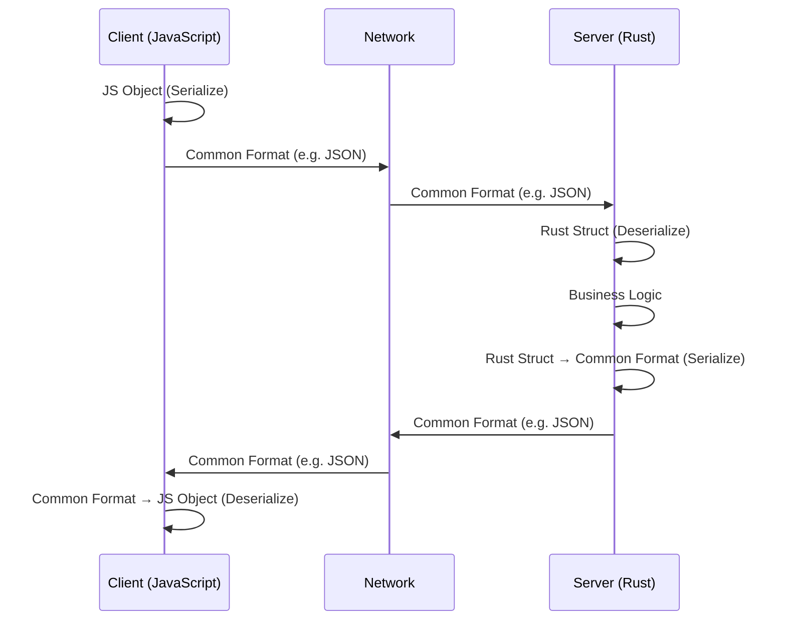
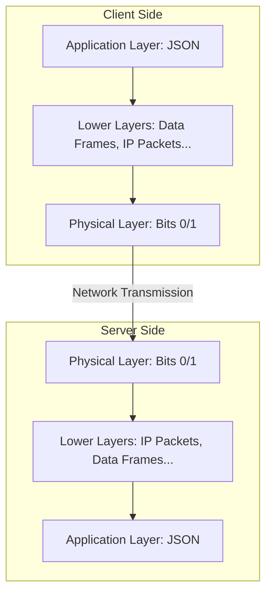
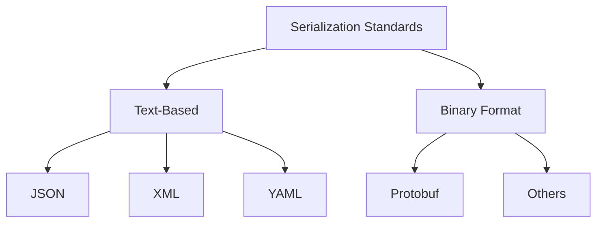
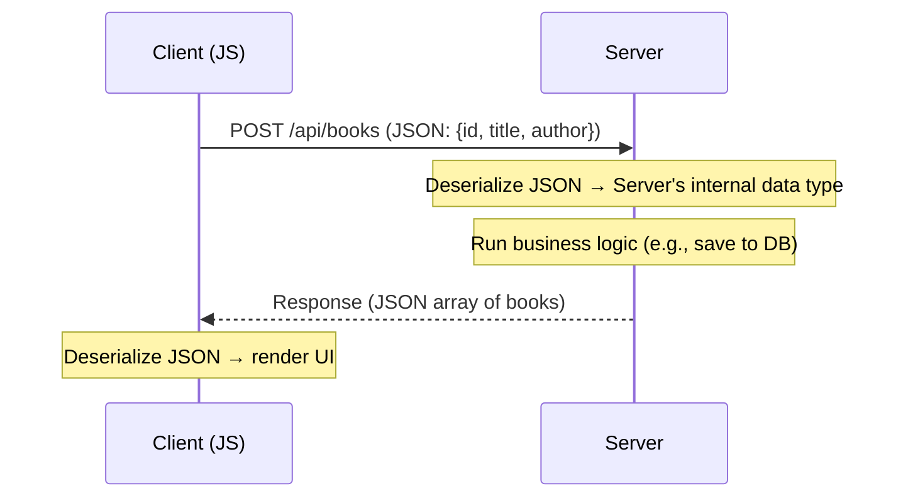

# Serialization and Deserialization

## 1. Overview

Backend engineering mein client aur server alag-alag machines pe, alag-alag languages mein, alag-alag jagah (localhost ya cloud jaise AWS/GCP/Azure) pe run hote hain. Ye dono aapas mein network ke through communicate karte hain — HTTP (REST APIs), gRPC, ya WebSocket jaise protocols use karke.

Is chapter ka core focus hai: **jab do completely different machines/languages data exchange karte hain, to wo ek dusre ka data kaise samajhte hain?** Isi problem ko solve karne wali technique ko **Serialization aur Deserialization** kehte hain.

---

## 2. Why Do We Need This?

Socho ek typical setup hai:

- **Client** → JavaScript app (React/Angular/Vue, koi bhi framework/library)
- **Server** → Rust app

Dono languages ka nature bilkul opposite hai:

| Property    | JavaScript (Client)      | Rust (Server)                     |
| ----------- | ------------------------ | --------------------------------- |
| Typing      | Dynamic                  | Strictly typed                    |
| Compilation | Not compiled             | Compiled                          |
| Data types  | JS ke apne dynamic types | Rust ke apne strict structs/types |

Ab agar client JavaScript object bhejta hai (jaise `{ name: "some string" }`) aur ye Rust server tak pahunchta hai, to Rust server ko is data ka **koi concept nahi hai** JavaScript object jaisa — uske paas apne khud ke data types hain (structs).

> 💡 Important
> Problem ye hai: network ke us paar jo machine hai, wo tumhari language ka native data type samajh hi nahi sakti. Isliye humein ek aisa tarika chahiye jisse **kisi bhi language ka data, kisi bhi doosri language tak, bina meaning kho ke pahuncha sake.**

Isi problem ko solve karne ke liye Serialization/Deserialization ka concept aata hai.

---

## 3. Core Concept

**Serialization** aur **Deserialization** basically data ko ek **common, standard format** mein convert karne ki technique hai, taaki:

- Transmission (network ke through bhejna) ke time
- ya Storage (file/log mein save karna) ke time

data **language-agnostic** aur **domain-agnostic** ban jaaye — matlab koi bhi language ya system us format ko parse aur samajh sake.

```text
Serialization    → Apni language ke data (object/struct) ko common format mein convert karna
Deserialization  → Common format ko wapas apni language ke data (object/struct) mein convert karna
```

> 💭 Mental Model
> Serialization/Deserialization ko socho jaise ek **universal translator** — chahe tum Hindi bolo ya English, translator dono ko ek common language (jaise sign language) mein convert kar deta hai jisse dono party samajh saken.

---

## 4. How It Works (The Common Standard Approach)

Agar tumhe ye problem solve karne ko diya jaaye — "do machines jo alag jagah hain aur internet pe connected hain, unhe ek dusre ka data samajhna hai, language-agnostic tarike se" — to sabse obvious solution hoga:

> Ek **common standard** decide kar do, jise client aur server dono agree karein.

Iska matlab:

1. Client apni language (JavaScript) ka data leta hai
2. Use standard format mein **convert (serialize)** karta hai
3. Network ke through bhejta hai
4. Server us standard format ko receive karta hai
5. Use apni language (Rust struct) mein **convert (deserialize)** karta hai
6. Business logic run karta hai
7. Response wapas standard format mein **serialize** karke bhejta hai
8. Client use apni language mein **deserialize** karke UI render karta hai ya logic run karta hai



---

## 5. Internal Workflow — OSI Model Mental Model (Backend Engineer's View)

Data jab network pe transmit hota hai, to OSI model ke multiple layers se guzarta hai — Application Layer se leke Physical Layer tak. Beech mein data, data frames → IP packets → aur finally electrical/optical bits (0s aur 1s) mein convert hota hai.

> 🧠 Remember
> Backend engineer hone ke naate, tumhe OSI model ke saare internals (IP packets, data frames, physical signals) deeply samajhne ki zaroorat nahi hai. Agar CS background nahi hai, to bas high-level idea hona kaafi hai. Ye video/note us cheez ka scope nahi hai.

Jo important mental model tumhe rakhni hai wo ye hai:



Yahan focus karne wali baat:

- **Application Layer** (jahan backend engineer kaam karta hai) pe data **JSON** (ya jo bhi standard format hai) ki form mein hota hai
- Beech ke saare layers (transport, network, physical) data ko apne format mein convert karte hain — **ye backend engineer ki responsibility nahi hai**
- Server ke receiving end pe wapas Application Layer tak pahunchte-pahunchte data phir se **JSON** format mein aa jaata hai
- Server ko sirf JSON padhna aata hai — beech ke intermediary conversions se server ko koi matlab nahi

> 💡 Important
> As a backend engineer, tumhari responsibility sirf itni hai: Application Layer pe data **kis common format (jaise JSON)** mein hai, use samajhna aur handle karna. Neeche ke network layers apna kaam khud sambhal lete hain.

---

## 6. Types of Serialization Standards

Jaise databases mein relational (Postgres, MySQL, SQLite) aur non-relational (MongoDB, DynamoDB) options hote hain, waise hi serialization ke bhi multiple standards hain industry mein.



| Category      | Formats          | Human Readable? | Typical Use Case               |
| ------------- | ---------------- | --------------- | ------------------------------ |
| Text-Based    | JSON, XML, YAML  | ✅ Yes          | REST APIs, config files, logs  |
| Binary Format | Protobuf, others | ❌ No           | gRPC, high-performance systems |

> 🎯 Interview Tip
> Agar interviewer puche "JSON ke alawa kya options hain?", to text-based mein XML/YAML aur binary mein Protobuf ka naam le sakte ho.

Is playlist/course ka focus **JSON** pe hai kyunki ye REST API communication mein sabse zyada (~80% cases mein) use hone wala standard hai.

---

## 7. Important Concepts — JSON Deep Dive

**JSON** = **JavaScript Object Notation**

Naam se hi samajh aata hai ki ye JavaScript object jaisa dikhta hai aur behave karta hai, lekin ye **JavaScript tak limited nahi hai** — ye har jagah use hota hai:

- Configuration files mein
- HTTP REST API request/response mein
- Log files mein (application/server runtime data logging ke liye)

### JSON Rules (Structure)

```json
{
  "name": "some string",
  "age": 25,
  "isActive": true,
  "address": {
    "country": "India",
    "phone": 3456
  }
}
```

JSON ki key characteristics:

1. Data starting `{` se hoti hai aur ending `}` pe hoti hai
2. Har **key double quotes** ke andar hoti hai, aur wo hamesha **string** hoti hai — koi aur data type key nahi ban sakta
3. **Value** in mein se koi bhi ho sakta hai:
   - String
   - Number
   - Boolean
   - Array
   - Nested Object (jisme phir se yehi rules apply hote hain — keys double-quoted strings, values same characteristics)

> 💡 Important
> Ye jo nested object hai, wo apne andar bhi wahi rules follow karta hai jo parent object follow karta hai — recursively.

> ⚠️ Common Mistake
> Beginners kabhi-kabhi keys ko bina double quotes ke likh dete hain (jaise JavaScript object literal mein hota hai: `{name: "x"}`). Valid JSON mein key hamesha double-quoted string honi chahiye: `{"name": "x"}`.

---

## 8. Practical Example — Client-Server JSON Flow (API Demo)

Video mein ek real demo dikhaya gaya hai jisme ek `POST /api/books` request bheji jaati hai (tool: API client jaisa Postman/BAPI Suite).

### Request Flow

Client (JavaScript) ek Book object bhejta hai server ko, jisme `id`, `title`, aur `author` fields hain:

```json
{
  "id": 1,
  "title": "some title",
  "author": "some author"
}
```

- Ye pura object **starting aur ending braces** ke saath hai
- Saari keys double-quoted strings hain
- `id` number hai, `title` aur `author` strings hain

Ye JSON, request body mein daal ke HTTP POST request ke through bheja jaata hai.

### Response Flow

Server is data ko receive karta hai, use samajhta hai (deserialize), apna business logic run karta hai (jaise book ko database mein add karna), aur phir response wapas **JSON array format** mein bhejta hai:

```json
[
  {
    "id": 1,
    "title": "some title",
    "author": "some author"
  }
]
```

- Yahan response ek **array** hai, jiske andar ek ya multiple book objects hain
- Har object phir se same JSON rules follow karta hai

Client is response ko receive karta hai, deserialize karta hai, aur UI mein render kar deta hai (isi tarah PHP jaisi kisi doosri client-side language mein bhi kaam karega).



> 🚀 Real-World Usage
> Har REST API call jo tum browser DevTools ya Postman mein dekhte ho, usme request body aur response body dono JSON format mein hote hain — yehi serialization/deserialization real-time mein action mein hota hai.

---

## 9. Advantages (of JSON as a Serialization Standard)

- **Human-readable** — easily padha aur likha ja sakta hai, debugging aasan hoti hai
- **Language-agnostic** — kisi bhi programming language mein parse/generate kiya ja sakta hai
- **Simple structure** — sirf key-value pairs, arrays, aur basic data types (string, number, boolean, nested object)
- **Widely supported** — har major language aur framework mein built-in JSON support hota hai
- **Multi-purpose** — REST APIs, config files, logging — sab jagah use ho sakta hai

---

## 10. Disadvantages / Limitations

> 💡 Extra Context
> Ye points transcript mein directly discuss nahi hue, lekin JSON ko samajhne ke liye standard background knowledge hai.

- JSON **binary formats (jaise Protobuf) ke comparison mein bada aur slower** hota hai transmit karne ke liye, kyunki text-based hai
- JSON mein **native date/time type nahi hota** — hamesha string ke roop mein represent karna padta hai
- Strict typing na hone ki wajah se runtime errors ho sakti hain agar deserialization ke time expected type na mile

---

## 11. Common Mistakes

> ⚠️ Common Mistake
> **Keys ko bina double quotes ke likhna** — JSON standard ke against hai, parsing fail ho sakti hai.

> ⚠️ Common Mistake
> Ye sochna ki JSON sirf JavaScript ke liye hai kyunki naam mein "JavaScript" aata hai — jabki ye **language-agnostic** standard hai, har language use kar sakti hai.

> ⚠️ Common Mistake
> OSI model ke intermediary layers (data frames, IP packets, bits) ko backend logic ka part samajhna — jabki backend engineer ka focus sirf **Application Layer** pe hota hai.

---

## 12. Comparison With Related Concepts

### Text-Based vs Binary Format

| Feature             | Text-Based (JSON, XML, YAML) | Binary Format (Protobuf)           |
| ------------------- | ---------------------------- | ---------------------------------- |
| Human Readable      | ✅ Yes                       | ❌ No                              |
| Size                | Bada (verbose)               | Chota (compact)                    |
| Parsing Speed       | Comparatively slower         | Fast                               |
| Common Usage        | REST APIs, configs, logs     | gRPC, performance-critical systems |
| Popularity for HTTP | ~80% cases (JSON)            | Kam common for typical REST        |

### JSON vs XML vs YAML (Text-Based Formats)

| Feature      | JSON                     | XML                             | YAML                                    |
| ------------ | ------------------------ | ------------------------------- | --------------------------------------- |
| Readability  | High                     | Medium (verbose tags)           | High                                    |
| Structure    | Key-value, braces        | Tag-based (open/close tags)     | Indentation-based                       |
| Common Usage | REST APIs (most popular) | Legacy enterprise systems, SOAP | Config files (e.g. Docker Compose, K8s) |

> 🎯 Interview Tip
> Agar puchein "JSON hi kyun sabse popular hai REST APIs ke liye?" — answer: compact size (XML se chota), human-readable, aur JavaScript ecosystem ke saath native fit hone ki wajah se web development mein widely adopted hua.

---

## 13. Real-World Usage

- **REST API communication** — client aur server ke beech request/response body
- **Configuration files** — jaise `package.json`, `tsconfig.json`, etc.
- **Logging** — application/server runtime logs JSON format mein store kiye jaate hain taaki structured logging aur later analysis easy ho

---

## 14. Interview Questions

### Basic

**Q. Serialization aur Deserialization kya hai?**
**Answer:** Serialization data ko ek common, standard format (jaise JSON) mein convert karne ki process hai taaki wo transmit ya store kiya ja sake. Deserialization iska opposite hai — common format se data ko wapas kisi language ke native data type mein convert karna.

**Q. JSON ka full form kya hai?**
**Answer:** JavaScript Object Notation. Naam JavaScript se aaya hai kyunki structure JS objects jaisa hai, lekin ye language-agnostic standard hai.

**Q. JSON mein key kis data type ki honi chahiye?**
**Answer:** Key hamesha double-quoted string honi chahiye. Koi aur data type key nahi ban sakta.

### Intermediate

**Q. Serialization/Deserialization ki zaroorat kyun padti hai?**
**Answer:** Kyunki alag-alag machines/systems alag programming languages mein bane hote hain jinke apne-apne native data types hote hain (jaise JS ke objects vs Rust ke structs). Ek common standard format ke bina, ek system dusre system ka data samajh nahi sakta. Serialization/Deserialization is gap ko bridge karta hai.

**Q. JSON mein value kya-kya ho sakti hai?**
**Answer:** String, Number, Boolean, Array, ya ek nested Object — jisme phir se yehi rules recursively apply hote hain.

**Q. Text-based aur binary serialization format mein kya farak hai?**
**Answer:** Text-based (JSON, XML, YAML) human-readable hote hain lekin size mein bade hote hain. Binary format (jaise Protobuf) human-readable nahi hote lekin compact aur fast hote hain — typically gRPC jaisi high-performance communication mein use hote hain.

### Advanced

**Q. OSI model ke context mein, backend engineer ki responsibility kahan tak hoti hai serialization ke regard mein?**
**Answer:** Backend engineer ka focus sirf **Application Layer** tak seemit hai — jahan data JSON (ya jo bhi standard hai) ki form mein hota hai. Neeche ke layers (transport, network, data link, physical) data ko apne internal formats (data frames, IP packets, bits) mein convert karte hain, lekin ye transformation backend engineer ki concern nahi hai — wo automatically handle hoti hai network stack dwara.

**Q. Agar client JavaScript hai aur server Rust hai, to data flow kaise hota hai end to end?**
**Answer:** Client apna JS object serialize karke JSON banata hai → JSON network ke through (OSI layers se guzarte hue) server tak pahunchta hai → server JSON ko deserialize karke Rust struct mein convert karta hai → business logic run hoti hai → response Rust struct se wapas JSON mein serialize hota hai → client tak pahunchta hai → client JSON ko deserialize karke JS object mein convert karta hai aur UI render karta hai.

---

## ⚡ Quick Revision

- Serialization = apne language ke data ko common standard format mein convert karna
- Deserialization = common format ko wapas apne language ke native data type mein convert karna
- Zaroorat isliye padti hai kyunki alag-alag languages ke alag-alag native data types hote hain (JS vs Rust example)
- Backend engineer ki responsibility sirf **Application Layer** tak hai — neeche ke OSI layers (data frames, IP packets, bits) apna kaam khud handle karte hain
- Serialization standards do types ke hote hain: **Text-Based** (JSON, XML, YAML) aur **Binary Format** (Protobuf)
- **JSON** = JavaScript Object Notation — sabse popular text-based standard (~80% REST API cases)
- JSON rules: `{ }` se start/end, keys double-quoted strings, values string/number/boolean/array/nested object ho sakte hain
- REST API request aur response dono typically JSON format mein hote hain
- JSON sirf JavaScript tak limited nahi — configs, logs, aur cross-language communication sab jagah use hota hai

---

## 🧠 Final Mental Model

```text
Client (JS Object)
     ↓ Serialize
Common Format (JSON)
     ↓ Network Transmission (OSI layers handle internally)
Common Format (JSON)
     ↓ Deserialize
Server (Rust Struct)
     ↓ Business Logic
Server (Rust Struct)
     ↓ Serialize
Common Format (JSON)
     ↓ Network Transmission
Common Format (JSON)
     ↓ Deserialize
Client (JS Object) → UI Render
```

Chahe client aur server kitni bhi different languages mein likhe hon, **JSON (ya koi bhi agreed-upon common format) ek pul (bridge) ka kaam karta hai** — dono taraf apna data isi common language mein convert karte hain, taaki communication seamless aur language-agnostic ho sake. Yehi Serialization aur Deserialization ka poora essence hai.
