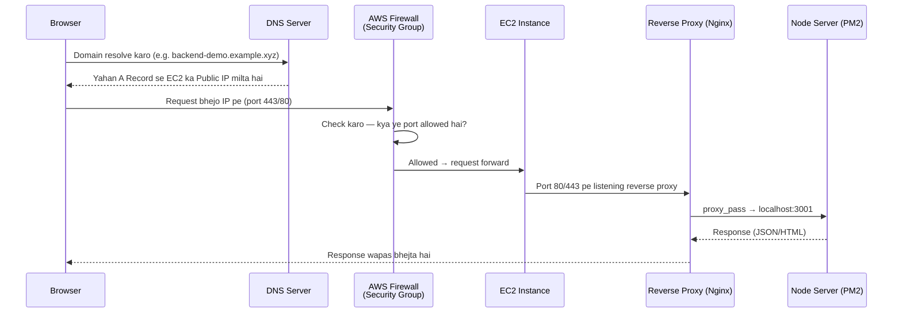
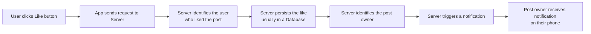

# What is a Backend? How Do They Work and Why Do We Need Them?

## 1. Overview

Ye video backend ki **traditional definition** se start hoti hai aur phir ek **real deployed AWS server** ka live demo dikhati hai — taaki sirf theory na rahe, balki ye pata chale ki jab hum browser me ek URL open karte hain, to physically network ke through wo request kaun-kaun se hops (DNS → AWS → Firewall → Reverse Proxy → App Server) se guzar kar humare backend tak pahunchti hai.

Uske baad video is fundamental question ka jawab deti hai: **backend exist hi kyun karta hai, aur frontend me hi sab kuch kyun nahi kar sakte?**

---

## 2. Core Concept: Backend Ki Traditional Definition

> 💭 Mental Model: Backend ek **computer** hai jo kisi open port (jaise 80 ya 443) pe HTTP, WebSocket, gRPC, ya kisi bhi type ki request ke liye **listen** kar raha hota hai, aur internet ke through accessible hota hai — taaki clients/frontends usse connect ho kar data bhej ya receive kar sakein.

- Ise **"server"** isliye kehte hain kyunki ye kisi na kisi type ka content **serve** karta hai — static files (images, JS, HTML) ya JSON data
- Ye client se aane wali data ko **accept** bhi karta hai

---

## 3. How It Works — Real Request Journey (Live Demo Breakdown)

Demo me ek backend server AWS pe deployed hai jo sample "users" data serve karta hai. Video browser ke Network tab se request trace karke dikhati hai ki request kaise-kaise hops se guzarti hai.



### Step-by-Step Explanation

#### Step 1: DNS Resolution

Request ka pehla hop hota hai **domain name** — browser sabse pehle DNS server se puchta hai ki ye domain kis IP pe hai.

> 💡 Important: DNS apne aap me ek bahut bada topic hai, isliye yahan sirf basics cover kiye gaye hain:
>
> - **A Record**: Domain/subdomain ko ek specific **IP address** se point karta hai
> - **CNAME Record**: Domain/subdomain ko ek doosre **domain name** se point karta hai

Demo me `backend-demo` subdomain ke liye ek A Record define kiya gaya hai jo ek AWS EC2 instance ke public IP address ko point karta hai.

#### Step 2: AWS Firewall (Security Group)

Request IP tak pahunchne se pehle ek firewall se guzarti hai — AWS me ise **Security Group** kehte hain.

- Security Group define karta hai ki kaunse **ports** allow hain aur internet se accessible hain
- Demo me 3 ports allow kiye gaye the:
  - Ek port SSH/terminal access ke liye (AWS instance me login karke commands run karne ke liye)
  - **Port 443** (HTTPS traffic)
  - **Port 80** (HTTP traffic)

> ⚠️ Common Mistake: Agar aap 443 aur 80 ports allow nahi karte Security Group me, to AWS request ko wahi block kar dega — request aapke server tak pahunchegi hi nahi.

#### Step 3: Reverse Proxy (Nginx)

Request EC2 instance tak pahunchne ke baad, seedha application server tak nahi jaati — pehle ek **reverse proxy** (yahan **Nginx**) se guzarti hai.

> 💭 Mental Model: Reverse proxy ek aisa server hai jo doosre servers ke **aage** baithta hai, taaki redirects/configs ko ek **centralized jagah** se manage kiya ja sake — har individual server me alag-alag config change karne ki jagah.

Nginx config me important parts:

- **Certbot** ka use hota hai SSL certificates automatically assign karne ke liye
- Nginx **port 80** pe listen karta hai aur usse **port 443** (HTTPS) pe redirect kar deta hai
- `server_name` field me domain/subdomain define hota hai (e.g. `backend-demo.example.xyz`)
- Jo bhi request is domain pe aati hai (jo already DNS se yahan route ho chuki hoti hai), Nginx use **localhost:3001** pe proxy/redirect kar deta hai — jahan actual Node server run ho raha hota hai

#### Step 4: Application Server (Node + PM2)

- **PM2** (process manager) se processes manage kiye jaate hain — demo me do processes chal rahe the: ek frontend ke liye, ek backend ke liye
- Ye Node server hi request ka **final hop** hai — yahi actual business logic run karke response return karta hai
- Agar aap directly instance ke andar `curl localhost:3001/users` karo, to same response milta hai — jo prove karta hai ki Nginx sirf ek routing layer hai, actual processing yahi ho rahi hai

### Summary of the Journey

```text
Browser
   ↓
DNS Server (domain → IP resolve)
   ↓
AWS Network → Firewall (Security Group: allowed ports check)
   ↓
EC2 Instance
   ↓
Reverse Proxy (Nginx) → correct localhost port pe route
   ↓
Node Server (final processing + response)
```

> 🧠 Remember: Local development me jab aap `localhost:3001/users` open karte ho, to same response milta hai jo production me milta hai — bas beech ke saare network hops (DNS, firewall, reverse proxy) production me add ho jaate hain.

---

## 4. Why Do We Need a Backend? (The "Instagram Like" Example)

> 🎯 Interview Tip: Ye example bahut useful hai backend ki zaroorat samjhane ke liye — commonly asked "explain what happens when you like a post" jaisa conceptual question isi se answer hota hai.

**Scenario**: Aap Instagram feed scroll kar rahe ho, apne friend ki post pe like button click karte ho, aur doosri taraf aapke friend ko notification milta hai. Beech me kya hota hai?



Is poore interaction ke liye ek **centralized computer** chahiye hota hai jiske paas:

- Saare users ka data ho
- Har user ka apna customized profile, unke follow kiye hue log, unki permitted actions

> 💡 Core Idea: Agar iss poore backend ke responsibility ko ek word me condense karein, to wo hai — **DATA**.
>
> Backend ki core job hai:
>
> - Data **fetch** karna
> - Data **receive** karna
> - Data ko kahin **persist** (save) karna
> - Data se related har action handle karna

---

## 5. Frontend Request Flow (Comparison Demo)

Video ek Next.js frontend app ka bhi wahi live demo dikhati hai (`frontend-demo` subdomain, same AWS EC2 instance pe deployed):

- Browser sabse pehle **primary HTML document** fetch karta hai
- Uske baad alag-alag requests me JavaScript files, images, fonts, aur CSS files fetch hote hain
- DNS me `frontend-demo` subdomain ka bhi A Record hai jo same EC2 instance ke public IP ko point karta hai
- Wahi 80/443 ports allow hone chahiye
- Nginx config almost same hai, bas farak itna hai ki ye request ko **localhost:3000** (frontend server) pe proxy karta hai — na ki 3001 (backend) pe
- Jab HTML aa jaata hai, browser CSS fetch karke **paint** karta hai (styles, colors, fonts) aur JavaScript fetch karke **hydrate** karta hai (event listeners add karta hai — jaise button clicks)

> 🧠 Key Difference: Backend me jab request bhejte ho, **processing server pe hoti hai** aur result wapas milta hai. Frontend me iska ulta hai — server sirf **code bhejta hai** (HTML/CSS/JS), lekin us code ko **run browser karta hai** (client ki machine pe). Yahan **browser hi hamara runtime** hai.

---

## 6. Why Can't We Just Put Backend Logic in the Frontend?

Ye video ka sabse important conceptual section hai — agar frontend bhi ek computer/device hai, to backend logic wahi kyun nahi likh sakte?

### Reason 1: Browser Sandboxing & Security

- Browsers **sandboxed environments** hote hain — matlab wo operating system, processes, aur file system se **isolated** hote hain
- Is isolation ki wajah se browser code sirf limited resources access kar sakta hai: **DOM**, kuch **Browser APIs** (jaise Local Storage, Cookies), aur external APIs (lekin sirf agar unke paas appropriate headers hon)
- Backend ko often file system access chahiye hota hai (log files likhna, environment variables access karna) — browsers ye allow nahi karte

> ⚠️ Ye sandboxing security ke liye hi hai: Browser essentially ek remote server se code fetch karke user ki machine pe execute karta hai. Agar isolation na ho, to malicious remote code aapke file system ko access karke sensitive data steal kar sakta hai.

### Reason 2: CORS Restrictions

> 💭 Mental Model: **CORS** ek browser security policy hai jo JavaScript code ko sirf **same-domain** resources/APIs call karne deti hai. Agar aap kisi doosre domain ko call karne ki koshish karte ho jiske paas required headers nahi hain, to browser request ko **block** kar deta hai.

- Backend servers ko often multiple external servers se data fetch karna padta hai — lekin humara un external APIs ke CORS headers pe control nahi hota
- Isliye ye restriction frontend ke liye ek **deal-breaker** hai

### Reason 3: Database Access

- Server runtime ke paas native **database drivers** (jaise Postgres ke liye `pg`, MongoDB ke liye respective drivers) hote hain jo databases ke saath efficiently communicate kar sakte hain
- Ye drivers **socket connections**, **binary data**, aur **persistent connections** handle karne ke liye likhe gaye hain — jo browsers nahi kar sakte
- Backend servers ek **connection pool** maintain karte hain database ke saath — taaki har request pe naya connection create/destroy na karna pade

> 💡 Important: Backend server ek second me hazaron requests receive kar sakta hai. Agar har request pe database connection create aur destroy kiya jaaye, to database server overwhelm ho jaayega. Isliye connection pooling zaroori hai.
>
> Browsers persistent database connections maintain karne ke liye design hi nahi kiye gaye — aur agar har user apna khud ka connection database se banaye, to database bahut zyada connections se overwhelm ho jaayega. Efficient connection pooling ya query execution browser environment se possible hi nahi hai.

### Reason 4: Computing Power

- Frontend applications alag-alag environments pe chalte hain — smartphone, desktop, laptop, ya kam RAM/single-core wale devices bhi
- User ke device me heavy business logic run karne layak computing power na ho, to app **lag** ya **crash** kar sakta hai
- Ek **centralized backend server** ki memory/CPU hum jab chahein badha sakte hain — isse load handle karna aasan hota hai

---

## 7. Comparison: Frontend vs Backend

| Aspect                      | Frontend                                            | Backend                                                             |
| --------------------------- | --------------------------------------------------- | ------------------------------------------------------------------- |
| Code kahan execute hota hai | Client ke browser me (browser hi runtime hai)       | Server pe                                                           |
| Processing kahan hoti hai   | Client's machine                                    | Centralized server                                                  |
| File system access          | Nahi (sandboxed)                                    | Haan                                                                |
| External API calls          | CORS policy se restricted                           | Unrestricted, direct server-to-server                               |
| Database access             | Nahi (no native drivers, no persistent connections) | Haan (native drivers, connection pooling)                           |
| Computing power             | User ke device pe depend karta hai (variable)       | Centralized, scalable (CPU/RAM badha sakte hain)                    |
| Responsibility              | UI render karna, presentation, interactivity        | Data fetch/receive/persist karna, business logic, centralized state |

---

## 8. Common Confusions

| Confusion                                                                   | Clarification                                                                                                                                                      |
| --------------------------------------------------------------------------- | ------------------------------------------------------------------------------------------------------------------------------------------------------------------ |
| "Frontend bhi to ek computer hai, backend logic wahi kyun nahi likh sakte?" | Browser ek **sandboxed runtime** hai — security, CORS, DB access, aur variable computing power ki wajah se backend logic frontend me practically possible nahi hai |
| "Reverse proxy aur application server same cheez hain?"                     | Nahi — reverse proxy (Nginx) sirf **routing/redirect layer** hai; actual business logic application server (Node) pe run hoti hai                                  |
| "DNS A Record aur CNAME Record same kaam karte hain?"                       | A Record domain ko **IP address** se point karta hai; CNAME Record domain ko **doosre domain name** se point karta hai                                             |

---

## 9. Interview Questions

### Basic

**Q. Backend ki traditional definition kya hai?**
**Answer:** Backend ek computer hai jo kisi open port (jaise 80 ya 443) pe HTTP/WebSocket/gRPC jaisi requests ke liye listen karta hai, jo internet ke through accessible hota hai, taaki clients/frontends connect ho kar data bhej ya receive kar sakein.

**Q. Backend ki responsibility ko ek word me kaise define kar sakte hain?**
**Answer:** **Data** — data fetch karna, receive karna, aur persist (save) karna, aur us data se related har action handle karna.

### Intermediate

**Q. Ek browser request DNS se lekar application server tak kin-kin hops se guzarti hai?**
**Answer:** Browser → DNS Server (domain se IP resolve) → AWS Firewall/Security Group (allowed ports check) → EC2 Instance → Reverse Proxy (Nginx) → Application Server (Node, jahan actual processing hoti hai) → response wapas usi path se.

**Q. Reverse proxy (Nginx) ka role kya hota hai?**
**Answer:** Reverse proxy doosre servers ke aage baith kar centralized jagah se redirects/configs manage karta hai — jaise kis domain ki request ko kaunse local port (application server) pe forward karna hai, aur SSL redirection (Certbot ke through 80 → 443) handle karna.

**Q. Frontend aur Backend me code execution ka fundamental difference kya hai?**
**Answer:** Backend me processing **server pe** hoti hai — client sirf request bhejta hai aur result leta hai. Frontend me server sirf code (HTML/CSS/JS) bhejta hai, lekin us code ko run **browser (client ki machine)** karta hai — browser hi frontend ka runtime hai.

### Advanced

**Q. Backend logic ko frontend me implement na kar paane ke 4 major reasons kya hain?**
**Answer:**

1. **Security/Sandboxing** — browsers isolated environments hain, file system/OS access nahi milta
2. **CORS restrictions** — cross-domain API calls restricted hain jab tak proper headers na ho, aur external APIs ke headers pe humara control nahi hota
3. **Database access** — browsers ke paas native DB drivers nahi hote, na persistent connections/connection pooling maintain kar sakte hain
4. **Computing power** — user devices ki hardware capability variable hoti hai, jabki centralized server ki capacity control me hoti hai (scale up kar sakte hain)

**Q. Connection pooling ki zaroorat kyun hoti hai backend servers me?**
**Answer:** Backend server ek second me hazaron requests receive kar sakta hai. Agar har request ke liye database se naya connection banaya aur destroy kiya jaaye, to database server overwhelmed ho jaayega. Isliye backend ek connection pool maintain karta hai — pehle se open connections ki ek list — taaki repeated create/destroy overhead na ho aur database efficiently serve kar sake.

---

## 10. ⚡ Quick Revision

- Backend = ek computer jo open port pe HTTP/WebSocket/gRPC requests ke liye listen karta hai
- Request journey: Browser → DNS (A/CNAME record) → AWS Firewall/Security Group (port check: 80/443) → EC2 Instance → Reverse Proxy (Nginx, via Certbot SSL) → App Server (Node, PM2)
- Backend ki core responsibility = **Data** (fetch, receive, persist, act on it)
- Instagram "Like" example: click → request → server identifies user → persists like in DB → identifies post-owner → triggers notification
- Frontend me: server sirf code (HTML/CSS/JS) bhejta hai, browser hi runtime hai jo use execute karta hai
- Backend logic frontend me kyun nahi: (1) Browser sandboxing/security (2) CORS restrictions (3) No native DB drivers/connection pooling (4) Variable/limited computing power on client devices
- Reverse proxy = centralized redirect/config management layer, application server se alag hota hai
- Connection pooling database ko har request pe naya connection banane/todne ke overhead se bachata hai

---

## 11. 🧠 Final Mental Model

```text
Client (Browser)
     ↓ resolves domain via
DNS Server (A/CNAME records)
     ↓ routes to
AWS Firewall (Security Group — allowed ports)
     ↓
EC2 Instance
     ↓ routed by
Reverse Proxy (Nginx — SSL, domain → local port mapping)
     ↓
Application Server (Node + PM2)
     ↓
Database (persist data) + Business Logic
     ↓
Response travels back through the same hops
```

> 🧠 Backend fundamentally exist isliye karta hai kyunki **data ko securely, reliably, aur centrally manage karna** kisi single, controlled environment me hi possible hai — browser jaisa sandboxed, variable-capacity, aur restricted environment ye kaam nahi kar sakta.
