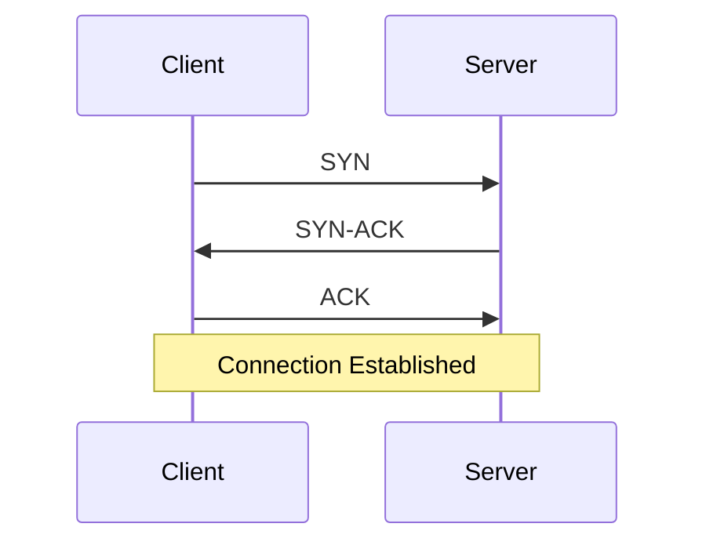

## Computer Networks

This section covers networking fundamentals:

- **OSI Model** — 7 layers of networking
- **TCP/IP** — reliable transport, handshake, flow control
- **UDP** — unreliable but fast transport
- **HTTP/HTTPS** — web communication protocol
- **DNS** — domain name resolution
- **Sockets** — network programming
- **TLS/SSL** — encryption in transit
- **CDN & Load Balancing** — traffic distribution

:::info Content Coming Soon
Notes will be added as content is provided.
:::

## OSI Model

| Layer | Name | Protocol Example |
|-------|------|-----------------|
| 7 | Application | HTTP, FTP, DNS |
| 6 | Presentation | SSL/TLS |
| 5 | Session | NetBIOS |
| 4 | Transport | TCP, UDP |
| 3 | Network | IP, ICMP |
| 2 | Data Link | Ethernet, MAC |
| 1 | Physical | Cables, Radio |

## TCP Handshake

