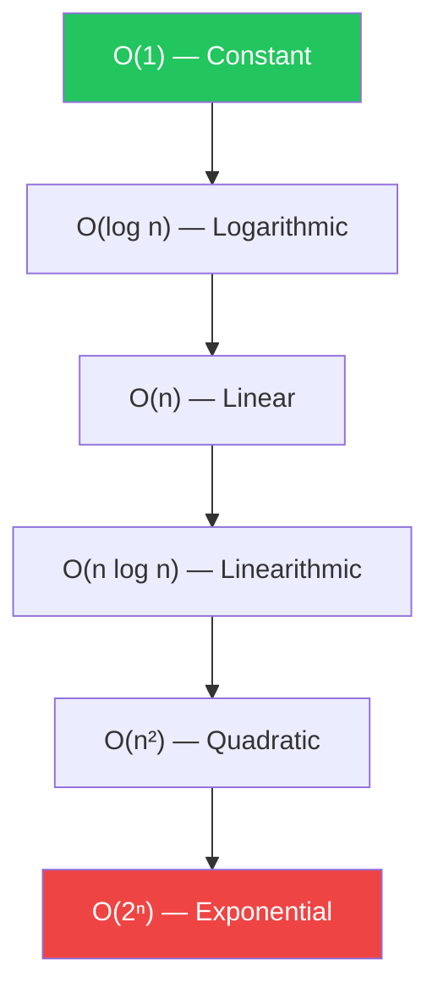

## Welcome to DSA

This section will cover Data Structures and Algorithms topics including:

- **Arrays & Strings** — the fundamental building blocks
- **Linked Lists** — pointers and node traversal
- **Stacks & Queues** — LIFO and FIFO structures
- **Trees & Graphs** — hierarchical and relational data
- **Sorting Algorithms** — comparison and non-comparison sorts
- **Searching** — binary search, BFS, DFS
- **Dynamic Programming** — optimal substructure and memoization
- **Greedy Algorithms** — local optimal choices
- **Backtracking** — exploring solution spaces

:::info Content Coming Soon
Notes will be added to this section as content is provided.
:::

## Big O Notation

Algorithmic complexity is measured with Big O notation — describing how an algorithm's runtime or space usage grows with input size.

| Notation | Name | Example |
|----------|------|---------|
| O(1) | Constant | Hash table lookup |
| O(log n) | Logarithmic | Binary search |
| O(n) | Linear | Linear search |
| O(n log n) | Linearithmic | Merge sort |
| O(n²) | Quadratic | Bubble sort |
| O(2ⁿ) | Exponential | Recursive Fibonacci |

