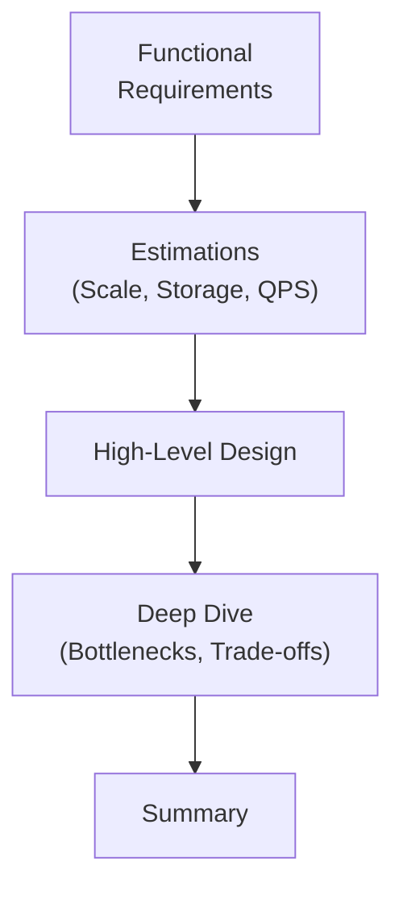

## System Design

This section covers system design patterns:

- **Scalability** — vertical vs horizontal scaling
- **Load Balancing** — round-robin, least connections
- **Caching** — Redis, CDN, client-side
- **Database Design** — sharding, replication, CAP theorem
- **Message Queues** — Kafka, RabbitMQ, async processing
- **Microservices** — service decomposition, API gateway
- **High Availability** — redundancy, failover
- **Consistent Hashing** — distributed key routing

:::info Content Coming Soon
Notes will be added as content is provided.
:::

## System Design Framework

## Key Trade-offs

| Trade-off | Option A | Option B |
|-----------|----------|----------|
| **CAP Theorem** | Consistency | Availability |
| **Storage** | SQL | NoSQL |
| **Communication** | Sync (REST) | Async (Queue) |
| **Scaling** | Vertical | Horizontal |
